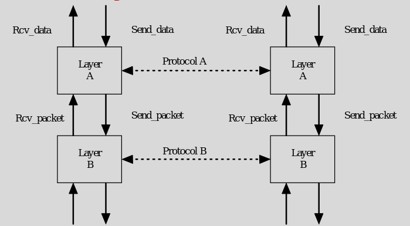
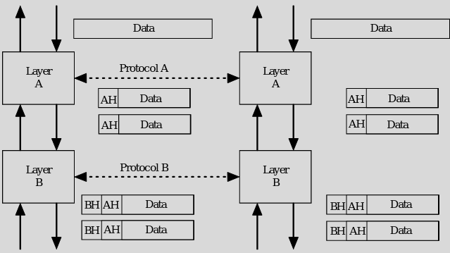

### Protocol
    - how to cordinate 
    - how to move info from laye4r aboce 
    - How to talk to peer 
    - Abstraction for communication from layer N in peer A to layer N of peer B
        - Goes down to layer 1 

    
    

### Service

### SAP - Service access point

    

### Function

### Encapsulation
    
    

