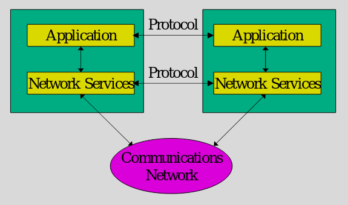
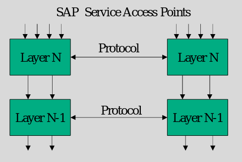

### Protocol
- How to coordinate communications 
- How to move info from layer above 
- How to talk to peer 
- Abstraction for communication from layer N in peer A to layer N of peer B
    - Goes down to layer 1 
- Define rules and how peers talk back and forth
    - Uses, expectations and functions
- Respresent the extra information that would be passed

### Service

- functionality a lower layer provides to the layer above it
- I think it defines the input and output standards

### SAP - Service access point

- How a layer communicates with the layer below it
- Picture below shows layer A coverts data to packets and reverse
- Layer B handles sending of packets
- High level idea - probably more layers to validate and other things until layer 1

### Function

- The operational guarentee that a layer provides
    - Such as ensuring that data is in the same order 
    - Or that data is valid if passed upwards

### Encapsulation

- Each layer adds header
- Protocol data unit is the data from higher layer and this layers control info
- Lower layer treats header + data together as one thing of data

