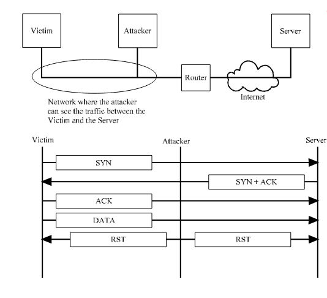
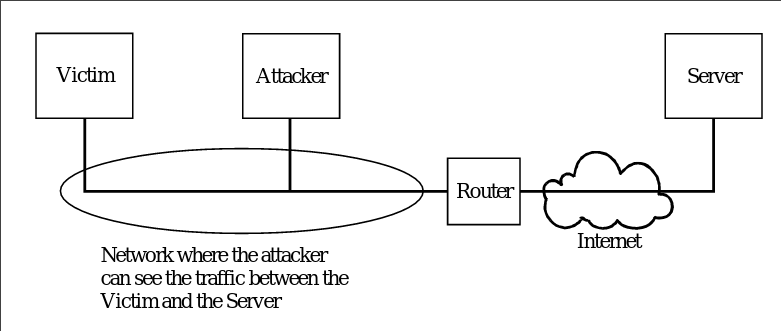
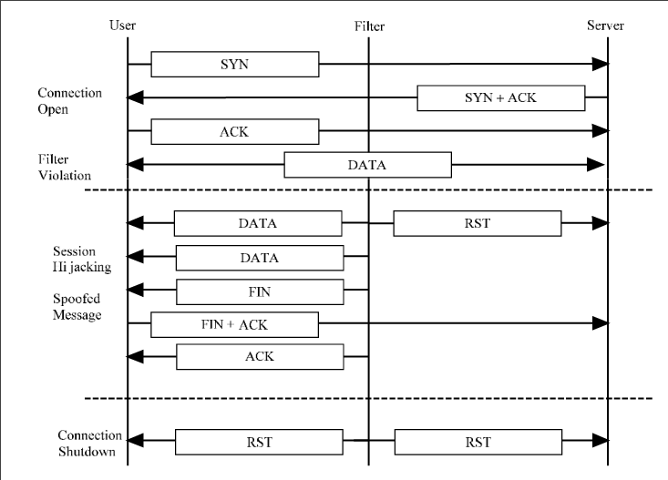

# TCP Attacks

### Header Based
- Invalid Flag combinations used to break things
- Fixed but now able to help determine type of OS
    - Probing attacks
    - Invalid header response
    - Initial values
        - Seq Number
        - Window Size

### Protocol Based
- Syn flood
- Reset Packets
- Session Hijacking• Session Hijacking

### SYN Flood

### RST Shutdown

### Session Hijacking

- Can see the data and become the user

### Mitigations 
- Session Hijack
    - Encrypt the traffic
- RST 
    - 
- SYN Flood
    - Cloudflare
    - Firewalls have mitigations

### Passive Network Filter

- Filter catches access attempt to something not allowed
    - Resets the connection to prevent access

### Authentication Based
- No Authentication 
- Ports aren't but are

### Traffic Based
- Flooding 
- QoS
    - Application layer / Port switch
    - Traffic type separation and speeds
        - change Window Sizes
        - 3 acks
- Sniffing
    - Can't stop sniffing of tcp
    - Encrypt data though

