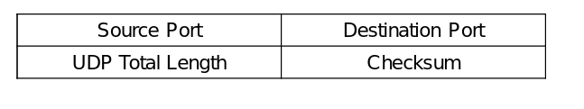
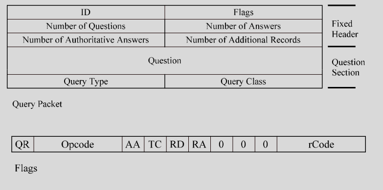
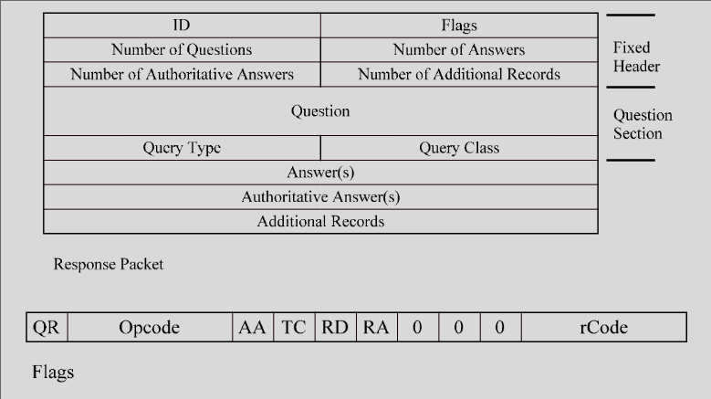

# UDP and DNS

### UDP Header

- Just a wrapper to give ports to IP

### Attacks
- Header & Protocol: None since there is no protocol and very simple header
- Authentication: same as TCP
- Traffic: typically not a problem 
    - Sniffing is a potential problem
        - most UDP protocols don’t try to hide data
    - Flooding is hard with UDP
- Mitigation: Most organizations block all UDP except port 53 (DNS)

### DNS
- Maps name to IP
- Distributed database
- Number of root level servers (13)
    - Know top level domain servers
    - Level 0 knowns level 1
- Organizations managing their own DNS
- Now there is DNS as a Service 
    - Centralized systems that manage domains

### Misc DNS
- Max 128 levels
- labels == edu (each level is a label)
- fully qualified domain name
    - end with dot (www.iastate.edu.)
- Partially 
    - sticks your domain to end
    - www becomes www.iastate.edu

### DNS Servers
- Root
- Primary
    - Holds zone file that contains devices in the current network
- Secondary
    - Backup the zone file
    - Redundancy / Load balancing

### Queries
- Name to IP
- Want to know name of 129.186.5.100
- Ask 100.5.186.129.in-addr.arpa
- Responses with the name

- Resolver 
    - Library for looking up name
    - Cached
    - IP to DNS server (multiple)
    - Your internal domain
    - Connect to server over udp 53

- Server
    - Config and cache
    - Internal resolver
        - Point to root or another upper layer server (0 is top)

### Query Types
- Recursive
    - Server resolves all questions 
    - I ask for 1 address it finds each layer
        - Asking each server itself
    - Builds cache for many servers
        - Next Server is recursive ... 

- Iterative
    - Server gives back the next server 
    - Your resolver then needs to ask that server
    - Burden on your resolver as it asks each server its self
    - Aren't many layers from root so iterative actually doesn't have large overhead
        - Recursive also loses benefits

### Query Responses
- Whether from authoritative server or not
    - Doesn't get handled differently
- Request Format
    - Fixed header
        - ID, Flags, recursive, num ?s, num answers, num authoritative, num additional
    - Question
        - Has query type
        - IPv6? Mail? ...
- Response Format
    - Fixed Header
    - Answer
    - Authoriative
    - Additional records

### Name Representation
- String
- ee.iastate.edu
- becomes "2ee7iastate3edu"
    - numbers aren't the ascii value
- Only 6 bits for numbers
    - Labels max size of 63

### Multiple Answers
- Load balancing servers
- Round Robins requests
- Look up google.com 
    - Get 5 servers
    - First person gets 1st server
    - Second gets 2nd ... until 6th restarts

