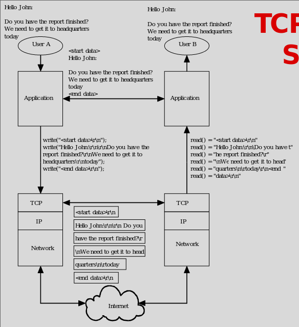
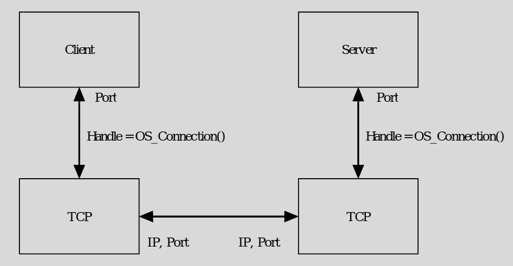
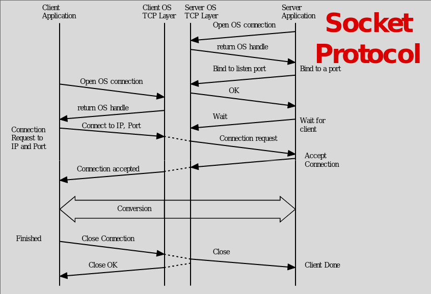
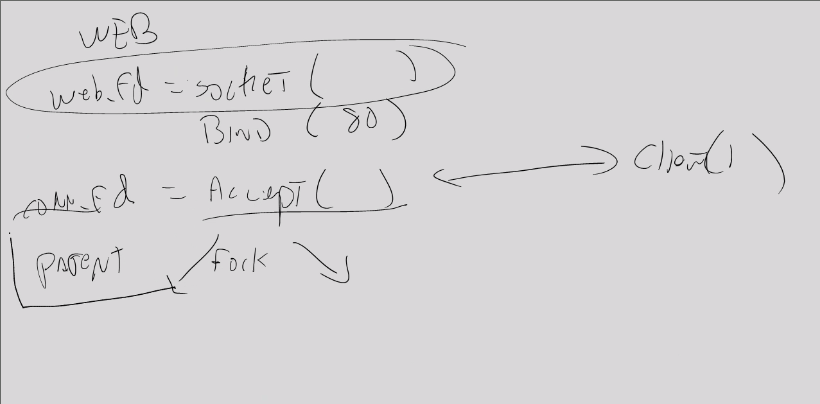

# Application Level Security

### TCP Stream Service 
- Simple way for Aplication to send data
- App just has to write to TCP 
    - Will send if not write for a while or if told to send

### Sockets
- Application to TCP interace
    - Asking OS to use TCP 
    - Get back handle (way file is described)

- Socket Protocol

### C Sockets Server
- Nsdaddr.sin 
    - Server
    - Family
    - s_addr
    - port =  htons(num)
- vs = socket(AF_NET, SOCK_STREAM, 0)
    - Can use other than sock stream for different things like UDP
- bind(vs, nsaddr, sizeof(nsaddr))
- listen(vs, 5)
    - How many connects to allow until drop
- ns = accept(vs, from_addr, from_len)

### Client 
- gethostbyname()

### Web 
- Get connecttion and fork

