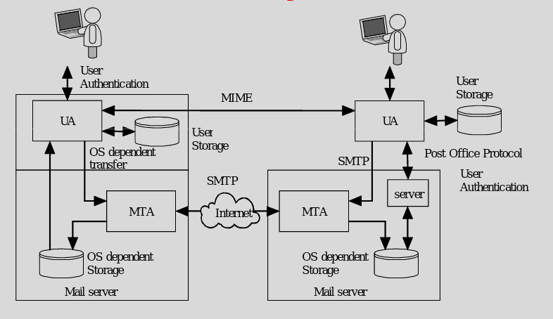
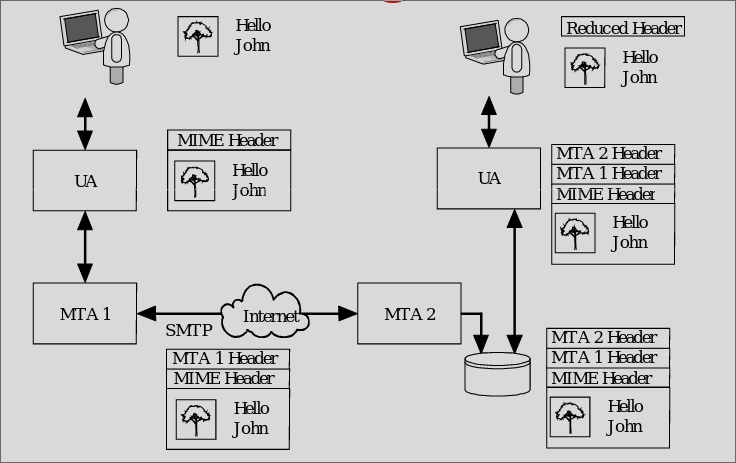
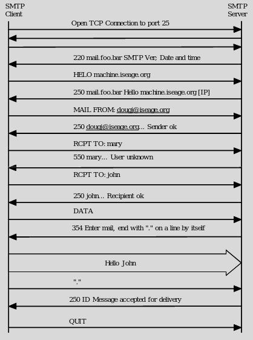
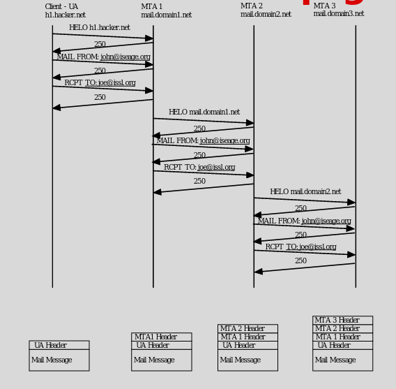
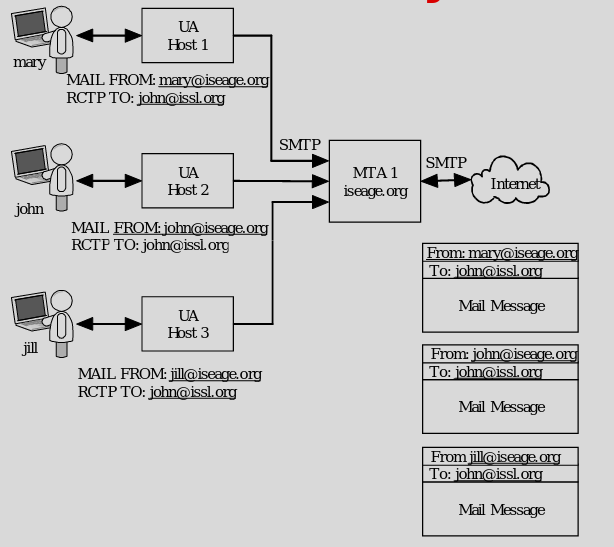

# Email

### General Email System
- Creation / User creates message in editor
- Send / User designates the recipient
    - Recievers mail system stores message
- Reception / Intended user can retrieve the mail and read
- Storage / Both sides can store message

- Each MTA adds a header

### SMTP
- Standard
- Had many security issues in original features
- Not concerned with message format
    - 7 bit ascii 
    - adds logging information to message for the path the message took
- Mime is to format the data appropriately 
- SMTP is to move the data

### Commands
- 14 with only 4 charactes
- HELO <domain> / Used by the sending system to identify itself
    - HELO eeclass.ee.iastate.edu
- MAIL FROM: <path> / Identifies who the message is from
- RCPT TO: <forward path> / Identifies who the message should be mailed to
- DATA / Indicates that the next transmission contains the message text
    - Terminated with a line containing <CR LF>.<CR LF>
- QUIT / Sent after completion of transfer, prior to closing TCP connection

### Unused or Dead Commands
- RSET / Terminate current transaction
- SEND FROM: <path> / Used instead of MAIL if message should be displayed on user's terminal
- SOML FROM: <path> / (Send or Mail) Used instead of MAIL if message should be mailed or displayed on user's terminal
- SAML FROM: <path> / (Send And Mail) Used instead of MAIL if message should be mailed and displayed message should be mailed and displayed on user's terminal
- VRFY <string> / Returns to the sender the full name of the user specified in the parameter
- EXPN <string> / Returns to the sender a list of mailboxes corresponding to the alias provided
- NOOP / Performs no actions: returns a "250 OK" for debugging
- TURN / Reverses the role of SMTP sender and receiver.

### Error Codes
- First digit specifies whether the response was good, bad, or or incomplete.
    - 1XX - worked but not supported by smpt
    - 2XX - worked
    - 3XX - worked but needed further information sent to it
    - 4XX - Temporary failure
    - 5XX - Command not accepted
- The second digit specifies what type of error occurred.
- The third digit details specific failures

- 220 
    - Service ready
- 250
    - Requested mail action completed
- 354
    - Start of mail input
- 450 
    - Mail busy
- 500 
    - Syntax Error, command unknown

- Can have text after the emails

### Traffic Diagram

# Attacks

### Header 
- Basically just buffer overflows

### Protocol 
- Not much
- Limited state information
- Send out of order just says can't do anything
- Multiple connections could limit access
    - Reaaly traffic

### Authentication
- Most common
- No auth in CMTP
- Sender tells MTA the name of the sender
- Spam and phishing attacks
- Sometimes we want to spoof the senders address

### Relaying

### Traffic
- Flooding server
    - many messages 
    - Large messages
    - Sending email to B from A with C as return addr
    - Attacks C
- Sniffing

### Countermeasures
- STARTTLS cause SMTP to use TLS
- Auth provides a method users to authenticate with MTA
- Typically used for remote access to MTA for relaying
    - MTA rewritting address so that it comes back to that MTA
- Being discussed as way to reduce spam

