# Email Security

### General Countermeasures
- Encryption & authentication
- Email filtering
- Content Filtering
- Email Forensics

### Encryption and PGP
- General encryption

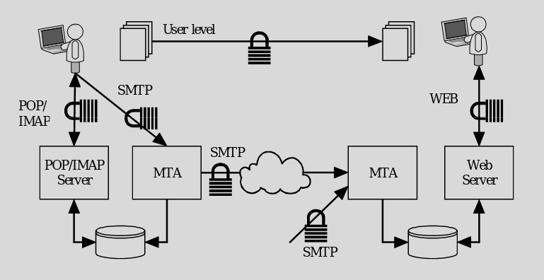

- PGP encryption

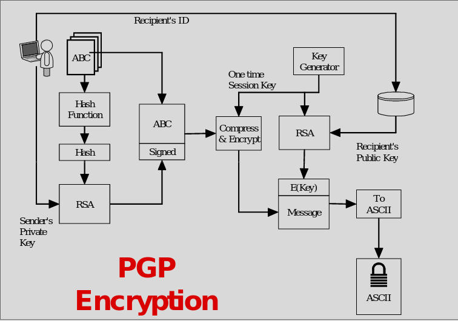

- PGP decryption

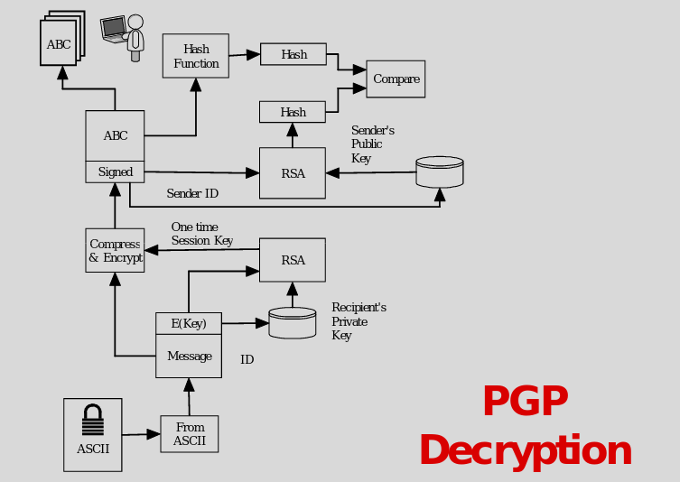

### Email Filtering
- Check email
    - Based on email addresses
    - Based on domain address
    - Based on malicious payload
- Either Block, pass, or modify the email

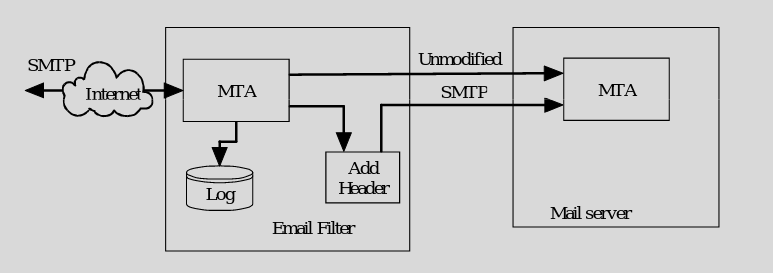

### Spam
- Uses learning to decide what content is spam.
    - System is “trained” to know is spam
    - Old idea is just based on words / misspelling
    - Newer is Pictures and words
    - # of recievers 
- Spam filter will mark the message as spam.
- Some User agents support spam detection and will move spam email into a spam folder

### Bypassing Spam
- Keyword loading
- Misspelled keywords
- Picture only
- Picture with background words

### Filtering 
- Blacklist
    - A list of bad users & domains
    - Spammers just change domains
- Whitelist
    - A list of good users and domains
    - Very restrictive
- Greylist
    - Reject all email with a temp reject
    - Maintain a whitelist that is not subject to filtering
    - Add machines to the grey list when they resend the email

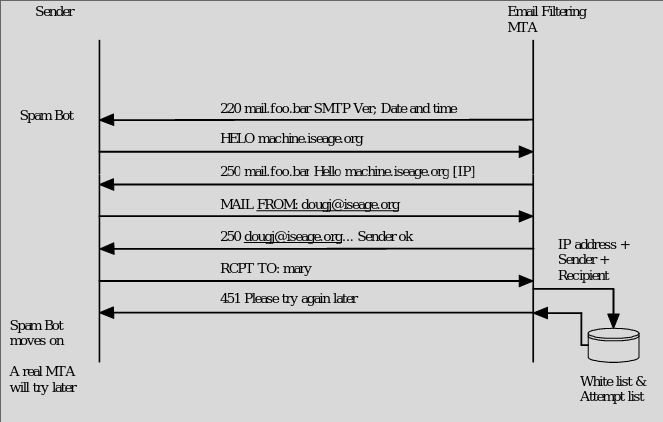

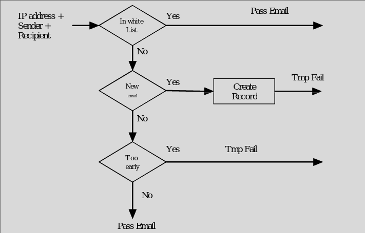

- Bypassing 
    - Use real MTA to send email

### Content Filtering
- Examine the payload for:
    - Viruses
    - Worms
    - Trojan horses
- Often based on a signature
- Requires constant update of signatures

### Outbound filtering
- Used to keep private information from leaving
    - SS Numbers
    - Account Numbers
    - Medical records
- Will either log, stop, or encrypt violating emails
- Data Loss Prevention
- Authentication as a service ideas
    - Confirming the reciever
    - Web portal sign-on
    - Making suring content is going to who its meant to 
    - Sensitive info is limited access
    - Alert user for sending info to who they shouldn't
    - (This is my ideas extended from things Doug said)

### Bypass Content Filter
- Encryption
    - There are encrypted viruses
- Compression
- Encoding
    - Base64

### Forensics Examples

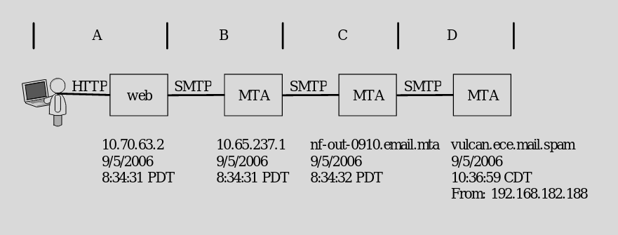

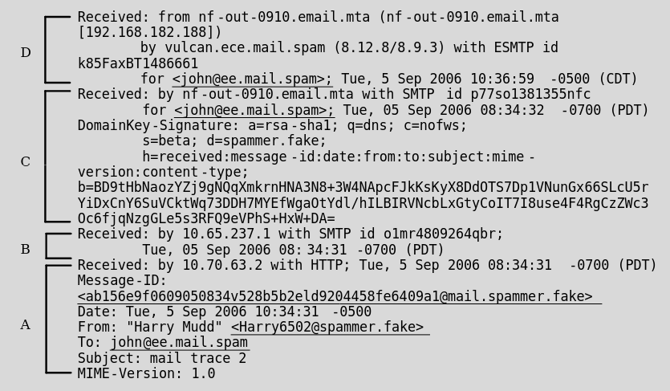

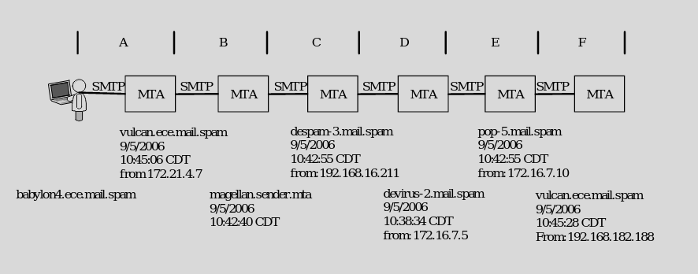

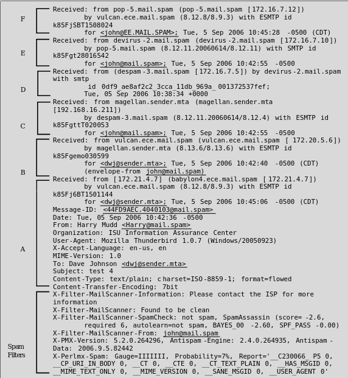

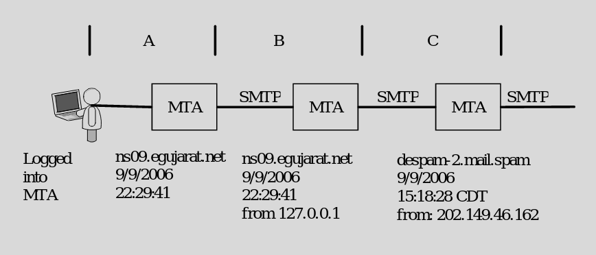

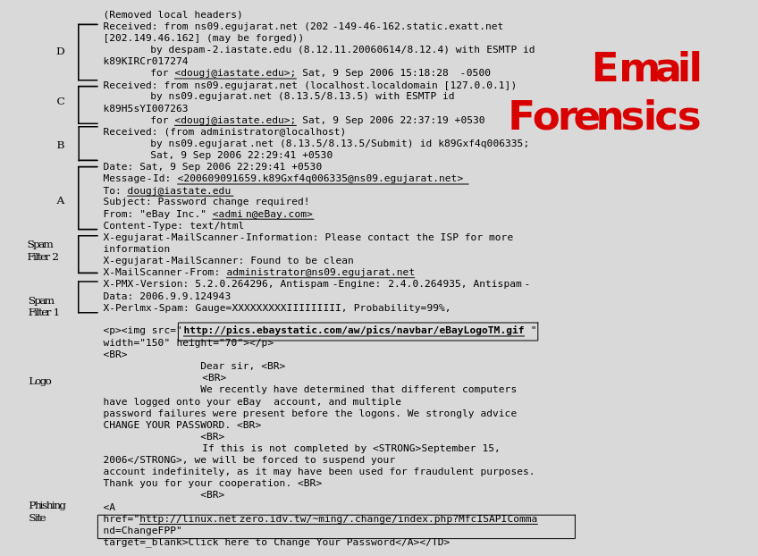

