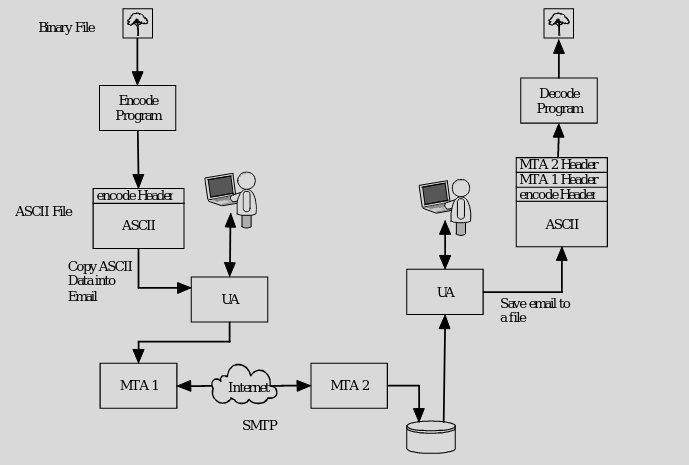
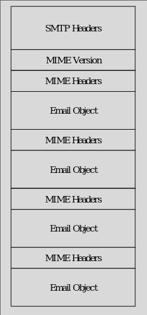
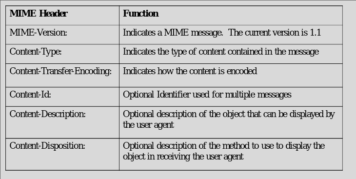
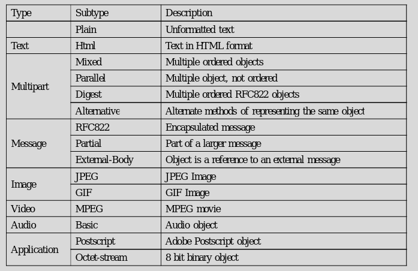
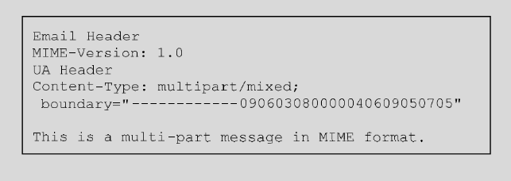
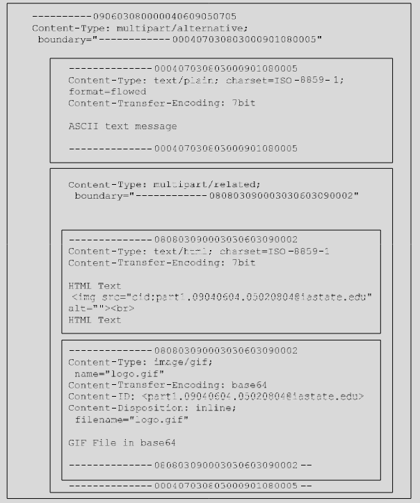
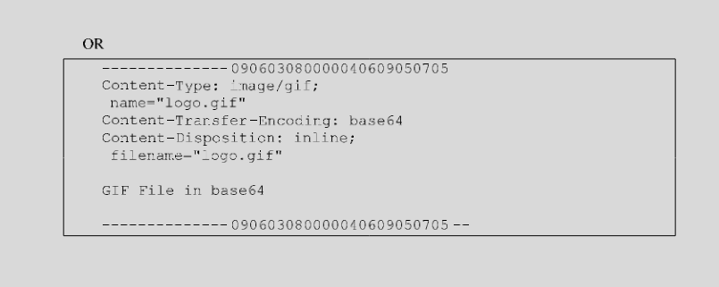

# MIME

### Intro
- Multipurpose Internet Mail Extensions
- Convert to be able to send over SMTP 
- Email message format
    - Embedded pictures
    - Embedded code
    - Attachments

### Diagrams

- Network with MTAs and UAs

- Structure of header

- Header Information

- Header Content Type Info

### MIME Message Images

### Content Description
- Content-Description: <description>
    - Lets user “tell” the User Agent what type of file is attached
    - Allows malicious code to look like something else

### Content Disposition
- Content-Disposition: (Inline, Attachments)
    - Allows inline documents which will be displayed by the user agent
    - Allows malicious code be open automatically

# MIME Attacks

### Header
- Headers can be used to hide actual content type
- HTML documents with hyperlinks where the text is different than the link
- Countermeasure
    - User education

### Protocol
- Different that normal protocols (no message exchange)
- Attachments can be malicious (viruses, worms, Trojan horses)
- Some can be auto opened (inline)
- Countermeasures
    - Disable UA functions
    - Scanners, filters
    - Education

### Authentication
- MIME does not support authentication
- Can support email monitoring
- “Web Bugs”
    - 1x1 pixel picture stored on a web site
    - When email is read the file is downloaded
    - Web server will log access to the file and information about the machine that accessed it
- Countermeasures
    - Disable User Agent function to auto display pictures

### Traffic
- Enables flooding of email with large messages
- Sniffing
    - Says it but I don't really think so

