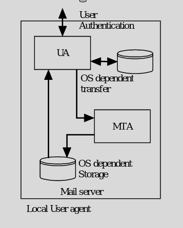
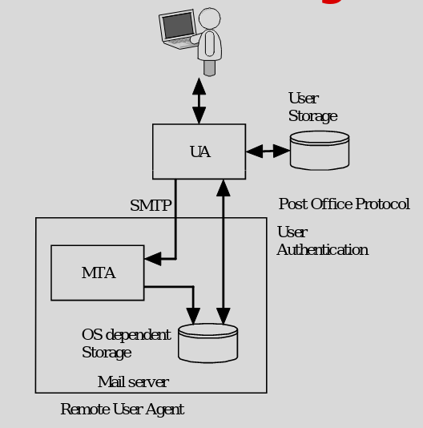
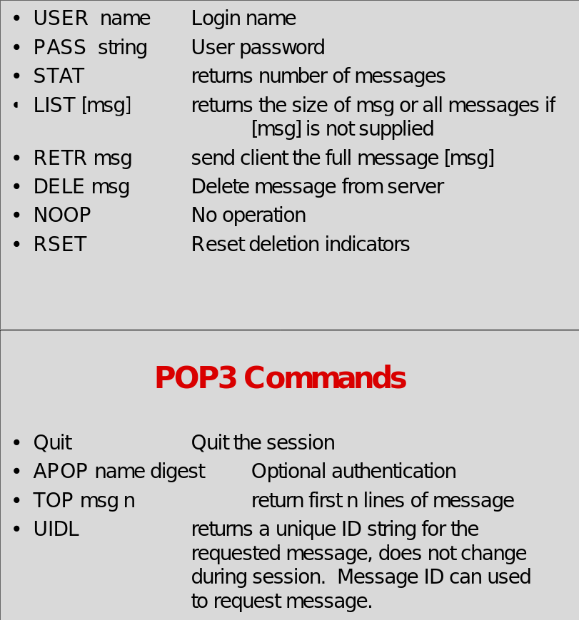
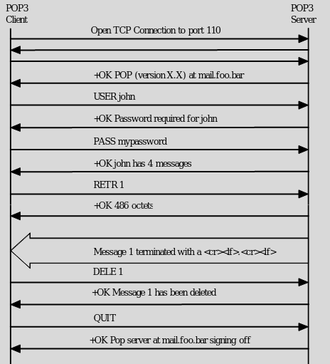

# POP3

### User Agents

- Local UA

- Remote UA

- Local to Remote UA

### POP3
- Post Office Protocol
- Tranfers mail from MTA or mail storage server to PC
- Has User authentication
- Client logs in to pop3 server (tcp 110)
    - in clear text though
- User can config how mail is checked
    - login can be sent multiple times a day
    - easy to capture

### Commands

### Diagram

### Concepts 
- UA retrieves inbound messages from POP3 server
- Sends outbound message to SMTP server

