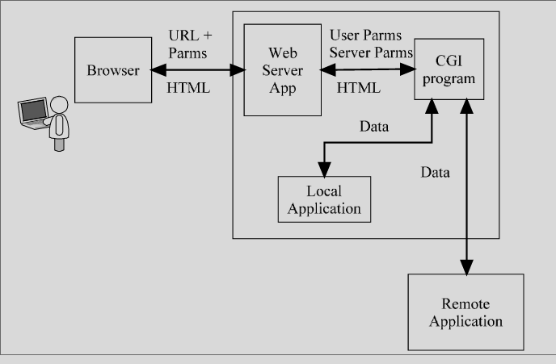

# CGI

### Server Side Security
- HTML documents can cause applications to be run.
- Common method is via a CGI script
- HTML documents can also front end other applications 
    - databases through a CGI script

### CGI
- Common Gateway Interface
- Allows a server to run programs and scripts
- CGI is the method for passing data back and forth 
    - between the server and the program or script
- Variables can be passed to the program or script
    - either through a form or after the ‘?’ in the URL
-  Examples: 
    - http://HOST/cgi-bin/program.pl?name=bob;state=ia
        - or
    - `<FORM  METHOD=POST  ACTION=/cgi-bin/program.pl>`




• CGI can access additional information through environment variables
• Environment variables are passed from the server to the program or script
• Environment variables include:
```
Query_string    HTTP_referrer
Remote_addr     HTTP_user_agent
Remote_host     Path_info
Remote_user     Server_port
Server_name
```

# Attacks

### Header Attack
- Buffer overflow problems on CGI scripts
- Server can pass HTTP requests to back-end servers and applications
    - header problems are not just with the header problems are not just with the WEB server
- Some header-based attacks facilitate authentication based attacks or direct access to the web server

### Protocol 
- Not a protocol

### Authentication 
- Provide access to application auth methods

### Traffic
- No more attacks on CGI script
- Internal to a server

