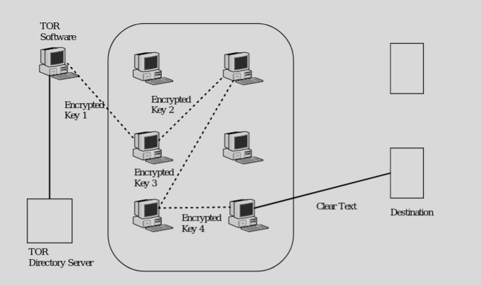

# Anonymous and Proxies


### Email Tracking
- www.readnotify.com
- Uses web bug tracking
- Keeps a log and emails you when the recipient opens the email
- Looks like the email came from the sender, you send the email to:
    - user@domain.readnotify.com


### Anon Email
- Login to a web site and send email from the site
- Gmail, etc.
- Special sites for anonymous email
    - www.anonymousspeech.com

### Private surfing the Internet
• Web servers can collect demographics about you
• www.privacy.net will show you all the things a webserver knows about you
• Examples: 
    – Your browser type and Operating System
    – CPU type
    – whether JavaScript is enabled
    – Date/Time on your computer
    – Your IP address
    - which plugins you have installed

- Once you login and give your email address, you are no longer anonymous
- Some web sites share your email address with other  sites
- This can lead to you receiving spam from sites to which you’ve never disclosed  your email
- Some sites store cookies on your harddrive  
    - Amazon.com does this to recommend based on your previous purchases
- One way to surf privately: connect through a proxy


### Proxy
- A proxy is basically someone who makes requests on your behalf
- They were originally designed to cache information  to prevent  redundancy
- Suppose you (M) want to view a web page from server W.  
- Here’s how it would look without a proxy:

```
SIP = M S Port = ephemeral
DIP = W D Port = 80
URL=http://w.com/path
```

- With a proxy 

```
Packet A:               Packet B:
SIP=M SPort=?           SIP=P SPort=?
DIP=P DPort=            DIP=W Dport=80
URL=http://w.com/path   URL=http://w.com/path
```

- There are two reasons to be anonymous
    - Don’t want webservers to know who we are
    - Don’t want big brother (ie: your boss) to know what sites we are visiting
- A proxy can provide some amount of anonymity
- Examples of existing proxy servers used to provide anonymity: 
    - anonymizer.com, safeweb.com, kaxy.com, the-cloak.com
- However, if your company does not wish you to be using these proxies, they can block access to them through their firewall.


### TOR

• However, TOR has a fix that prevents a company from blocking access to their site.





- Starting host builds the connection one node at a time
- The encryption keys are between each node and the starting point, so each node is unable to read the data
- Once the end node is reached the starting node has a key with each node.
- Destination host only sees the last node

- Bypass company security policies
- Hard to stop

