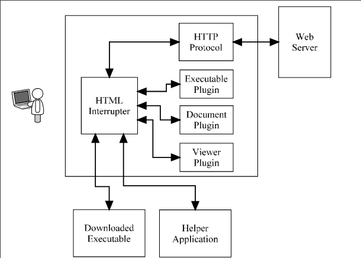
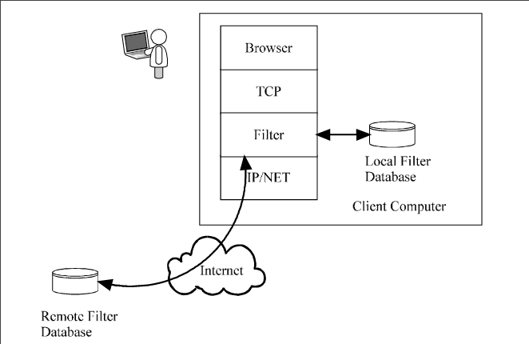
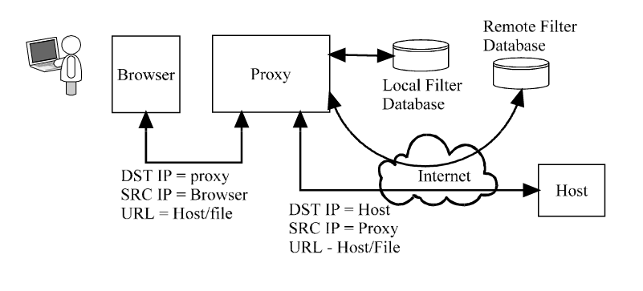
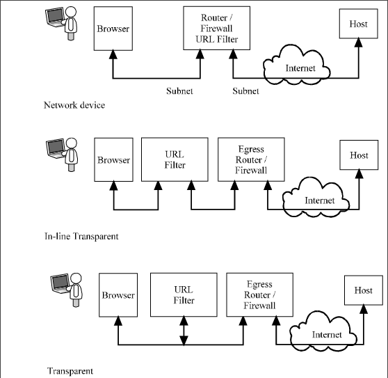
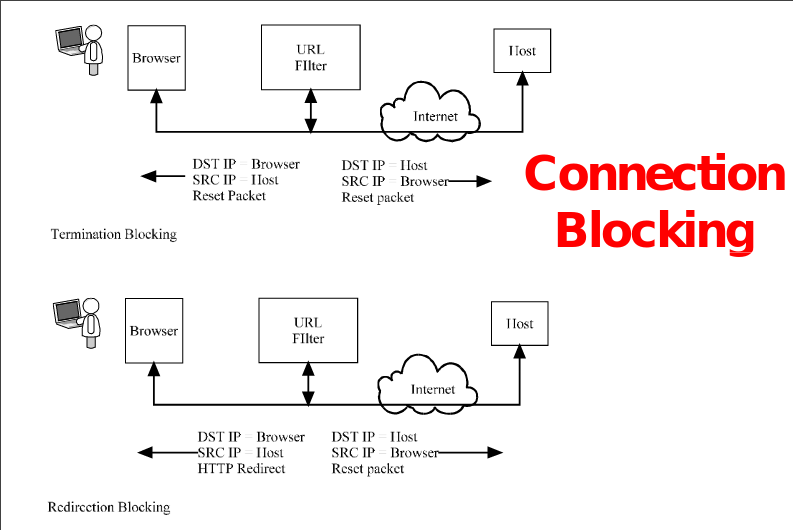
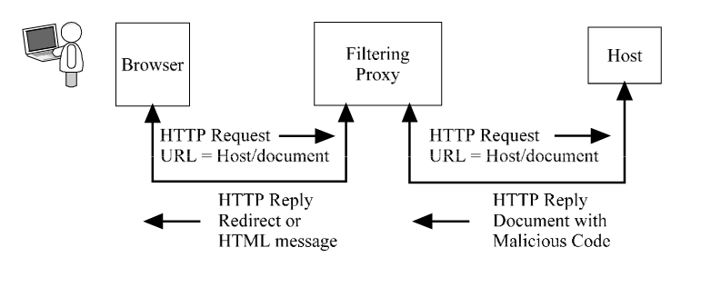

# Client Side Security (WWW)

### Intro
- Cookies are placed on the client
- Executable programs can be downloaded automatically by the browser
    - Java Scripts
    - Active X
- They can send information back to the server

### Cookies
- A file on the users computer in which the website can store data
    - Why cookies?
    - HTTP is stateless protocol, websites like to keep state information on your information and habits
- First implementation of cookies allowed any site to read another website’s cookie
- Now only the site the storied the cookie can look at it
    - Example of Amazon cookie
    - Netscape has one cookie file whereas explorer has a file for each cookie
- Passwords can be in clear text

### Clear Gifs
- One pixel gif
- Hyperlink to another site
- Track documents

### Executables
- Plugins: Applications that are part of the browser to help read different file types
- Scripts: Programs run by the browser often to provide inactive graphics or forms
- Downloads: Programs that are downloaded using the browser

# Attacks

### Header / Protocol
- Non as their is not a header or protocol

### Authentication
- No authentication of applications leads to malicious code
- Client side executables provide a method for attackers to interject code
    - Trojan horses
    - Spyware
    - Key loggers
- Can be coupled with email attacks (using phishing to direct a user to a web side which downloads code)
- Mitigations
    - Client side protection
    - User awareness

### Traffic
- Malicous program could generate a lot of traffic

### General Countermeasures
- Encryption and authentication
- URL Filtering
- Content filtering

### Encrypted Transactions
- SSL
    - Secure Socket Layer
- Broader application than HTTP
- Another layer to the mix, creates a secure layer between HTTP and TCP
- Uses port 443
- Browser is shipped with certificates for support of this service
- Communicates through an encrypted channel

### URL Filtering
- Client side

- Proxy based

- Network Filtering

### Content Filter

- network based
- proxy based

