# Remote Access


### Telnet


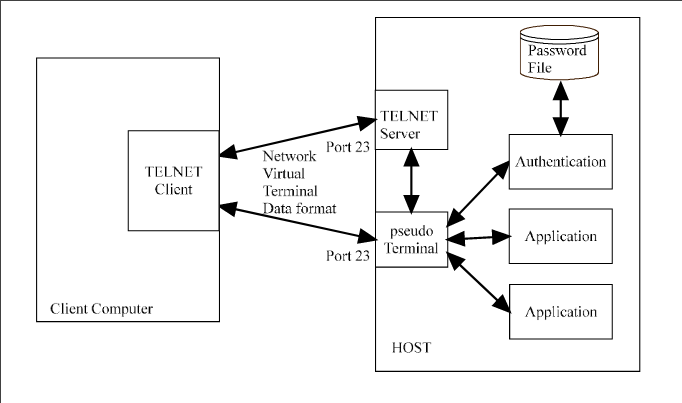

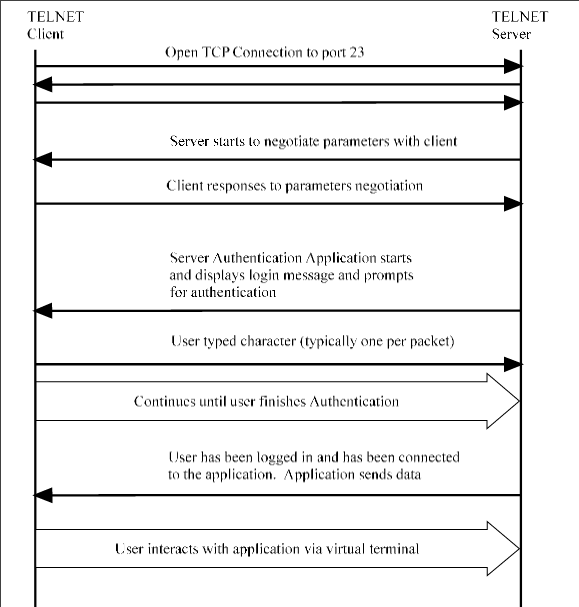

### Rlogin
- Remote login (rlogin)
- Similar to telnet, but much simpler
- Designed for unix to unix communication
- Possible for hosts to login without a password
- Uses port 513
- Sequence:
```
– Client  sends:    \0
                    local login name
                    \0
                    server login name
                    \0
                    terminal type
                    \0

– Server  sends:    \0
```

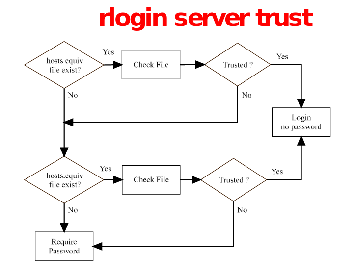


### X Windows
- The user sits on the server side of X windows
- Usually SSH into client and start X window client 
- X windows then starts and the client authenticates  to the X windows server
- X windows sends information in clear text


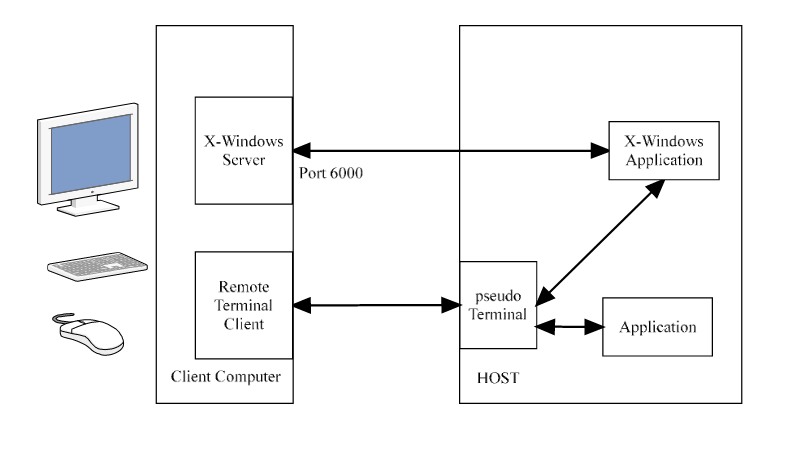


- In order for two programs to communicate in Unix, a pipe is created between the two processes
- Pipe works like it sounds, put data in on one side comes out the other
- Pipe created in the tmp directory
- Port 6000

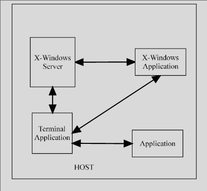

- X windows offers up your computer to the outside world to manipulate
- Pc also has public domain X windows programs
- Xhost determines who can connect to your server
    - Xhost + would allow all to connect to one’s X windows
- X windows is designed to allow applications control over the display

- Client  side
    - How does client know which server to connect to
    - Variable called display
    - :0.0 display means local display
    - The second number is the monitor
    - If remote machine:0.0 which is set on the client
    - Tells X windows  to point  to server

- Authentication?
    - Xhost command, indicates who can connect to one’s server, which is IP address based authentication
    - Xhost + allow all connections
    - Xhost \- allows nobody 
- Command set is designed to allow total control over input and display
    - Through X windows, hackers could
        - Capture screen 
        - Capture  keystrokes
        - Create, destroy windows
        - Enter key strokes into windows


### Attacks


### Header
- For Telnet and rlogin there is not much of a header
- X-Windows there is possible buffer overflow attacks


### Protocol
- Telnet and rlogin have a simple protocol and there is not any attacks 
    - other than telnet can be used to connect to any service (not really a flaw)
- X-Windows has some issues with the protocol 
    - gives the application control over the remote computer


### Authentication 
- Telnet offers access to the remote machine and to the login prompt 
- Rlogin does not need password unless setup correctly.  
    - Uses IP address for authenticator
- X-Windows 
    - server can allow any machine to control it based on the IP address
    - Client uses machine authentication to allow a user to run the application


- Stepping Stone

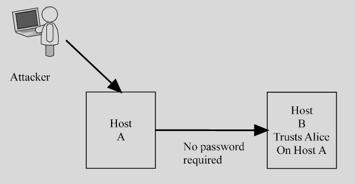


### Traffic Based
- All three are clear text
    - User and Passwd
    - Commands and Output Text


### FTP
- Commonly used files transfer protocol
- Uses a command channel and a data channel
- Command channel is used to control the FTP session and remains open for the entire FTP session.
- The data channel is used to transfer data between the client and the server
- A new data channel connection is opened for each data transfer


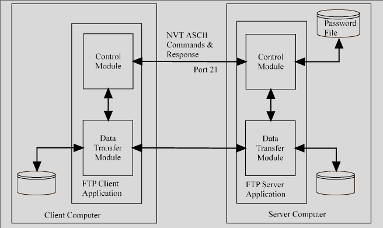

- Commands
- The next slide lists the common FTP commands
- The commands are sent as ASCII text and the responses to the commands are also ASCII


### Exchange


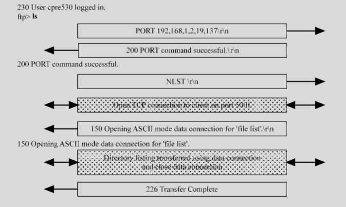


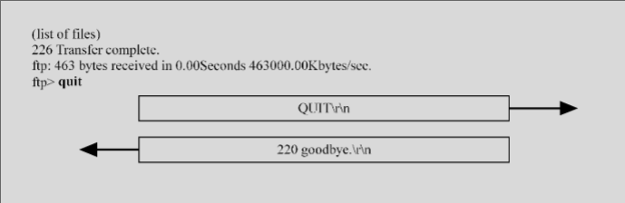


### Anonymous FTP


- ftp spock.dougj.net
- Connected  to  spock.dougj.net.
- 220  spock.dougj.net  FTP server ready.
- User  (spock.dougj.net:(none)):  anonymous
- 331 Guest login ok, type your name as password.
- Password:
- 230 Guest login ok, access restrictions apply.


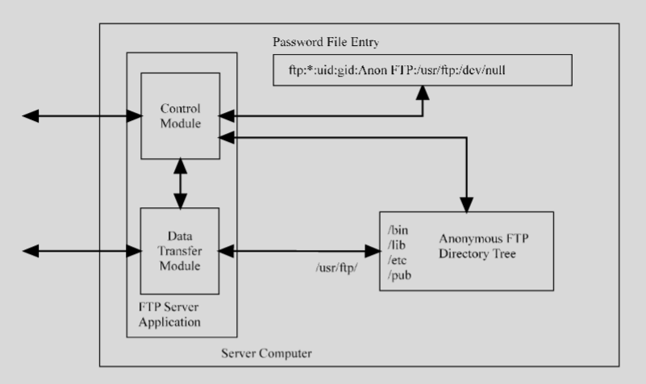


### RCP
- Based on rlogin
- If user is trusted copy will take place
- If user is not trusted copy will not take place.


### Attacks

### Header and Protocol
- FTP has problems with buffer overflows
- Not many protocol attacks
    - One is an FTP redirect attack
    - Done by telneting to an FTP server that has exploit  code.
    - Use ftp to transfer the code to another server


### Redirect
- telnet  klingon.iseage.org  21
- 220  klingon.iseage.org  FTP  server  ready.
- user  anonymous
- 331 Guest login ok, type your name as password.
- pass  doug
- 230 Guest login ok, access restrictions apply.
- port  192,168,1,40,0,25
- 200  PORT  command  successful.
- retr m1
- 150 Opening ASCII mode data connection for 'm1' (84 bytes).
- 226  Transfer  complete.
- Quit


### Authentication
- FTP Prompts for username  and password
- Anonymous  FTP  with  writable  directories
- User based FTP server


### Traffic
- Clear text
- FTP can be flooded
    - Large uploads and downloads


### Countermeasures
- Encrypted remote access
    - Application-based
    - Tunnel-based
    - SSH
    - Remote  desktop
    - Secure File transfer


- App Based Enc


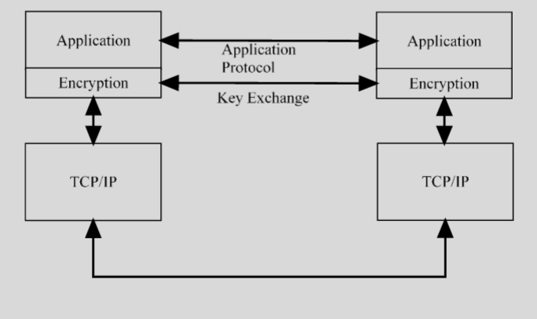


- Tunnel Based Enc


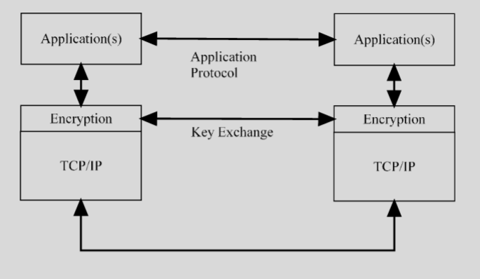


### SSH
- SSH
    - Secure  shell
    - Designed to replace rlogin, rsh, rcp
    - Provides 
        - Authentication at the machine level, doesn’t care about user authentication
        - Secure communication through encryption

- Strong  Authentication
- Public  domain  software
- Some versions support  compression of data
- Privacy
    - Key negotiation with symmetric key
    - Key exchange based on no trust of network
    - Multiple keys to deal with replay attacks
- Can provide secure X11 sessions
- Encrypt any traffic with SSH
- Same parameters as rlogin
- If other side doesn’t support SSH drops to rlogin
- Need server and client software
- Sshd server demon software
- Ssh is the client software
- Ssh keygen
    - Generates  host key
- Ssh agent 
    - Uses public and private key technique to get process started

- Client  sends query
- Server sends two public keys which is a 1024 bit client key and a server key which is a 768 bit key
- Server key recomputed  every hour
- Client generates 256 bit random number which is the symmetric key, which is encrypted using the server and the host keys
- Server responds with ok which is encrypted with session  key
- All traffic is now encrypted with session key
- Problems
    - Man in the middle attack
    - Putty is a man in the middle attack program


### SSH MitM

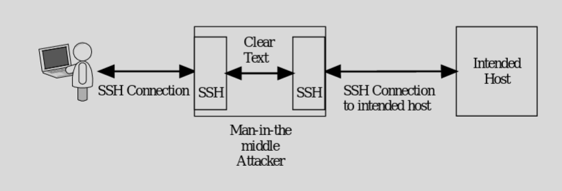


### Remote Desktop

- Uses tunnel-based encryption
- Via RDP or TLS (newer versions)
- Key exchange is similar to SSH
- Three levels
    - High (128 bit)
    - Medium (56 or 40 bit)
    - Low (56 or 40) only client to server data
- Subject to password guessing and man in the middle attacks


### Secure File Transfer
- SFTP: uses SSH
- FTPS: uses SSL/TLS
- HTTPS: uses SSL/TLS


