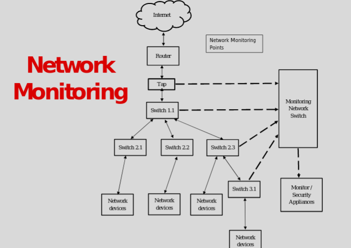
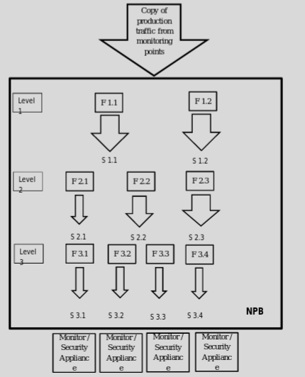
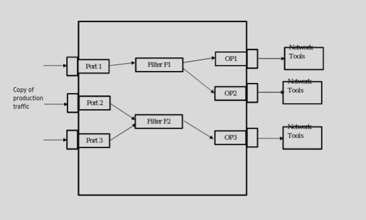
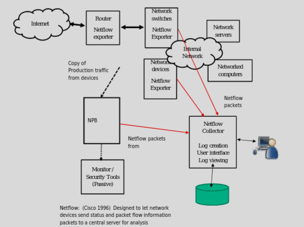

# Network Monitoring

### Points of Monitoring

### Network Packet Broker
- Cloning of traffic to send to monitoring points
- Based on header filtering rules
- Send to IDPS
- FPGA
- PAtch panel
- Inline or from a Tap

### Inline NPB
- Can order the way traffic goes through devices
    - Like Firewall, DLP, IPS
- Could in theory be different for certain headers
- Easily reprogrammed

### Netflow
- Information about network traffic based on the flow
    - Interface (input and output)
    - SRC & DST IP
    - Protocol
    - SRC & DST port (if UDP or TCP)
    - Type of service
    - Start and end of flow
    - Number of packets
- Statistics 

