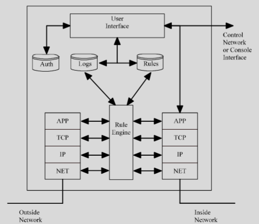
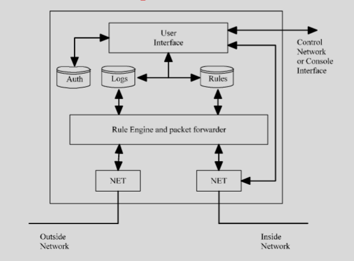
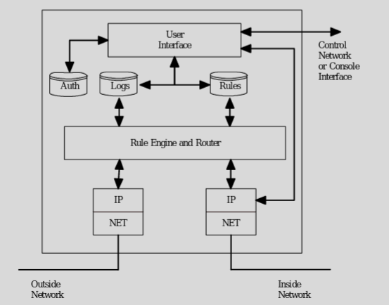
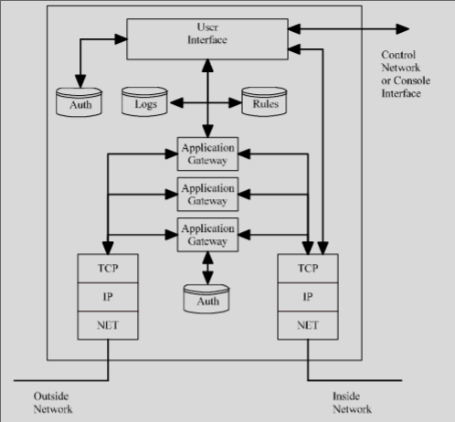
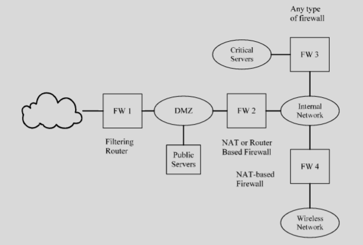
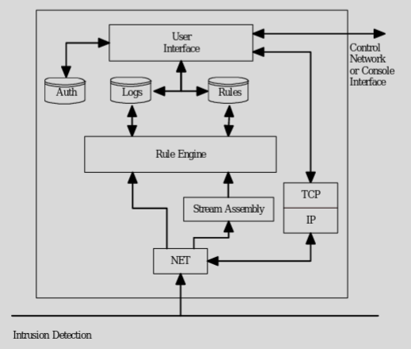
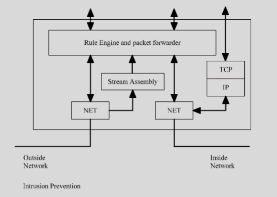
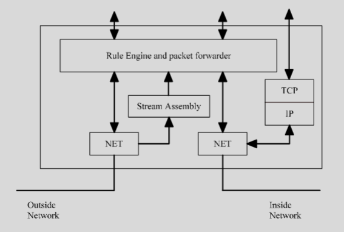

# Network-Based Mitigations

### Network Firewalls
- Designed to “look” at each packet on the network 
    - decide if the packet should be allowed to pass through the firewall or not
- Uses set of rules to decide if the packet should be blocked
- Rules are typically based on the packet headers (IP & TCP)
- Public domain versions are available

### Firewall Rules
- Stateless
    - Each  packet  is  independent
    - Very fast and  simple to implement
    - Only  simple  rules
    - Example: block all UDP but port 53
- Stateful
    - Deals  with  packet  streams
    - Slower  and  requires  more  resources
    - Can  implement  complex  rules
    - Example: Block all port 53 unless there is a pending  request.

### User Control
- GUI on the device
- Network based
    – Typically  password  protected
    – Only  allows  access  to  control  interface from  inside  network
    – Can  use a separate control network

### Firewall Types
- Transparent

- Two network interfaces
- “sniff” traffic
- Does not have an IP layer for the packet flow
- No need to change network configuration
- Can be implemented as a single port firewall
- Typically simple rule set (mostly stateless)

- Router-based

- Acts like a normal router
- Both stateless and stateful (with simple rules)
- Often some stateless firewall functionality included in most routers

- NAT-based
- Implemented as part of a NAT
- Firewall rules can restrict traffic even more than a normal NAT

- Application

- Uses application gateways to allow a user to gain access through the network
- Application gateways look like an application 
    - Typically require user-based authentication to gain access through the firewall
- Also typically supports NAT functionality for applications without a gateway

### Firewall Deployment

- DMZ
- Used  to support  public  servers

### Intrusion Detection and Prevention
- IDS
    - Watches the network traffic looking for traffic patterns that could be an attack

- IPS
    - Same as an IDS, but will also block traffic based on rules

### IDS/IPS Rules
- Correctly identify the attack
- False Positives
    - Identifying an attack that is not there
- False Negative
    - Missing  an  attack
- Balance between the false positive and false negative rate is difficult
- Large log files are hard to deal with

### Deployment

### Data Loss Prevention
- Stop data from leaving an organization
- Like an IDS/IPS except it looks at the payload
- Two data types
    - Structured: data that can be matched to a list like credit card numbers
    - Unstructured:  data  like  letters  or  memos

- Structured data
    - Pattern  matching
- Unstructured
    - Fingerprinting
    - Lexical  analysis

- What to do when you find data leaving
    - Block
    - Log
    - Redirect or quarantine

### Single Port DLP

### Multi Port DLP

