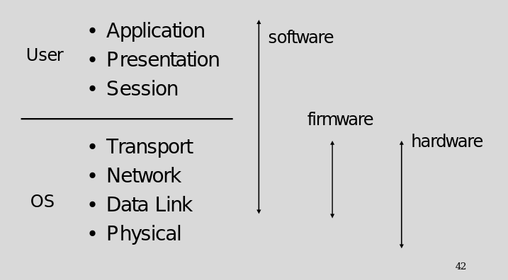
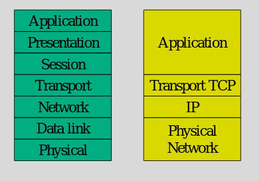
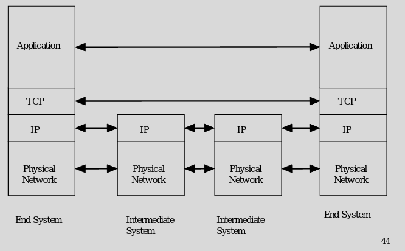
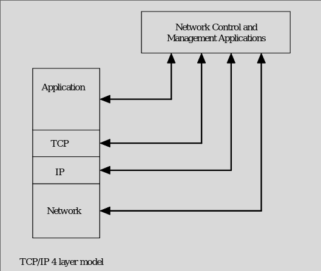

### Layers By Hardware and Software

- Software layers is the biggest attack surface
    - Modifiable and can be used to trick users
- Firmware unlikely/harder to be modified 
    - OS would need to be able to modify it and attack has root privileges 
- Can't remotely modify hardware
    - Use custom hardware in wireless space to distrupt/attack systems  

### TCP/IP vs OSI 

- OSI model has been pretty much done out for the TCP/IP model
- Only really used as a reference model

### Networking with TCP/IP

- Much simpler than OSI
- Intermediary nodes only uses certain levels of the stack
    - I think switches only implement bottom layers
- App layer - App to App talking
- TCP layer - end to end comms
- IP layer - routing between each nodes
- Physical - sending over wire / MAC addressing

### Nonlayered Networking

- Not showing the management of this
    - Devices on internet / network have management apps as well
    - Implement full stack

- Intermediate devices have additional functionality for remote management
    - My managed switch does this as I can manage and control it from ssh/https
    - There functionality when transferring to other devices is only lower layers 
    - To themselves, they can see and implement all layers as well

- OS can pull information from all layers
- We can see information on all layers without having to go through them

