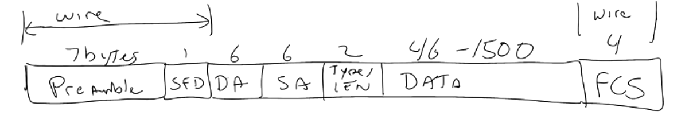

### Ethernet Frames

- Preamble
    - Saying we're here
    - Tells reciever the frame is coming
- SFD / Start of Frame Delimeter
    - Always 10101011
    - Signals end of preamble and start of frame
- DA and SA
    - Machine Address 
    - Vendor code and Unique Device code
    - All 1's is broadcast
- Type / Len
    - IEEE Lengths of the code
        - if under 0x800 length
    - Types of hardware packet
        - if over 0x800 value
        - 0x800 is IP
        - 0x806 is ARP
- FCS / Frame Check Sequence
    - 4 byte CRC code
    - Generated on the fly for the data
    - Uses DA to Data segments

### Header Based Attacks
- Change the Addresses
    - Broadcast attack
- Confuse switches by changing SA
    - Convince switch you are multiple parties 
    - Send you data

### Other Attacks
- Use attacks to attack upper layers
    - Not really attacking the layer itself
- Phsyical attacks 
    - Adding bad devices
    - Spamming
    - Spying

### Authentication
- Some switchs are programmed to only allow one address per port
- Spoof devices address and gain access to that port
- Network access control
- Changing address breaks authentication
- ARP is used to associate IP to MAC address
    - Attack sends ARP packet to say I am the owner of the IP not actual owner
    - ARP poisoning
- Promiscuous mode
    - Slurp up regardless of address
- Don't encrypt at ethernet layer

