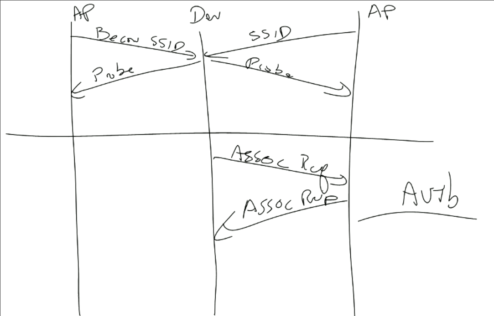

### Wireless Coverage
- Upstairs is worse than outside
- Neighbor has better access
- Building have faraday cage to prevent people from accessing AP

### Protocol
- IBSS 
    - Independent Basic Service Set
    - Ad-hoc / No one in charge
- Extended Service Set
    - Wireless world needs to connect wired 
    - Access point gives us that access
    - Wireless plus wired is one network
    - Share IP addresses
- Now generally in separate networks
    - Or router to switch to many APs
    - Bottleneck is wireless comms jamming each other
    - Bottleneck is other people
    - Easy to fail

### Diagram 

- APs boadcast/beacon SSID
    - Or probe who exist and get response
- Associate Request
    - Then Response
    - Can have user auth in the request
    - PSK or EAP
- Can not broadcast/beacon
- Can bypass and know it exists 

### CSMA / CA
- Can tell when we succeed
- Expect response
    - If we don't get a response then fails
- Much bigger punishment for a collision

- If quiet for 5 packet times then talk, else wait random packet times
    - repeat
- Doug did not say but I believe before we talk, we send out a message saying we are going to 
    - This gets everyone to do a random backoff and then we can talk

