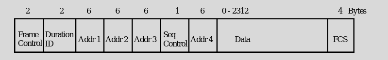
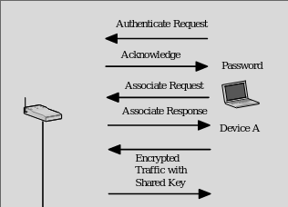
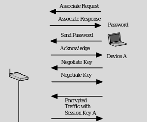
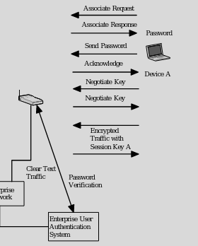

### Wireless

### inSSIDer
- Shows wireless configurations
- Look it up 

### 802.11 Wireless Frames

- Frame Control == type of the frame
- Duration/ID == manage access control protocol
- Address 1 == Destination of the packet
- Addr 2 == transmitting device
- 1 & 2 are for the wireless side 
- 3 & 4 are for the wired side
- Addr 3 == AP is part of extended network (where to relay the traffic)
- Addr 4 == (Probably source on wired side)
- Seq Ctrl == acknowledgement
- Data == Data (2312 bytes)
- FCS == what the FCS is in ethernet

### Header Based Attack
- Can broadcast to wired network if just AP
- Invalid header can force to drop association

### Protocol Based Attack
- In hardware
- Transmit packets to cause denial of service
- Jamming signals (smart or stupid)
    - Smart == disassociate packet to kick others off
    - Force disassociate to have user renegotiate key
- Hard to stop
- Accesspoint can broadcast its SSID
    - Wardriving

### Wardriving
- Is it much of an issue if they are encrypted?
- Could not broadcast SSID
    - I think you could still find them 
- Or use netowrk access control
- More should lockdown router and not care about SSID

### SSID discovery
- Really a privacy concern
- Find out business name or your last name
- Name of SSID shouldn't give out info on yourself

### Authentication Based
- You set the hardware address
    - used as authentication for AP
- Device Auth
    - Authenicate the User (WPA does this)
    - Correct AP / Wireless Router
    - Exposed control point to manage device
- AP authentication
    - Rouge AP
        - Valid user puts AP on wired network
        - Bypassing security mechanisms
        - Hard to find (same SSID)
        - NAC could stop this
        - Wired network can find it
    - Fake AP
        - An attacker puts up AP not on the network
        - Hard to fake within org
        - Easier to be done on public APs 
        - Gets you untargetted MitM

### Wireless pineapple
- Rouge/Fake AP
- Can answer to all AP requests
    - Will pretend to be Iastate/Eduroam ...

### AP Config Auth
- Configured over the network
- Default passwords 
- Attack can gain access and modify settings

### Traffic Based
- Open access points can have traffic sniffed
    - Promiscous mode
    - See all information
- Flood AP by broadcasting traffic 

### Wired Equivalent Privacy
- PSK (encryption key, not auth)
    - 40 bits
    - 128 bits
- Easy as hell to crack
- Aircrack will find WEP key

### WiFi Protected Access
- 802.1X and can use EAP
    - Auth with auth server
- Encryption
    - RC4
    - AES (WPA2)

### WPA2 (Home)
- Shared password for authenication
- If keys match then encryption keys exchanged
- New keys for each new association
- Access point does authentication

### WPA2 (Enterprise)
- Associate with AP
- Authenticate to authentication backend server
- Auth server distributes keys to AP and your device

### WPA3
- Method called SAE
- Gen Key to associate securely
- Then, associate and gen key
- Now can't deassociate

### Misc 
- Device authentication 
    - QR code scanning for a device to associate 

