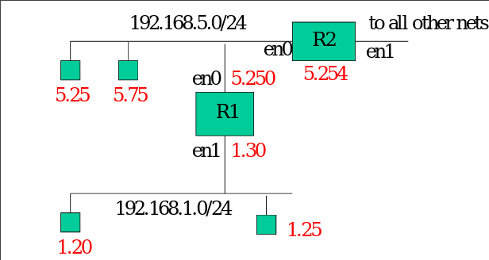
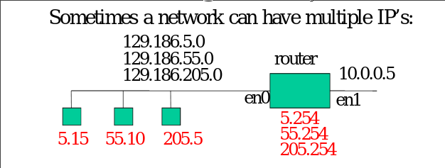
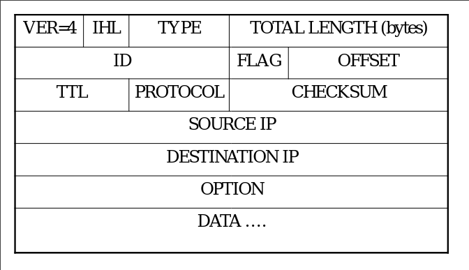
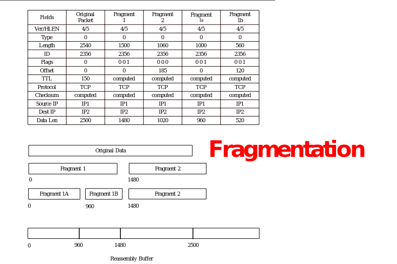
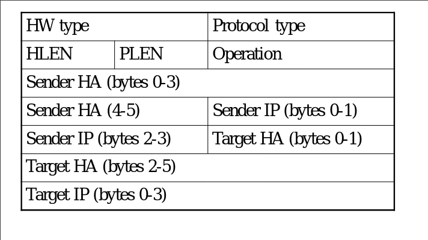
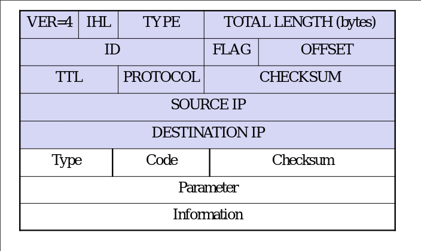

### More Routing Examples

- Devices on 129.186.5.0/24
    - Need three 
    - Self is 129.186.5.0/24
    - R1 is 192.168.1.0/24
    - default R2

- Multiple IP Addresses
    - Devices in network with 3 addresses
    - ...5.15 has:
        - Self is 5.0/24
        - Self is 55.0/24
        - Self is 205.0/24
        - Defualt is R1

### IP Packets

- IHL: header length in words
- Type of service: almost always 0
- Total length (bytes) includes header length
    - Max packet size = 65536 bytes
- ID: used in fragmentation
- Flag: 3 bits
    - 0: not used
    - D=1: don’t fragment
    - M=:1 more data
    - M=0: last packet of fragment
- Offset: #8 bytes
    - For rebuilding fragmentation
- TTL (time to live): 
    - Max value 255, decrements after each hop
- Checksum: 
    - Worse coverage than ethernet
    - worthless because it must be recalculated after every router due to the TTL decrement

### Protocol Field 
- 1 == ICMP
- 6 == TCP
- 17 == UDP

### Fragmentation

- Other example
    - Break data into 3 packets
    - Packet 1 
        - flags: m = 1
        - offset: 0
    - Packet 2 
        - flags: m = 1
        - offset: data 1 len / 8
    - Packet 3 
        - flags: m = 0
        - offset: data 1 len / 8 + data 2 len / 8

### ARP
- Broadcast IP looking for HW address
- Get unicast answer from who owns IP address
- Reverse ARP
    - Broadcast to get your IP
    - Know HW but not your IP
    - Replaced by DHCP

- Hardware type 
    - 1 = Ethernet
- Protocol Type 
    - 0x800 = IP
- HLEN = 6
- PLEN = 4
- Operation
    – 1 = ARP Request
    – 2 = ARP Response
    – 3 = RARP Request
    – 4 = RARP Reply

### ICMP
- Encapsulated in IP
    - Protocol == 1
- Used by IP 
    - Errors and Status

- Fields:
    – Type (8 bits): message type
    – Code (8 bits): message sub-type
    – Checksum (16 bits)
    – Parameter (32 bits)
    – Information (variable)

### ICMP Echo (Ping)
- Type = 8 (echo)
- Type = 0 (reply)
- Code = 0
- Parameter
    – ID number (2 bytes)
    – Sequence number (2 bytes)
- Optional Data
    - The optional data field has been used in the past for tunneling info through a firewall

### ICMP Dest Unreachable
- Type = 3
- Code:
    – 0 Network Unreachable
        - Could be used by recon 
    – 1 Host Unreachable
        - Maybe respond 
    – 2 Protocol Unreachable
        - Maybe respond
    – 3 Port Unreachable
        - Don't respond
    – 4 Fragmentation needed and DF set 
        - Should respond
    – 5 Source Route Failed
        - Not used
- Parameter = 0
- Data = IP header + first 8 bytes of datagram

### ICMP Source Quench
- Meant for flow control but not commonly used anymore
    - Generally TCP does the flow control
- Type = 4
- Code = 0
- Parameter = 0
- Data = IP header + first 8 bytes of datagram
- Sent when a packet arrives too quickly for a host to process. 
    - The packet is discarded.
- A host receiving a source quench message will slow down its rate of transmission 
    - until it no longer receives source quench messages. 
    - Then it will slowly increase its rate as long as no more source quench messages are received.

### ICMP Redirect
- Used to inform of a better route 
- Type = 5
- Code:
    – 0 Redirect for the NET
    – 1 Redirect for the Host
    – 2 Redirect for type of service and net
    – 3 Redirect for type of service and host
- Parameter = gateway IP address
- Data = IP header + first 8 bytes of datagram
- Sent when a gateway detects a host using a non-optimum route
    - Original packet is not dropped
- If the host does not update its route table and continues using the non-optimum route
    - an ICMP redirect storm can occur

### ICMP Time Exceeded
- Type = 11
- Code:
    – 0 TTL (time to live) count exceeded
    – 1 Fragment reassembly time exceeded
- Parameter = 0
- Data = IP header + first 8 bytes of datagram
- Traceroute 
    - Sets first packet TTL to 1 then 2 and so on
    - Get response from routers 

### ICMP Parameter Problem
- Type = 12
- Code = 0
- Parameter (8 bits) = pointer to error
- Data = IP header + first 8 bytes of datagram
- Sent when a gateway or host finds a problem with the IP header. 
- The pointer identifies the octed in the header that caused the problem

### ICMP Timestamp
- Type = 13 (echo)
- Type = 14 (reply)
- Code = 0
- Parameter:
    – ID number (2 bytes)
    – Sequence number (2 bytes)
- Originate timestamp
- Receive timestamp (reply only)
- Transmit timestamp (reply only)

