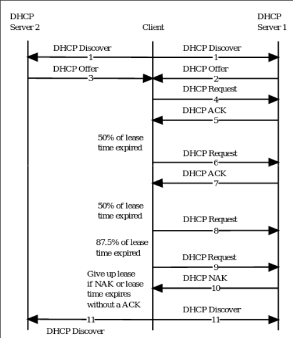
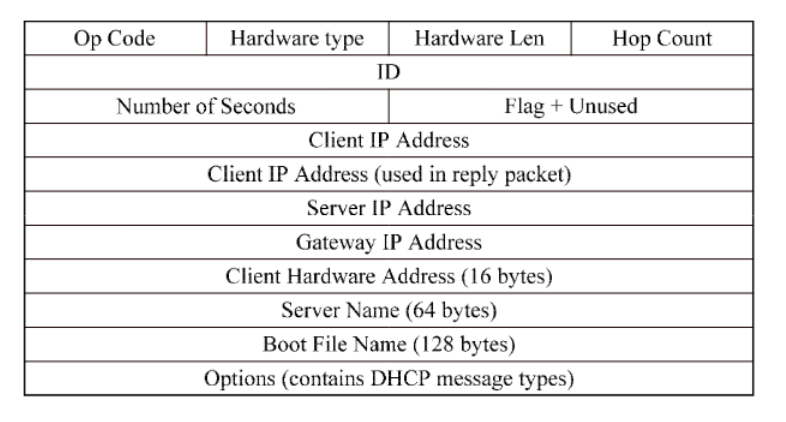

### BOOTP
- Bootstrap protocol
- Network machine can auto get IP
- Client/Server 
- Server maps (1:1) hw addr to IP 
- Printers and diskless machines
- Provides:
    - IP address
    - Subnet mask
    - IP of router
    - IP of dns server
- Client broadcasts requests
- Server trusts hw address in request
    - Can't use arp

### DHCP
- Enhancement of BOOTP
- UDP packets
- Static Pool 
    - Same as BOOTP
- Dynamic Pool
    - Temporary leases IPs 
    - After expires, client renews
    - if rejected, client (should) give up IP

- Discover only done 5 times
    - Broadcast
    - Rest is all unicast
- Takes longest offer
- Sends request and should get ACK
- At 50% time, request again
    - ACK means you reset time
    - Nothing means you continue with lease
- Try again at 87.5%
    - NAK or lease times end 
    - Gives up IP
    - ACK would reset
- Trusting client to act as it should
    - giving up IP when told to

### DHCP Packet

- Built on top of UDP packet
- So HW + IP + UDP + DHCP

### DHCP Relay
- In router
- Client broadcast
- Router catches and sends request to DHCP server
    - Unicast
- DCHP responds to router
- Router to client
- Uses DHCP packet info to know which network it is part of
    - I believe router changes it to be for network the client is on

### DHCP and NAC
- DHCP gives you IP in sandboxed VLAN
- Limits your access
- Have to give up lease to get once requested
    - Short lease
    - Reboot

### Header Attacks
- Nada
- Simple

### Protocol / Auth Attack
- BOOTP is simple
- DHCP is complex
    - Both could respond to client and give false information
    - Make your device the router
    - Make devices unroutable
    - Rouge server and MitM
- DHCP only
    - Could reserver all addresses
    - Fake release packets 
        - Clients forced to give up IP
- Switches can protect against rouge DHCP 
    - Find and block DHCP offers/acks
    - Would have to be reading application data
    - Smart switch
    - Hard/Impossible? on wireless network

### Traffic Attacks
- Sniff doesn't matter as information is public
- Protocol is slow so flooding doesn't really work
    - This is using the protocol

