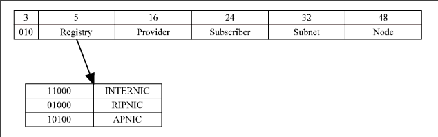

# IP Version 6

### But Why Would We Need A New IP
- IPv4 had 32 bit addresses 
    - We were running out until NAT
- Real time traffic (video streaming)
- Security with IPv4

### Larger Addresses
- Header format 
    - separates state information from dynamic routing info to simplify router actions
- New Options
- QoS
- Security Features

### Address Space
- IPv6 has 128 bit addresses
    - 16 bytes
- 4 hex digits separated by colon
    - 1234:1234: ....
    - Abbreviate by removing leading zeros
        - :00F0: == :F0:
- CIDR rules supported

### Addresses
- Types
    - Unicast: A => B
    - Anycast: same first part; subnet broadcast
    - Multicast
- Format of Address
    - Type Prefix | Address
- Prefixes
    - 010 = Provider based Unicast
    - 100 = Geographic Unicast
    - 1111 1110 10 = Link Local– 1111 1110 10 = Link Local
    - 1111 1110 11 = Site Local
    - 1111 1111 = Multicast
    - 0000 010 = IPX
    - 0000 001 = NSAP

### Provider Based Unicast

- A = 8 bits = 010 + Registry
- B = variable (16 bits recommended) = Provider
- C = 24 bits = Subscriber
- D = variable (32 bits recommended) = Subnet
- E = variable (48 bits recommended) = Node
    - If Ethernet, Ethernet MAC address recommended

- Simplifies routing on the provider (ISP) side
    - Fixed parts of address
    - Not having to manage numerous subnets and NATs

### Reserved Address
- Start with 0000:0000
- Unspecified == :: (all zeros)
- Loopback == ::1 (just last is 1)
- IPv4
    - 0000 0000 | 88 0’s | 32 bit IPv4 Address

### Local Addresses
- Start with: 1111:1110
- Link local 
    - 10 | 70 0’s | 48 bit node address
- Site local 
    - 11 | 38 0’s | 32 bit subnet | 48 bit node |

### Multicast
- Starts with: 1111 1111
- 4 bits = flag
- 4 bits = scope (node local, link local, site local, organization, globalsite local, organization, global
- 112 bits = Group ID

