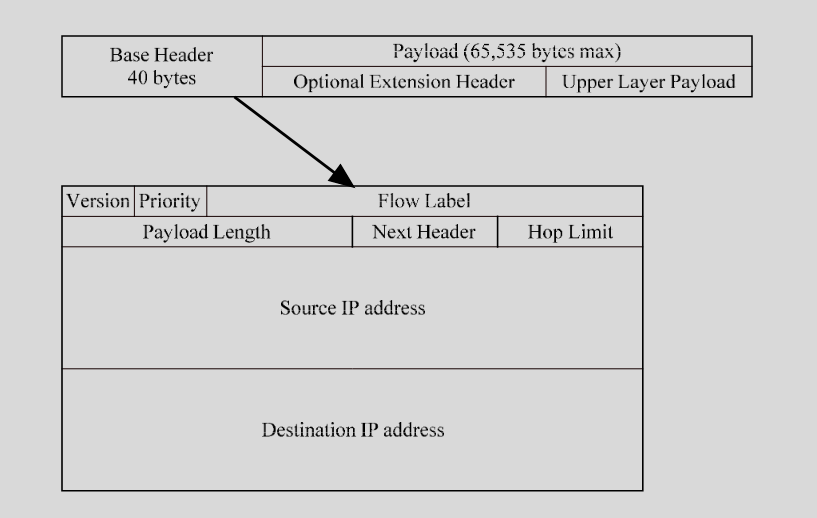
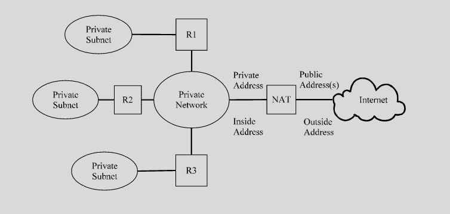
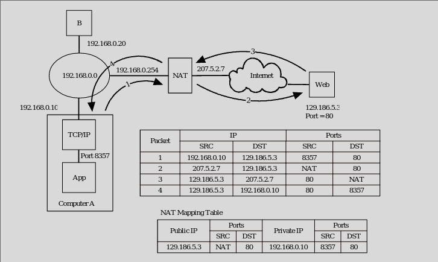
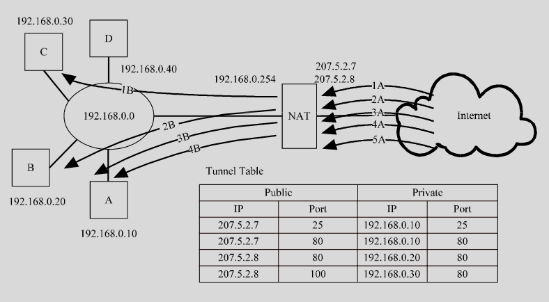
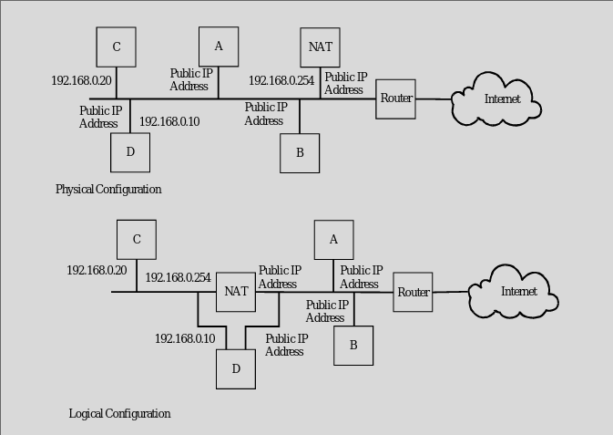

### IPv6 Header

### Optional header 
- For more than what Ipv6 can do
- Called HDR by Doug
    - 2 / icmp
    - 7 / TCP
    - 17 / UDP
    - 44 / Frag
    - Enc
    - Auth
    - 53 / None
- Next Header for stacking
    - Only enc/auth kind of packets

### Priority
- 8 bit field
- 0 through 7 for congestion control
    - Delays are Okay
    - Not real time
- 8 through 15 for priority (noncongestion)
    - Ranked by redundancy
    - Can lose in 8
    - 15 can't really lose
- Higher priority goes first

### Flow Label
- shorter unique identifier for routing
- ipv6 needs DA, DP, SA, SP
- Creates cache with this ID and SA
- Quick compares to reading ips 

### Changes
- No checksum / meaningless
- No support in header for fragmentation by default

### ICMP
- Error and Reporting
- Most errors exist and reporting gone
- Error
    - Dest Unreachable
    - Packet Too Big (new)
    - Time exceeded
    - Parameter problem
    - Redirect
- Reporting
    - Echo
    - Router solicitation
    - Neighbor sol. 
        - Old arp (NDP)
    - Group membership (multicasting)
- Reporting (gone)
    - Timestamp
    - Addr Mask

### IP mitigation
- IPv4 has retroactively implement security features of ipv6

### IP Filtering
- IP address
- Inbound filter on src IP
    - Deny list
    - Spend money for IP threat intelligence
    - Starting to see attackers is in cloud and src addr are cloud IPs
        - Can't block
    - Moving and change IPs
- Outbound filter on src IP
    - Matches our internal IP
- Reserved
    - Things that shouldn't be routable
    - Aren't allowed out for src or dst
- Port numbers
    - Allow certain dst ip out for a port
    - Allow certain src ip in for a port
- Protocols (TCP/UDP)

### Network Address Translation

- Give more internal ips for small block
- A and B
    - A is private
    - B is public
    - A sees nothing different 
        - Src is private and dst is public
    - B sees NAT ip as src 
- Layered
    - NAT behind NAT
    - Outbound easy
    - Inbound harder

### Private IP addresses
- 10.0.0.0/8 
    - Class A network
- 172.16/12 
    - 16 class B networks
- 192.168/16
    - Class B Network

### NAT
- Static 
    - One to one mapping of external addresses
    - Not very useful?
- More common
    - 1 public IP
    - N devices
    - DHCP 
    - Just outbound access
    - Tunnels or static NAT combo for inbound traffic
    - Creates a big old table 

### Port Mapping

- Outbound traffic is kept in table mapping ports
- Changes and maps available port to port of internal device
- Web just communicates with NAT IP and port
    - NAT Translates to internal IP and port
    - Tracks requested server port and IP that needs to communicate

### Public Servers
- Needs a public IP
- Two networks
- Tunneling

### Pass by NAT

