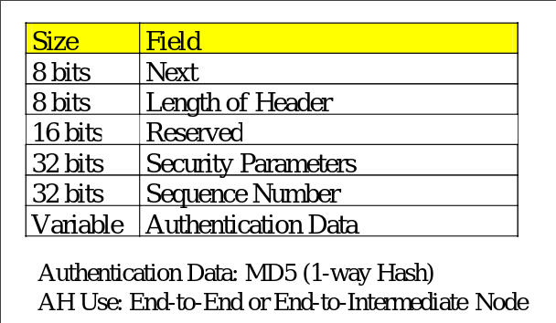
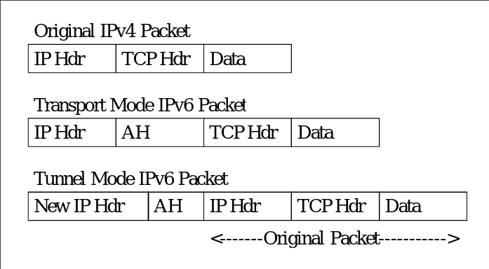
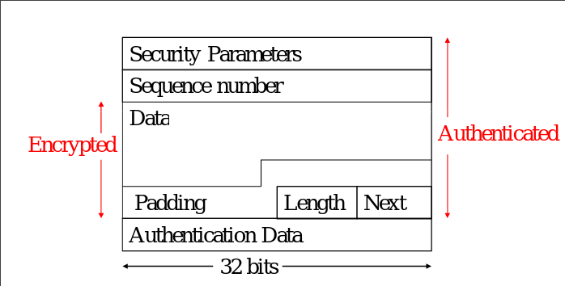

### More IP Mitigation Techniques

### Virtual Private Networks
- Encrypted tunnel between devices
- Authentication
- Protocols
    - SSH
    - IPSEC
    - OpenVPN
    - Proprietary aka cisco

### Network to Network
- Only when talking to target network
    - Acts normally if not sending packets to the other network
- Always routes through the VPN
    - All traffic from main network is sent to remote first
    - Goes through VPN

### Client to Client
- P2P
- Basically just connection to another device
- SSH

### Client to Network
- Client connects to VPN server 
- Client auth with server
- Essentially adds client to network
- All traffic through VPN
- OR Only when talking to the network

# IPSEC

### Purpose
- Authentication
    - Sender and reciever
    - Can't spoof
- Encryption
    - Privacy and Secrecy
- Not E2E

### Modes
- AH == Authentication Header
    - Used much
- ESP == Encapsulated Security Payload
- Not in IPSEC
    - Encryption Algs
    - Key management
    - Domain of interpretation

### AH

### ESP
- Security Parameters: help identify the encryption algorithm (eg: DES, blowfish)
- Sequence number: an ever increasing number used for replay
- Authentication data: a hash of everything, proves non-alteration
- Data, Padding, Length, and Next fields are all encrypted

- Tunnel and Transport modes
- Tunnel is E2E 
- Tunnel mode is VPN 
    - Assigns another IP address to the device
    - Connect to others from/to that IP

