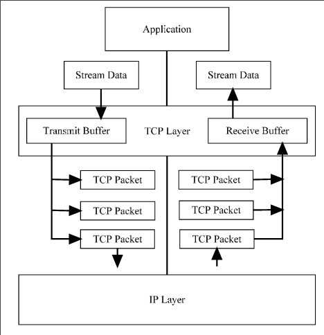

# TCP

### Service 
- Reliable end to end connection for app layer
- Even over unreliable IP layer
- Buffering and ordering
- Multiplexing
    - Process within a host uses a port 
    - Port plus IP addr is a socket
        - Unique
    - Connection between sockets

### Connection Management
- Establishment
    - Setup a connection
    - Only one connection for a pair of sockets
    - Can have multiple different sockets to the same socket
    - Both agree
- Maintenance
    - Exchange of data
    - Support data transport
    - Keep connection established
- Termination 
    - Abrupt or graceful
    - data lose vs waiting for all data to be recieved

### Data Transport 
- Full duplex
- Timely
- Ordered
- Labeled
- Flow and error control 

### TCP Stream
- Treat recieving of data from TCP as stream of data
- Breaks up into packets
- Sends, recieves and reorders packets
- Puts data packet into stream of data

