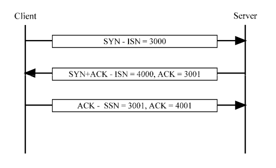
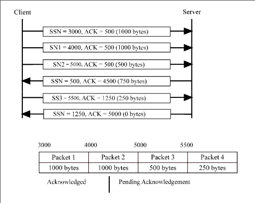
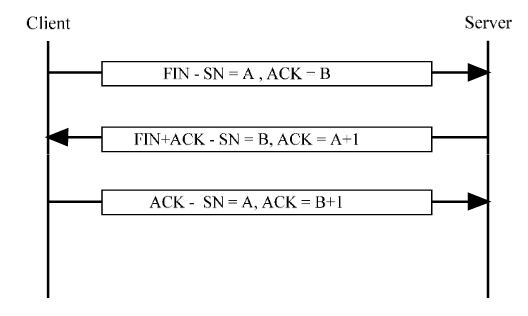
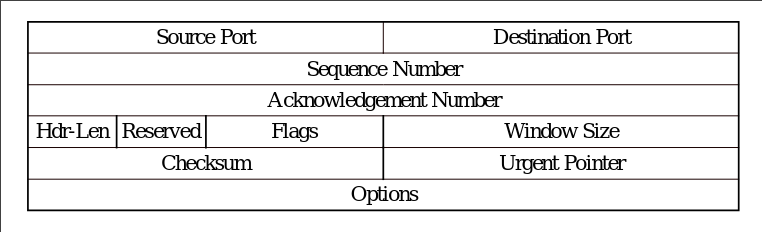
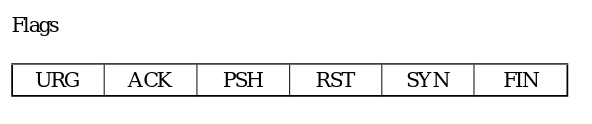

# TCP

### Service 
- Reliable end to end connection for app layer
- Even over unreliable IP layer
- Buffering and ordering
- Multiplexing
    - Process within a host uses a port 
    - Port plus IP addr is a socket
        - Unique
    - Connection between sockets

### Connection Management
- Establishment
    - Setup a connection
    - Only one connection for a pair of sockets
    - Can have multiple different sockets to the same socket
    - Both agree
- Maintenance
    - Exchange of data
    - Support data transport
    - Keep connection established
- Termination 
    - Abrupt or graceful
    - data lose vs waiting for all data to be recieved

### Data Transport 
- Full duplex
- Timely
- Ordered
- Labeled
- Flow and error control 

### TCP Stream
- Treat recieving of data from TCP as stream of data
- Breaks up into packets
- Sends, recieves and reorders packets
- Puts data packet into stream of data

### Special TCP
- Data Stream Push
    - Used to force the delivery of all data waiting to be sent
- Urgent Data Signaling
    - Provides a means of informing the destination TCP user that urgent data is in the incoming data stream
- Error Reporting
    - TCP will report service failure stemming from catastrophic conditions

### TCP Handshake

- Send different seq numbers

### Data Transfer
- Seq number is the number of bytes
- Flow control by credit allocation 
    - Set window size (how much data sent)
    - Can only send WS data unacknowledged by recv
    - Have to wait for data to be acked to send more 

### Connection Termination

- A is how much I have sent
- B is how much you have sent

- Abrupt termintation
    - RST Flag
    - SN and Ack number

### Header Format 

- 32 bits across
- Flags are 6 bits

- Flag Functions
    - URG / Packet contains urgent data
    - ACK / Acknowledgment number is valid
    - PSH / Data should be pushed to the application
    - RST / Reset Packet
    - SYN / Synchronize packet
    - FIN / Finish packet

