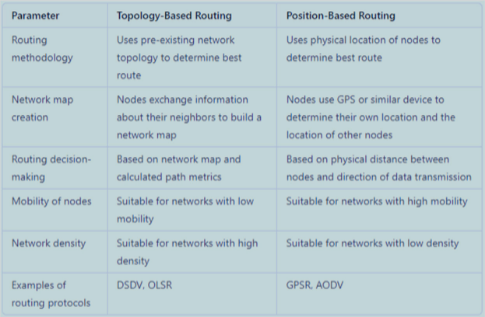

# MANET V2X

### Mobile Ad Hoc Networks
- A collection of wireless mobile hosts forming a temporary network without the aid of any established infrastructure.
- Significant Features
    - Starred
        - Dynamic topology
        - Auto‐configuration and reconfiguration
        - Multi‐hop routing
        - No administrator or server
        - Peer‐to‐peer
        - All nodes are routers (cooperation is needed)
    - Not Starred 
        - No fixed infrastructure
        - Mobile hosts
        - Short transmission ranges

### Change of Topology
- The network topology can change at any time:
    - Because of node mobility,
    - Due to node failures,
    - Due to selfishness (non‐cooperation)

### Application of MANETs
• MANETs are useful where geographical constraints and/or application requirements cause totally distributed network without fixed BSs & centralized servers.
    - Military Battlefields
    - Disaster and Rescue Operations
    - Emergency Services (hospitals, police)

### Standard
- Mostly by IETF (Internet Engineering Task Force)
- MANET Charter
    - Primary aim is to standardize IP routing protocol functionality to be used in MANETs

### Emergence of MANETs
- An academic notion
    - Applicable in practice
- Not by a standardization group or industrial initiation
- Military applications are appealing
- Although IETF is standardizing MANETs, there is no boss of the concept

### Focus in MANETs
- The wireless networks that we have seen so far define the technology from scratch
    - Physical to application layers
    - New low layer standards are needed
    - Low layer standards mean new hardware
    - New hardware means new market
- MANETs can be built using IEEE 802.11, Bluetooth, ZigBee, LoRa, etc.
- Focus is on Network level problems
    - Routing
    - Security, key management
    - etc.

### MANET Security Challenges
- Mainly due to ad‐hoc nature
    - Nodes are mobile
    - Lack of fixed infrastructure and central concentration point where IDS can collect audit data
    - Lack of a central authentication or key distribution server
    - Protocols should be cooperative
    - Protocols should be adaptive
    - Nodes can be compromised in such a way that the incorrect and malicious behaviors may not be understood.
- Most of the research on ad hoc network security concentrated on secure routing
    - Well‐established traditional security approaches to routing are inadequate in MANET.
- Some research on key distribution and authentication
- Thwarting Selfish Behavior is another challenging area that security community works on

### Ad‐hoc Network Routing Protocols
- Two main approaches
- Topology based Routing
- Position based Routing

### Topology Based Routing
- Uses a pre‐existing network topology to determine the best route for data transmission.
- Nodes exchange information about their neighbors and build a network map.
- Routing decisions are based on the network map and the calculated path metrics.
- Suitable for networks with low mobility and high network density.

- Inherited from traditional networks
    - Use of routing tables
    - Distribution of link state information or distance vectors
    - But adapted to MANETs
- proactive
    - Maintains up‐to‐date routes for all pairs in the network all the time
    - Advantage: no delay when one node wants to send a packet to another node
    - **Disadvantage: cost of maintenance; needs regular route information exchange; bad for highly mobile systems**
    - distance vector based (e.g., DSDV)
    - link‐state (e.g., OLSR)
- reactive (on‐demand)
    - A route is established on demand, i.e. whenever needed
    - Advantage: no need to exchange route information for regular route maintenance; saves resources and reduces traffic
    - **Disadvantage: Delay is incurred before sending packets**
    - distance vector based (e.g., AODV)
    - source routing (e.g., DSR)
- hybrid approaches
    - Combines both proactive and reactive protocols

### Position based Routing
- Uses the physical location of nodes to determine the best route for data transmission.
- Nodes have a GPS that allows them to determine their own location
- Routing decisions are based on the physical distance between nodes and the direction of data transmission.
- Suitable for networks with high mobility and low network density.

- Learns other nodes’ positions
    - via location service
- No routes are determined a priori
- Nodes dynamically gives routing decisions depending on the positions of itself and destination.
- Advantages: no route discovery, no route maintenance
- **Disadvantage: additional hardware for position determination; additional traffic and overhead of location service**
- Example protocols
    - Greedy forwarding (e.g., GPSR, GOAFR)
    - Restricted directional flooding (e.g., DREAM, LAR)

