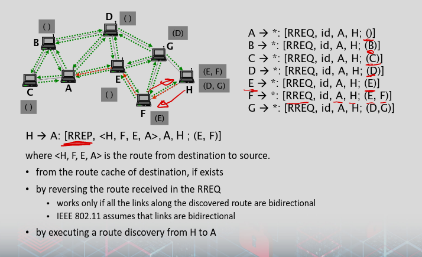
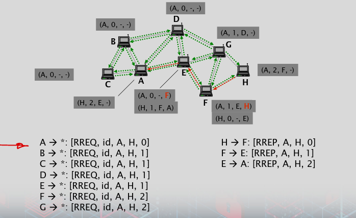
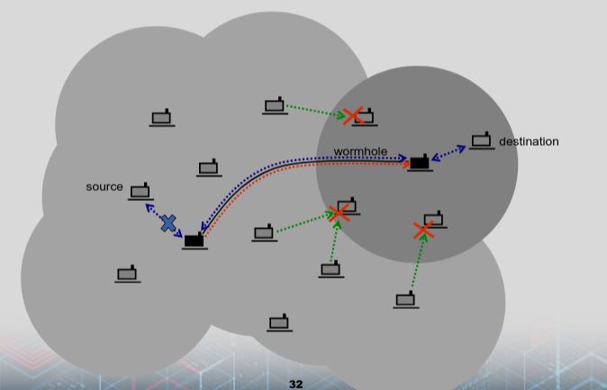
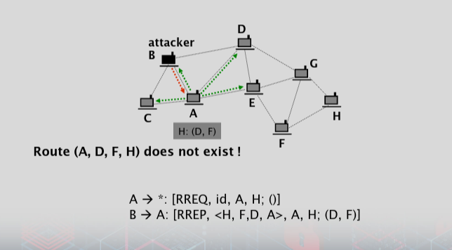
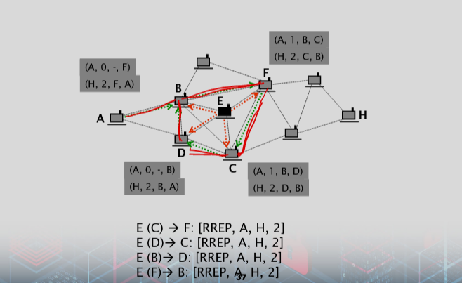

# MANET Routing Algorithms

###  Dynamic Source Routing (DSR)
- On‐demand source routing protocol (topology based)
    - Reactive
- Source Routing
    - Source determines the route and provides the list of nodes to visit in the packet header
    - Good for intermediate nodes
        - No routing table needed
        - No routing decision made
    - Local route cache is needed
        - Known routes from the source are kept
        - All received and overheard packets are good sources of route information
    - If a route is not known, DSR uses route discovery
        - Source node broadcast a route request (RREQ) packet to all its neighbors
        - The RREQ packet contains the source and destination addresses
        - When a node receives a RREQ packet, it checks its own cache to see if it has a route to the destination
        - If it does not, it rebroadcasts the RREQ packet to its neighbors.

- Two components
    - Route discovery
        - based on flooding of Route Requests (RREQ) and returning Route Replies (RREP)
        - used only when source attempts to send a packet to a destination for which there is no cached route
    - Route maintenance
        - Source detects route errors (e.g., if a link along that route no longer works)

### DSR Discovery 

### DSR Route Maintenance
- If next node fails to receive
    - Retransmit
- If retransmissions fail as well
    - Intermediate node informs the source about a node failure and source invalidates this route
    - Other nodes that have this failed node in their route caches also invalidate the related routes
- If alternative routes exist in route caches, they are used
    - Otherwise a new route discovery is performed

### DSR Advantages and Disadvantages
- One advantage of DSR is that it can handle network topology changes and node mobility well.
- However, it can suffer from high overhead due to the need to broadcast RREQ packets and store routes in cache.
- Additionally, it can be vulnerable to attacks such as spoofing and packet dropping.

### Ad‐hoc On‐demand Distance Vector routing (AODV)
- on‐demand, distance vector routing (topology based)
    - Reactive ( nodes only establish routes when they are needed)
- Operation is similar to that of DSR but the nodes maintain routing tables instead of route caches
    - Each node knows the next hop to reach the specified destination and its cost (cost is mostly number of hops towards destination)
- Route discovery procedure is similar to DSR: RREQs and RREPs
    - Aim is to fill out the routing table
- Uses sequence numbers mainly to detect out‐of‐date routing information

- A routing table entry contains the followings:
    - destination address
    - number of hops needed to reach the destination
    - address of the next hop towards the destination
    - sequence number for the route to destination

### AODV Discovery

### AODV Route Maintenance
- When a node detects a broken/unreachable link in its routing table
    - Entry is deleted
    - Affected nodes are informed
- Propagates towards the source
- Then when necessary a new route discovery is performed

### AOVD Advantages and Disadvantages
- Advantages:
    - handle both unicast and multicast traffic 
    - which makes it suitable for group communication in ad hoc networks.
- However, it can be vulnerable to attacks such as route poisoning and black hole attacks.
- To address these issues, extensions to AODV such as Secure AODV (SAODV) have been proposed.

### Position‐based greedy (PBG) forwarding
- Assumptions
    - nodes are aware of their own positions and that of their neighbors
    - Each node periodically broadcasts beacons to send its location information
    - packet header contains the position of the destination
- Packet is forwarded to a neighbor that is closer to the destination than the forwarding node
    - **Most Forward within Radius (MFR)
    - Nearest with Forward Progress (NFP)**
    - Compass forwarding

### Restricted Directional Flooding
- Intermediate node rebroadcasts a data packet only if it lies in the direction of the destination
- Three pieces of location information are needed
    - Node’s own location
    - Source’s location
    - Destination’s location
- Two example systems
    - DREAM (Distance Routing Effect Algorithm for Mobility)
    - LAR (Location Aided Routing)

### Position‐based greedy forwarding A&D
- PBG is a simple and efficient routing protocol that does not require a centralized control mechanism or network‐wide route discovery.
- It also works well in highly dynamic environments and is robust to node mobility.
- One of the main limitations is the presence of obstacles in the network, such as buildings or mountains, that can block the line‐of‐sight communication between nodes.
    - In such cases, the optimal route may not be the one that is closest to the destination node.
- Additionally, PBG is vulnerable to node localization errors and attacks that can cause nodes to report incorrect location information.

### Attacks on routing protocols (1/3)
- general objectives of attacks
    - increase conflict control over the communications between some nodes;
    - degrade the quality of the service provided by the network;
    - increase the resource consumption of some nodes (e.g., CPU, memory, or energy)

### Attacks on routing protocols (2/3)
- Attack mechanisms
    - eavesdropping, replaying, modifying, and deleting control packets
    - fabricating control packets containing fake routing information (forgery)
    - fabricating control packets under a fake identity (spoofing)
    - dropping data packets (attack against the forwarding function)
    - wormholes and tunneling
        - Similar ideas but wormholes operates mostly at physical layer

### Attacks on routing protocols (3/3) 
- Types of attacks
    - route disruption
    - route diversion
    - creation of incorrect routing state
    - generation of extra control traffic
    - creation of a gray hole

### Route disruption
- The adversary prevents a route from being established between two nodes that are otherwise connected
- The primary objective of this attack is to degrade the quality of service provided by the network
    - two victims cannot communicate, and 
    - other nodes also suffer and are enforced to use suboptimal routes

- Some attack mechanisms
    - Dropping route request or route reply messages
        - In topology based routing
    - Forging route error messages
    - Adversary may generate fake RREQs with the next id and flood the network with this one
        - Legitimate RREQ with this id will be discarded
    - Enforcing to use a particular link and drop the packets on that
        - Rushing is a form of it (see next slide)

### Route Disruption With DSR Rushing

### Route Diversion 
- The adversary causes the protocol to establish routes that are different from those that it would establish, if the adversary did not interfere with the execution of the protocol
- The objectives of route diversion:
    - to increase adversarial control over the communications between some victim nodes
        - the adversary's aim: the diverted routes contain one of the nodes that it controls or a link that it can observe
        - In this way, the adversary can eavesdrop or modify data sent through the victim nodes
    - to increase the resource consumption of some nodes
        - many routes are diverted towards a victim that becomes overloaded
    - degrade quality of service (QoS)
        - by increasing the length of the discovered routes, and thereby, increasing the end‐to‐end delay between some nodes

- route diversion can be achieved by
    - forging or manipulating routing control messages
        - e.g. in source routing protocols, the node addresses may be changed by the adversary
    - dropping routing control messages
    - setting up a wormhole/tunnel
        - may cause the nodes close to the endpoints of the wormhole/tunnel to use up more energy

### Creation of incorrect routing state
- This attack aims at compromising the routing state in some nodes so that the state appears to be correct but, in fact, it is not
    - data packets routed using that state will never reach their destinations
    - via non‐existing link or via loops
- the objective of creating incorrect routing state is
    - to increase the resource consumption of some nodes
        - victims will use their incorrect state to forward data packets, until they learn that something goes wrong via maintenance protocols
    - extra delay in data packet transfer
- can be achieved by spoofing, forging, modifying, or dropping control packets

### Creation of incorrect routing state in DSR

### Creation of incorrect routing state in AODV 

### Generation of extra control traffic
- Injecting spoofed control packets into the network
- Aiming at increasing resource consumption due to the fact that such control packets are often flooded in the entire network

### Setting up a gray hole
- Not exactly a routing attack
    - Actually an attack against packet forwarding
- adversarial node participates in the route establishment and then selectively drops data packets that it should forward
    - If all packets are dropped, then it is called black hole
- the objective is
    - to degrade the quality of service (QoS)
    - to increase the resource consumption
        - wasting the resources of those nodes that forward the data packets that are finally dropped by the adversary

### Countermeasures
- authentication of control packets
    - using MACs or digital signatures
- protection of mutable information in control packets
    - using MACs or digital signatures
    - often implemented with the use of one‐way hash functions
- detecting wormholes and tunnels
- combating gray holes
    - using multi‐path routing
    - using a “detect and react” approach

