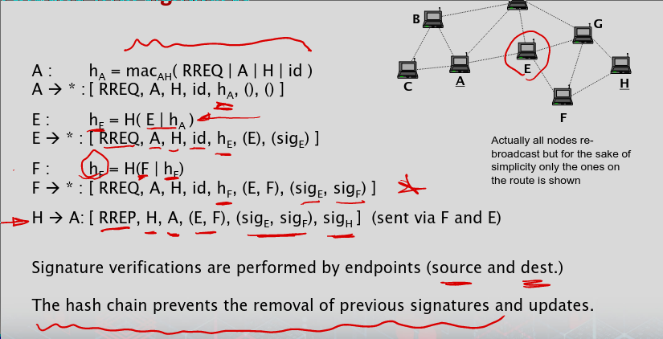
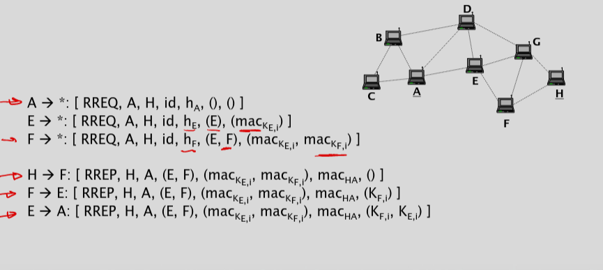

# Secure Routing Algorithms 

### Attacks on routing protocols (3/3)
- Types of attacks
    - route disruption: The adversary prevents a route from being established
    - route diversion: The adversary causes the protocol to establish routes that are different from those that it would establish
    - creation of incorrect routing state: This attack aims at compromising the routing state in some nodes
    - generation of extra control traffic: Injecting spoofed control packets into the network
    - creation of a gray hole: (not a routing attack) is an attack against packet forwarding where a malicious node drops some of the data packets (if all it will be a black hole)

### Authentication of Control Packets
- Also provides integrity
    - Many attacks are due to lack of authentication and integrity
- Questions and answers
    - Who should put authentication proof into the control packets?
    - Their originators (the source)
- Who should be able to verify authenticity? (Everyone should)
    - Target of the control packet (the entities that will take action)
    - But who are these targets?
    - See next slide

• Each node that processes and re‐broadcasts or forwards the control packet must be able to verify its authenticity
• As it is not known in advance which nodes will process a given control packet, we need a broadcast authentication scheme
• Bottomline: Authenticity must be verifiable by all nodes
• But how?
    • Digital Signatures
    • TESLA protocol

### Protection of mutable information in control packets
- intermediate nodes add/modify information to the control packet before re‐broadcasting or forwarding it (e.g. hop count, node list)
- this added information is not protected by origin authentication
- each node that adds information to the packet should also add authentication proof of that information
- Concept
    - Node A has packet + A
    - Node B has packet + A + B

### Protection of traceable modifications
- The entire control packet can be re‐signed by each node that adds info to it
- Problems:
    - signatures can be removed from the end;
- Solutions?
- Concept
    - Node A has packet + A
    - Node B has packet + A + B
    - Node M has packet + A + M
- Solutions:
    - one‐way hash chains
    - efficient aggregate signatures provide another solution
    - re‐signing increases the resource consumption of the nodes
    - corrupted nodes can still add incorrect information and sign it
        - very tough problem to overcome ..

### Detection of Tunnels
- A virtual link created by a tunnel is actually a multi‐hop one
    - So the delay is higher than a direct link
        - By measuring delays, tunnels may be understood
        - By making delay the routing metric (instead of hop count), it may be possible to implicitly bypass the tunnels 

### Combating gray holes
- Two approaches
    - Multiple paths
    - Detect and react
- use of multiple, preferably disjoint routes
    - increased robustness
    - but also increased resource consumption
    - resource consumption can be somewhat decreased by applying the principles of error correcting coding
        - data packet is coded and the coded packet is split into smaller chunks
        - a threshold number of chunks is sufficient to reconstruct the entire packet
        - chunks are sent over different routes
- detect and react
    - monitor neighbors and identify misbehaving nodes
        - by overhearing the re‐broadcasts in promiscuous mode
        - consumes more energy than being idle

### Some secure ad‐hoc network routing protocols
- SRP (on‐demand source routing)
- Ariadne (on‐demand source routing)
- S‐AODV (on‐demand distance vector routing)

### SRP (Secure Routing Protocol)
- SRP is a secure variant of DSR
- uses symmetric‐key authentication (MACs)
    - Assumes that it would be impractical to require that the source and the destination share keys with all intermediate nodes
    - hence there’s only a shared key between the source and the destination
    - only end‐to‐end authentication is possible
- SRP is simple but it does not prevent the manipulation of mutable information added by intermediate nodes (control messages)

### Ariadne
- Ariadne is another secured variant of DSR
- It uses message authentication to prevent modification and forgery of routing messages
    - based on signatures, MACs, or TESLA
- It uses a per‐hop hash mechanism to prevent the manipulation of the accumulated route information in the route request message
- TESLA Protocol:
    - Tesla Protocol provides secure and efficient communication between two parties.

### What is TESLA Protocol
- Tesla Protocol is a cryptographic protocol for authenticated and encrypted communication.
- It was introduced in 2013 as an alternative to SSL/TLS.
- Tesla Protocol uses symmetric‐key authenticated encryption, which encrypts and authenticates data using a shared secret key
- It uses the AES cipher for encryption, the HMAC algorithm for authentication, and the Diffie‐Hellman key exchange protocol for key agreement.
- The protocol is resistant to various types of attacks, including replay attacks, tampering, and eavesdropping.

### Ariadne with signatures

### Symmetric‐key broadcast authentication with TESLA
- MAC keys are consecutive elements in a one‐way key chain:
    - Kn => Kn‐1 => ... => K0 (order of hashing)
    - K i = h(K i+1 )
- TESLA protocol:
    - setup: K 0 is sent to each node in an authentic way
    - time is divided into epochs
    - each message sent in epoch i is authenticated with key K i
    - K i is disclosed in epoch i+d, where d is a system parameter
    - K i is verified by checking h(K i ) = Ki‐1

### Ariadne with TESLA
- Assumptions:
    - each source‐destination pair (S, D) shares a symmetric key KSD
    - each node X has a TESLA key chain KX,i where i = 0 .. n
    - each node knows an authentic TESLA key (K0’s) of every other node
- Route request (source S, destination D):
    - S authenticates the request with a MAC using KSD
    - each intermediate node X appends a MAC computed with its current TESLA key
    - D verifies the MAC of S using KSD
    - D also verifies the per‐hop hash value of each intermediate node as in other Ariadnes.
    - D verifies that the TESLA key used by each intermediate node X to generate its MAC has not been disclosed yet
- Route reply:
    - D generates a MAC using KSD
    - each intermediate node delays the reply until it can disclose its TESLA key that was used to generate its MAC
    - each intermediate node appends its TESLA key to the reply
    - S verifies the MAC of D, and all the MACs of the intermediate nodes
    - and also validates the keys of intermediate nodes via the hash chain

### Ariadne w/ TESLA

### SAODV (Secure AODV)
- SAODV is a secure variant of AODV
    - Provides authentication and integrity to routing messages
- protects non‐mutable information with a digital signature (of the originator of the control packet)
    - Non‐mutable parts are the ones set by the source and do not change
    - E.g. seq. numbers, addresses
- uses hash chains for the protection of the HopCount value (mutable field)
    - Existing mutable field: HopCount

### Key management issues in MANETS ‐ 1
- Aim: Fully self‐organized mobile ad hoc networks
    - no central authority (not even in the initialization phase !)
    - each user/node generates its own key and exchange keys with other users
- Pairwise Solutions
    - Prior to setup and deployment
    - Physical contact or short range/visual transmission

### Key management issues in MANETS ‐ 2
- Use of Public Key Cryptography
    - Need a PKI (Public Key Infrastructure)
        - By definition, a certification authority (CA) is needed
        - Can we have this distributed?
        - There are research papers proposing PKI for MANETs

