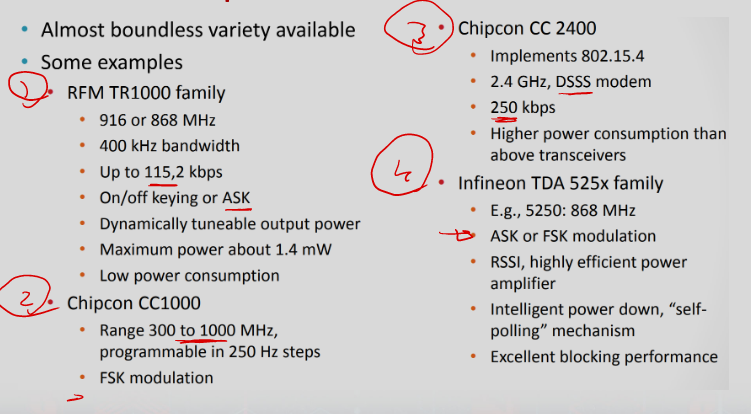

# WSN 

### What is Wireless Sensor Network?
- group of interconnected devices
    - equipped with sensors that can communicate wirelessly to exchange data about their environment.
- WSNs can be used to monitor and collect data from various sources
    - such as temperature, humidity, pressure, sound, motion, and more.
- The collected data can then be processed, analyzed, and used to make decisions in various applications
    - including healthcare, agriculture, environment, monitoring, smart cities, and industrial automation.

### What is Internet of Things?
- concept that refers to the interconnection of a wide range of devices and objects through the internet.
- These devices can include smartphones, wearable devices, smart home appliances, vehicles, and more.
- IoT devices are equipped with sensors and communication technologies that enable them to collect and transmit data to the internet.
- The collected data can be processed, analyzed, and used to make decisions in various app (mostly done in the cloud)

### WSN vs. IoT
- they have different scopes and are used in different applications.
- WSNs are more focused on collecting data within a specific area or domain
- while IoT is more diverse and wide‐ranging, with applications in many different fields.

### Wireless Sensor Networks
- Different computing paradigm
    - Thousands of sensor nodes distributed over a field
    - Both sensing (temperature, pressure, humidity, etc.) and short‐range wireless communication capabilities
    - Ultimate aim is to carry the sensed data towards a sink node
- Sensor nodes are small, low‐cost, low‐power devices with limited memory, computational power and energy
    - communicate on short distances
    - sense environmental data
    - perform limited data processing

### Sensor Networks
- How sensor are connected:
    - Ad‐hoc structure (infrastructureless)
    - Infrastructure (with the aid of BS or AP)
- communication patterns
    - sensors to base station, uplink (many‐to‐one)
    - base station to sensorsi, downlink (one‐to‐many)
- limited mobility
    - sensor nodes are mainly static
    - topology can change due to node and link failures
- resource constraints
    - sensor nodes are much more constrained in terms of resources

### Applications of WSN
- Agriculture:
    - WSNs can be used to monitor soil moisture, and temperature
    - track crop growth and detect pests or diseases.
- Industrial Automation
    - monitor and control various industrial processes, such as manufacturing, logistics, and supply chain management.
- Battle ground surveillance
    - Enemy movement (tanks, soldiers, etc.)
    - Biological/chemical attack detection
- Hospital tracking systems
    - Tracking patients, doctors, drugs
- Diaster relief
- Biodiversity mapping
- Intelligent building and bridged
    - reduce energy consumption

### Roles of Participants in WSN
- Sources of data: Measure and report 
    - devices w/ sensors
- Sinks of data: Receive data from WSN
    - May be in WSN or external
- Actuators: Control devices based on data

### Deployment Options
- Random deployment
    - Dropped from aircraft
    - Uniformly random over an area
- Regular Deployment
    - Fixed spots
- Mobile Sensor nodes
    - Can move to compensate for deloyment issues or failure
    - Or moved by environment like wind or water
    - Or seek areas

### WSN Mechanisms
- Multi‐hop wireless communication
- Energy Efficient operation (comm, computation, sensing,...etc)
- Auto‐configuration
- Collaboration & in‐network processing or pre‐processing
- Tradeoffs (energy vs. accuracy... more secure vs. consuming more energy)

### MANET versus WSN
- Apps and equipment
    - MANET are more powerful higher data rate 
    - Generally with human interaction
- Otherwise, WSN is hyperspecific for a certain use and meant to interact with environment

- Routing difference
    - MANET use dynamic routing to adapt
    - WSN use protocols for low power and resource limited devices

### Ad-hoc Node Architecture
- Core: the same
- But: More additional equipment
    - HDD, display, keyboard, voice, camera
- Laptop class device

### Sensor Node Architecture
- Main components of WSN node
    - Controllers
    - Comm device
    - Sensor
    - Memory
    - Power source

### WSN Transmission Characteristics
- Capabilities
    - Interface: bits, byte, or packet level
    - Frequency range
        - 433 MHz to 2.4 GHz
    - Range?
- Energy
    - Low
- Radio Preformance
    - Modulation? (ASK, FSK ...?)

- Examples

### Transceiver States
- Transmit
- Receive
- Idle
    - Can receiver but not doing so
    - Less power
- Sleep
    - Basically turned off
    - Recovery time and start up energy can be significant

### Security in WSNs
- What type of security do we need?
    - Authentication and integrity
        - Mostly in the sense that “data is coming from a legitimate entity” and “it is correct data”
    - Privacy
        - Especially location privacy
    - Resistance against network level attacks
        - DoS, wormholes, sinkholes, selective forwarding, etc.

### (mportance of WSN Security
- Confidentiality: 
    - Personal/Medical records or other secrets
- Integrity
    - Tampering with data
- Availability
    - Often mission-critical
    - ICS, disaster
- Safety
    - Healthcare and transportation

### Security is needed even for environmental applications 
- If we are tracking animals with sensors
    - Need to prevent poachers from gaining access to hunt animals

### Security Threats and Security Model
- Radio links are insecure
    - eavesdropping / injecting faulty information is possible
- Sensor nodes are often deployed in open areas
    - nodes can be captured by attackers physically
- Sensor nodes are usually not tamper‐resistant
    - if compromised, attacker learns everything
- Attack Models
    - Insiders vs. Outsiders.
- Traditional security techniques cannot be applied on WSNs because of the system constraints
    - Power
    - Bandwidth
    - Computation

