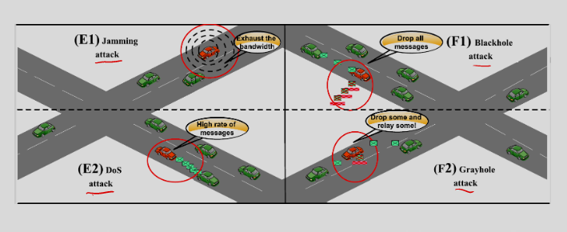
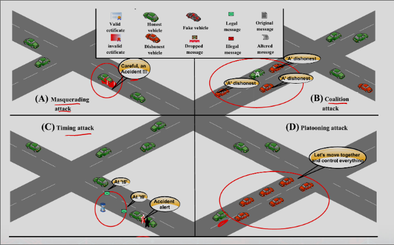
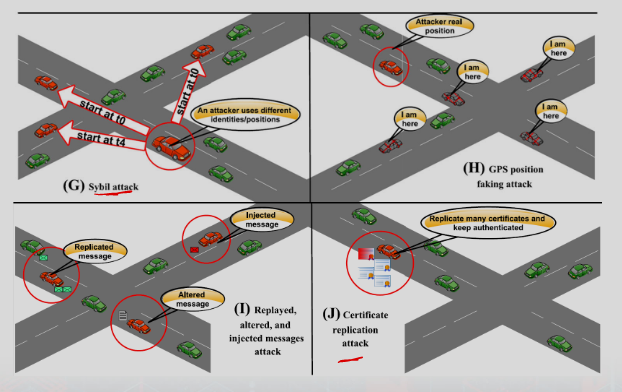

# V2X Security Attacks

### Attack Images

## Summary of Attacks

### Masquerade 
- This attack occurs when the attacker sends messages on behalf of other vehicles 
- from whom it successfully filches those identities.
- Authenticity and privacy compromised
- Digital signature; PKI

### Coalition and Platooning attack
- A group of vehicles within the same geographical area collaborate together for malicious purposes
- Availability compromised
- Trust management

### Timing attack 
- A malicious vehicle delays the packet delivery process, which may cause plenty of problems to safety applications.
- Availability, Authenticity, Integrity compromised
- Time stamp

### Man in the middle
- An attacker intercepts any information sent between two entities. 
- This attacker may impersonate as a legitimate vehicle to participate the ongoing V2X communications.
- Authenticity, confidentiality and integrity compromised
- MAC; Digital signature; PKI.
- Other authentication methods.

### Replay attack 
- Replay attack occurs when attackers maliciously or fraudulently transmitting repeated data. 
- This attack in VANETs can make other legitimate vehicles have wrong estimation of the current traffic condition.
- Availability, authenticity compromised
- Time stamp

### Eavesdropping 
- This attack occurs when attacker collecting all possible information from the network. 
- Eavesdropping is a passive attack, which does not affect the network directly.
- Confidentiality and privacy compromised
- Physical‐layer security

### Message Modification
- Message modification is modifying a legitimate message through deleting, adding to, changing or reorganizing it.
- Authenticity, Confidentiality and Integrity compromised
- MAC; Other authentication methods.

### Location tracking
- This attack occurs when attackers tracking legitimate vehicles’ location through keeping monitoring and analyzing messages sent by targets.
- This attack can be done even when targets keep changing their pseudonyms.
- Privacy compromised
- Pseudonyms with well‐designed pseudonym changing mechanism.

### Black hole/Grey hole
- Attackers drop all the packets/or selectively drop packets like a black hole instead of forwarding them. 
- This attack can cause a great data loss and hard to detect.
- Availability compromised
- Trust management.

### Sybil 
- Sybil attack is defined that attackers join the system using multiple real/fake identities. 
- This attack is hard to detect.
- Attackers can send multiple messages with different identities to misguide other vehicles without being identified.
- Even a spoofed identity has been identified, the attacker may get away without being punished.
- Authenticity, authorization compromised
- Digital signature; PKI; and other authentication methods.

### Infrastructure spoofing
- Attackers may spoof the IP address of the RSU/eNodeB/Application server to launch malicious activities.
- Authenticity, authorization, availability compromised
- Digital signature; mutual authentication.

### Selfish attack 
- Some V2X entities may refuse to cooperate with other vehicles (to relay messages).
- Availability compromised 
- Trust management.
### Denial of service
- Denial of service happens when attackers inject a great volume of messages into the network aggressively
    - to make network resource unavailable to legitimated users. 
- This attack can be performed in a distributed manner becoming the distributed denial of service attack
    - which can severely jeopardize the availability of V2X Net.
- This attack can be launched by either insider or outsider attackers.
- Availability Compromised
- Light weighted authentication schemes

