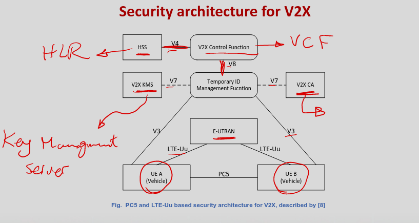

# More V2X Security Solution

### Different V2X 
- There are some other solutions designed for different V2X communication architectures:
    - LTE-AKA based V2X
    - LTE-V2X,
    - 5G-V2X.

### Security mechanisms based in LTE security framework
- The LTE security framework provides its own access authentication scheme with 
    - LTE Authentication and Key Agreement Protocol (LTE-AKA).
- AKA is a challenge-response-based mechanism that uses symmetric cryptography.
    - ISMI, Ki, RAND, XRES,....
- The LTE-AKA is responsible for :
    - User identification
    - User authentication
    - Network authentication
    - Key derivation and sharing
    - Finally, enabling secure access on the air interface.

### Security mechanisms in LTE‐AKA
- The 4G V2X system can utilize LTE-AKA to achieve mutual authentication between vehicles and the LTE Network
-** But LTE-AKA has some technical challenges:
    - High signaling overhead
    - Bandwidth consumption
    - Absence of quick authentication during handover
    - Vulnerability of the transmission of the IMSI in plain text.**
- Thus, many research have been conducted to improve the existing LTE-AKA protocol.

### LTE-AKA Solutions
- M. A. Abdrabou et al. proposed to perform a pre-authentication procedure to generate a dynamic key 
- whenever the user access to the network, so that the vulnerability of the disclosure of IMSI, man in the middle attack and DoS attack can be alleviated.
-  For the V2V communications, since V2V shares many similarities with D2D, the ProSe security framework specified by 3GPP can also be used to secure the V2V communications.

### LTE-V2X

- Main functional entities of LTE V2X security architecture include:
    - V2X control function (VCF)
    - Temporary ID Management Functions (TIMF)
    - V2X Key Management Server (KMS) or V2X Certificate Authority (CA)
- VCF is mainly responsible for authentication and authorization of vehicular UE (V-UE).
- Temporary ID Management Function (TIMF) is mainly responsible for distributing temporary IDs and credentials to V-UEs.
- V2X service operator may either choose V2X KMS or V2X CA

### Security issues and potential solutions in LTE based V2X communications
- 3GPP based V2X security solutions:
    - V2X one to many communications security
    - Vehicular UE privacy
    - Authorization and accountability
    - UE to V2X Control Function Interface

### One to many
- LTE V2X is a point to multi-point communications.
- However, existing LTE security system provides credentials only for point-to-point communications
- D2D proximity services (ProSe) is one of the solutions but it is not optimized for V2X communications

### UE Privacy
- Privacy will ensure the high participation rate of the vehicular UE.
- In a PC5 mode (V2V directly) 
    - some identifiable information is included in the periodic message which may reveal the private information of the user.
- Whenever the vehicular UE attaches to the network
    - mobile network operator (MNO) has the ability to track the UE.
- Whenever V2X data is sent across the network in Uu interface
    - the V2X application can track the UE by linking together V2X data such as IP address.
- Hence in both PC5 and Uu mode
    - there is a threat that identity will be revealed based on data transmitted by vehicular UE.

### Privacy Solutions
- Use pseudo random identifier
- Privacy based on data traversing the network
- **Encrypted International Mobile Subscriber Identity (IMSI)
- Hiding UE identity from other V2X UE and the serving network
- Homomorphic encryption**

#### Encrypted IMSI
- The proposed solution for LTE V2X communications mainly addresses three changes from existing LTE attachment procedure.
- Encrypt IMSI used at attach, in which IMSI is encrypted with a key that is itself encrypted with the public key of HSS.
- This scheme can provide some sort of privacy of UE from MNO.

#### Hiding UE identity from other V2X UE and the serving network
- Pseudonym can be used to hide the UE identity from all network elements except HSS.
- Pseudonym called as P‐IMSI can be generated following the standard IMSI format
    - mobile station identification number (MSIN) part replaced by mobile station pseudonym (MSPN).
- In the user side, V2X capable USIM should be installed for generating MSPN part for the pseudonym.
- In the network side, HSS needs to be prepared for maintaining records for V2X‐enabled UE and generating pseudonyms.

#### Homomorphic encryption
- type of encryption algorithm designed to allow mathematical operations to be performed on encrypted data.
- when decrypted, is the same as if the operation had been performed on the original, unencrypted data.
- This unique property of homomorphic encryption provides a way to process sensitive data securely while maintaining its privacy.

### Authorization and accountability
- If many UE tries to request radio resources at the same time, it would cause the exhaustion of radio resources.
- For this, MNO can check authorization information of vehicular UE before allocating radio resource.
- In the proposed scheme, V‐UE establishes a secure channel to the relevant **trusted traffic authority (TTA)**
- V‐UE runs an authorization or enrollment procedure and then V‐UE obtains evidence from TTA upon successful authorization.

### UE to V2X control function interface
- An attacker pretending to be V2X control function may maliciously manipulate or modify the data.
- To solve this, V2X control function (VCF) and V‐UE could use a shared key for mutual authentication and establish a secure channel based on pre‐shared key.
- The pre‐shared key could be derived using AKA procedure when V‐UE attach to the network through Uu interface.

### Open issues of LTE‐V2X communications
- Pre-authentication
    - Control channel spoofing
        - Prevent from attaching to network
        - Current LTE lacks ability to handle issue
- Authentication
    - Need high security level
- Reauthentication during handover
    - Handover key management is vulnerable to de‐synchronization attack
    - breaks the forward key separation using a rogue eNodeB

### Security solutions in 5G‐V2X
- 5G V2X system consists of heterogenous networks. 
- Some basic security mechanisms used in 4G V2X system and VANET can be reused
- However, a more flexible authentication framework is needed.
- The 3GPP standardization activity is focusing on the following aspects:
    - **Authentication and authorization
    - RAN security
    - Security within UE/secure storage, and processing of credentials.
    - Network slicing security
    - Enhanced IMSI privacy**

### Open Issues of 5G-V2X comms
- Compatibility: 
    - should be considered when applying existed heterogeneous authentication solutions proposed for VANET.
- Cloud security: 
    - Since 5G‐V2X always integrated with cloud, the cloud security must be improved. 
    - A “Cognitive Firewall” proposed to relay approved commands to vehicles ensures that these commands will not violate predefined rules.
- SDN security: 
    - SDN has many layers, e.g. application layer, control plane layer, and data plane layer. 
    - Security mechanisms should guarantee security inside each layer and the interfaces between those layers.

### Conclusions
- The era of 5G is coming which may also speed up the application of various V2X services.
- How to guarantee the security in an efficient way for V2X communications remains a big challenge.

