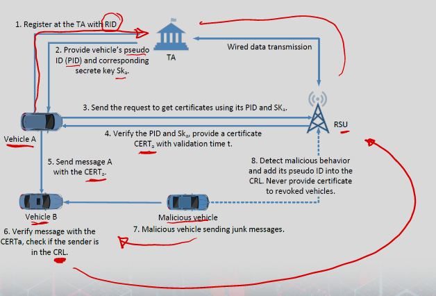
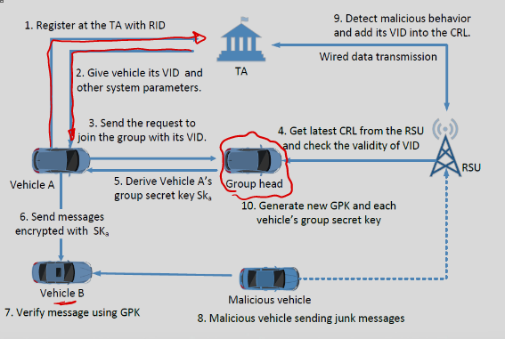

# V2X Security Solutions

### Security solutions
- There are plenty of attacks may compromise the V2X network.
- Researchers have proposed many security schemes to tackle those security threats in DSRC based V2X communications.
- Although the DSRC based V2X communications have some deficiencies, these security schemes also can be applied in cellular based V2X communications.

### Security mechanisms in vehicular ad hoc network
- Most of the existing schemes can be categorized as:
    - Cryptography based schemes
        - PKI based schemes
        - Identity based schemes
        - Group signature based schemes
        - Symmetric encryption based schemes
    - Trust based schemes
        - Those schemes usually apply more than one of tools listed below:
        - Elliptical Curve Cryptography
        - Bilinear Pairing
        - Keyed Hash Message Authentication Code

### Cryptography based solutions: PKI based schemes
- In this kind of schemes, a set of public key certificates and corresponding key pairs are pre-installed in vehicles.
- Those certificates should not disclose any identifying information which are used as unlikable pseudonyms.
- A vehicle signs messages with the secret key and then attaches the signature with the corresponding certificate.
- Problems with the PKI based schemes:
    - The verification process is time consuming.
    - Not suitable for high density scenarios
    - Vehicles need to acquire certificates periodically
    - Large certificate revocation list (CRL)

### Cryptography based solutions: Identity based schemes
- Identity based schemes (IBS) is similar to PKI based schemes 
- difference is that a vehicle’s public key is related with its identifier 
    - its private key is derived from the identifier. 
    - No certificate is required.
- Some IBS can perform batch verifications utilizing ideal temper-proofed device to function as the trust authority.
- Issues of IBS:
    - Key generation

### Cryptography based solutions: Group signature‐based schemes
- In group signature-based schemes, each group member can sign the message on behalf of the group. 
    - And the signature can be verified by using the shared group public key.
- This kind of scheme can provide privacy for the message signer within the group.
- Issues of group signature-based scheme:
    - Group management
    - The group manager can reveal the identity of any group member.
    - Revocation process: 
        - every time revoke a vehicle, the group manager needs to generate new private keys for each group member and the new public key. 

### Cryptography based solutions: Symmetric cryptographic schemes
- In symmetric cryptography-based schemes, usually an HMAC is used for message authentication.
- Message sender and receiver need to posses the same key.
- The anonymity set extends to the whole network if only one key is used for message authentication in the network.
- Issues of symmetric cryptography based schemes:
    - Key distribution.

### Security mechanisms in V2X Networks: Trust based schemes
- Cryptographic schemes are very effective against outside attackers.
- Trust based schemes mostly address inside attackers.
- Trust based scheme is applicable to:
    - privacy preservation,
    - availability,
    - key distribution
    - message delivery

### Data oriented
- Each message has a trust value
- The trust value of the message is updated according to the feedback of vehicles
    - who may have verified the content of the message.
- e.g. a message showing there is an accident ahead will be updated to a higher trust value
    - if a vehicle who received the message meet the accident spot after a certain time.

### Entity oriented
- Each vehicle has a trust value
- The trust value of a vehicle is determined by its historical behavior.
- Other vehicles accept the message if the trust value of the sender is higher than a threshold

### Hybrid
- The trust value of a message is determined by both of the trust level of the sender and the message itself.

### Problems of trust based schemes
- Since the trust is based on users historical integrations
- it is susceptible to on-off attack and the new-comer attack.

