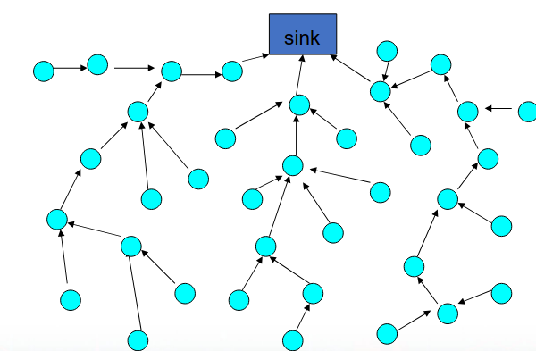
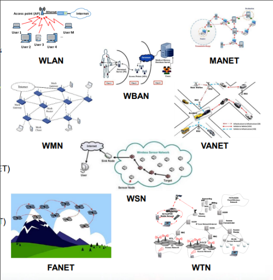

# Sensor Networks (IoT)

### Nodes

- Sensor nodes
    - low cost small devices, able to sense the environment (temperature, light, humidity, etc.), report sensed data using wireless communication
- Nodes are tiny
    - Limited memory, computational power, energy
- Nodes cooperate: communicate via multi‐hop wireless communication, some nodes aggregate data
    - No fixed infrastructure (kind of an ad‐hoc network)
- Applications
    - battlefield surveillance, medical monitoring, biological detection, habitat monitoring, home security, disaster recovery

### Ad hoc
- Devices collab to support network
- Network changes in response to devices moving
- Pro
    - Flexible and responsive to change
- Con
    - Complex and subject to manipulation

### MANET 
- Network self-configuring
- No fix infra
- Topology may change repidly and unpredictably
- Multi-hop comms among users
- Need to preconfigure devices to join network (ad hoc in general)

### Vehicular Networks
- Combat road traffic and accidents
- Vehicle to Vehicle
- Cars can break/move in response of communications
- Need special equipement on vehicles
- Reduce congestion

### Bluetooth
- Industrial specification for wireless personal area networks (PANs)
- Standardized by IEEE (IEEE 802.15.1)
- What does Bluetooth provide? Why do we need a PAN?
    - exchange information between devices like mobile phones, tablets, laptops, PCs, cameras, etc.
    - Main communication infrastructure for IoT devices
    - Replacement for infrared (remotes)
    - Replacement for any type serial communication interface (medical equipment, test devices, etc.)

### Bluetooth Security
- Very short range (1m – 10m)
- Advertised as a solution for too many cables
- Pairing uses Pass‐Phrase
- Attacks have progressively been successful at identifying vulnerabilities in the way PINs are used, can be reverse engineered
- Privacy: know what is on and how public it is

- Bluejacking
    - Attack that sends unsolicited messages to Bluetooth‐enabled devices
    - Text messages, images, or sounds
    - Considered more annoying than harmful
    - No data stolen

### NFC
- A short‐range wireless connectivity technology
    - Operates at 13.56 Mhz
    - Based on RFID technology
    - Data transfer rate: up to 424 kbits/second
    - Reader & Tag communicate
    - Promoted by the NFC‐Forum
- Advantages:
    - Quick setup time (<0.1ms )
    - Short range distance (up to 10cm)
    - Does not require line of site
    - Backward compatibility
    - Consumer experience
- Connect Electronic Devices
    - Exchange data
    - Simple, secure pairing
- Mobile transactions
    - Contactless payment
    - Mobile ticketing

### RFID
- Identity‐providing transponders
    - Passive: no power
    - Active: internal power
- Privacy/Security
    - Q: How do you control who is accessing your information?
    - A: You don’t (currently)
- Security Measures
    - One‐time tokens
    - Crypto‐protocols, limited range

### Wireless Networks
- WLAN
- Wireless Body Area Networks (WBAN)
- WPAN (Personal)
- Wireless Multihop Networks
    - MANET
    - Mesh
    - Sensor
    - VANET
    - Flying Ad Hoc
- Wireless Telecomms

### Wireless Challenges
- Wireless is open
    - Verification is more difficult
    - Resource availability not guarenteed
- Resource constraints
    - Energy
    - Bandwidth 
    - Scalability
- P2P instead of client to server
    - Multi hops
    - More security issues
- Tradeoff security, preformance, and scalability for usability/convienience

### Security
- Physical security is an issue
    - Base station is generally unattended
    - What about sensors?
- Eavesdropping is easy 
    - It’s on the air
- Mobility, infrastructureless nature of some applications and networks make the problems more difficult
- Resources are generally limited
    - Solutions must not have significant overhead
- Applications are more personal 
    - Privacy concerns

