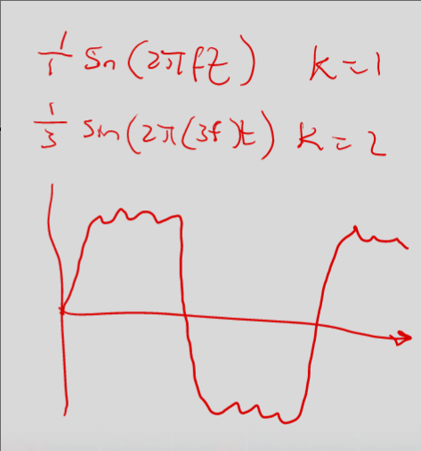

# Signals

### Radio 
- Wide range of frequencies for many different comm systems

### Frequency
- Hertz to Gigahertz

### Signals
- s(t) == amplitude over time
    - Asin($2\pi\*f\*t+\phi$)
    - Peak amplitute, A, max strength of signal over time
    - Frequency, f, rate at which signal repeats
    - phase, $\phi$, relative position signal has advanced
    
- Period, T, time for one cycle, T = 1/f
- Wavelength, $\lambda$, distance occupied by one cycle, $\lambda = c/f$
- Large T is not little t, but both are time
- f = 1/T

### Creating square wave
- $s_{square}(t)$
    - 4A/$\pi$ Sum(sin(2$\pi$\*f\*(2k-1)\*t)/(2k-1))  

### Time Domain vs Frequency Domain
- Time domain: signal amp vs time
- Freq Domain: signal peak amp vs frequency
- To simplify design, signals usually are frequency domain
- Characteristics 
    - Cutoff freq: highest and lowest amp which is significantly lower than peak
    - Bandwidth: width between cutoff frequencies
    - Center freq: mean of cutoff
    - Channel: refers to medium that carries signals

### Practical concers of freq and bandwidth
- Electromagnetic spectrum is limited resource
    - the more frequencies used, the higher the cost
- Signals of different frequencies propagate in different ways
- Range of frequencies (bandwidth) impacts on amount of data that can be transferred
- Vandwidth of transmission medium is limited (either physically or by regulations)
- Challenge: given bandwidth B, design a signal that maximizes data rate and minimizes errors

### Tradeoffs
- Bandwidth
    - Digital signal has infinite BW
    - Bandwidth is a limited resource
    - The greater the BW, the greater the cost
- Data Rate
    - Digital data is approximated by signal of limited BW
    - The greater the BW, the greater the data rate
- Accuracy
    - Receiver must be able to interpret received signal, even with transmission impairments
    - Limited BW leads to more errors

