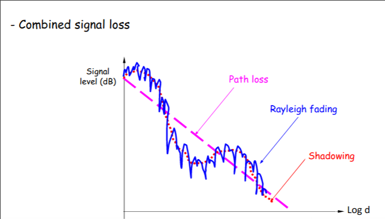

# Transmission

### Impairments
- Attentuation 
- Delay distortions
- Noise

### Model
- Recieved signal is affected by all three impairments
- Challenging to interpret

### Attentuation
- Strngth reduces of the signal as it travels a larger distance
- High frequencies are affected more
- Directly proportional with distance (squared?)

### Delay Distortion
- Component signals with different frequencies travel at different speeds through medium

### Noise
- Sources of noise
    - Thermal
        - due to thermal agitation of electrons
        - present in all transmission devices and media
    - Intermodulation 
        - Interference from different frequencies sharing medium
    - Crosstalk
        - transmission from another source interferes with other wireless transmitters

- Noise is additive
    - noise from all sources is added together to get total noise (N)

## Channels

### Channel Characteristics
- Multipath fading
    - Line of side signal 
        - Direct from base station
    - Also recieving from multiple places
        - They are not at the same time

- Shadow fading
    - is a large scale fluctuation of the signal 
    - due to large objects obstructing the propagation paths between tx and rx

- Doppler shift
    - The doppler effect because you are moving
    - The Doppler frequency shift should be compensated 
    - That a correct frequency synchronization is achieved

- Delay spread
    - Due to multipath fading
    - Delay equalizer to align delays

### Co-channel Interference
- Two nearby wireless transmitters transmit using the same channel
- Example 
    - two radio devices transmit at same time on same center frequency
    - receiver receives both signals and unable to determine the correct data
- Possible solution
    - devices transmit on different channels

### Transmit
- Transmit power, $P_t$
- Loss, L: attentuation means loss
- Noise, N, amount noise introduced

### Reciever
- Characterize signal by Signal-to-Noise Ratio (SNR)
- Signal power divided by the noise power
- Measured in dB (decibels)
- Variation Signal-to-Interference-and-Noise-Ratio (SINR)

### Decibels 
- dB = $10log_{10}(P2/P1)$

- dBm 
    - The power ratio in decibels (dB) of the measured power referenced to one milliwatt (mW).
    - $10log_{10}(P/1mw)$

### Reciever Characteristics
- Minimum SNR 
    - recieved signal must be greater than noise to be understood
- Noise floor
    - minimum amount of noise recieved
- Sensitivity
    - Minimum power for which signal can be understood
- Channel Capacity
    - max data rate over the channel
    - could uses "bit rate"  
    - Factors
        - bandwidth
        - Signal power
        - signal encoding
        - noise
        - error rate
    - Nyquist: perfect world w/ no noise
    - Shannon: w/ noise considered

### Nyquist
- Bandwidth B
- Signal with M levels carry $log_{2}(M)$ bits
- C = $2Blog_{2}(M)$

- Up bandwidth, up data rate
- Up signal levels, up data rate
    - but harder for reciever to interpret

### Shannon
- Singal to Noise ratio
    - SNR = signal power / noise power
- Capacity
    - $B\*log_{2}(1+SNR)$

- Up B or signal power, up data rate
- Up noise, reduce data rate
- Up B, allow more noise
- Up signal power, causes increased intermodulation noise

