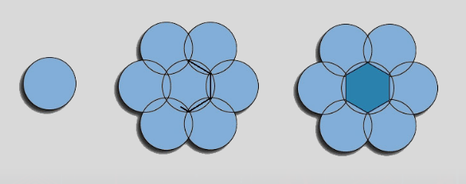
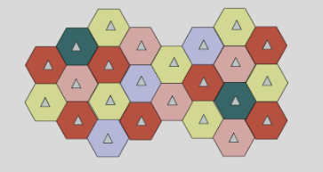
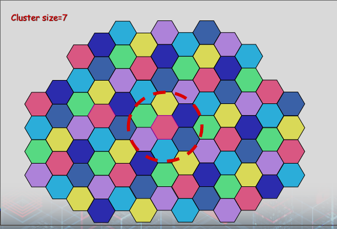
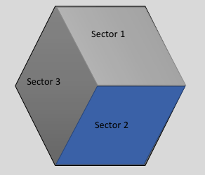
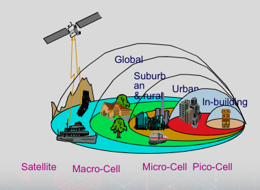

# Cellular Networks

### Features
- Wide coverage
    - Reuse frequencies as much as needed
    - Expansion of the network is easy
- Deployment
    - Wired communication among the base stations and connectivity to PSTN
    - Public Switching Telephone Network
- The entire network can serve a very large number of users
    - Cells must be formed depending on the expected number of users
    - Cell size is inversely proportional to the number of users

## Fundamentals

### Single transmitting/receiving station
- heavy, bulky and expensive
- no switching between regions
- low quality
- limited capacity
- rapid market saturation
- power hungry transceiver 
- power level was not safe

### First generation cellular system
- Introduction of analog cellular systems in the late 1970s and 1980s
- **analog system**
- **incompatible systems**
- limited to voice service
- **no encryption**
- FM modulation
- FDMA transmission technology
- suffer from capacity saturation

- 1st Gen Frequency Bands

### Second Generation cellular system
- Introduction of digital cellular systems (90’s) 
- development of unified international standard for mobile communications
- pan-national roaming
- digital encryption
- enhanced range of services (data + voice)
    - 56 kbps (data)
- low power consumption
- **light weight**, compact and pocket size terminals
- **TDMA** transmission technology
- huge capacity

### Third generation cellular system
- Multimedia services
- W-CDMA transmission technology
- Large BW
- Higher Bit Rate
- More Services

### Planning of Cells

- How are cells planned?

- Actual cell coverage isn't perfectly circular
    - Amorphous blob shape
- Dead spots and overlaps between in picture

### Reuse Frequency
• Frequency is limited so that we have to reuse it in several places
• Key concept: frequency reused by dividing the area covered by a cellular network in cells

### Clustering

### Cell sectorization 
- instead of omni-directional antenna we use directional antennas

### Cell Types
- Macro
- Micro
- Pico (In-building)
- Femto

### channel allocation techniques
- Fixed channel assignment technique (less Ts) 
- dynamic channel assignment technique (largest Ts)
- hybrid channel assignment technique (Improved)

## GSM

### Global System for Mobile Communications 
- GSM is the most popular standard for mobile phones
- The GSM Association estimates 82% of the global mobile market uses this standard
- Two billion people across more than 200 countries use GSM

### Services
- Voice Communication, Short Messaging Service, ...etc

