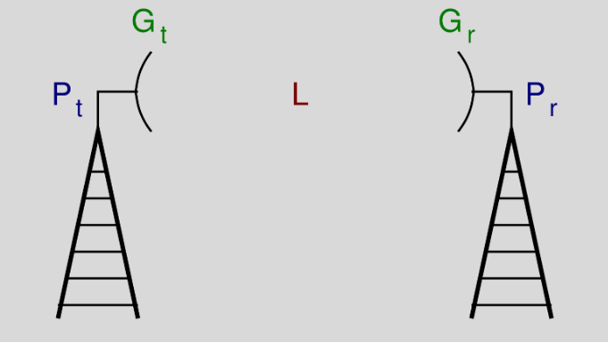
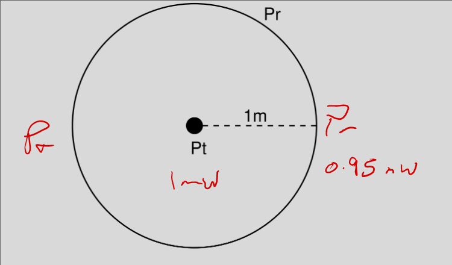
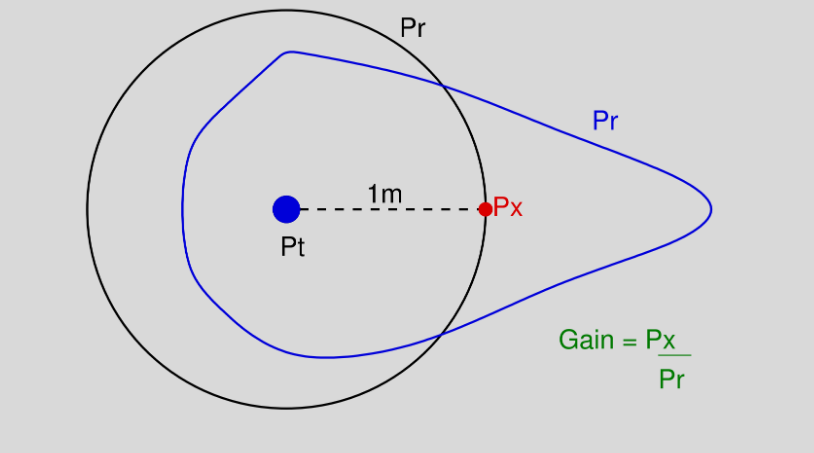

# Transmission Model

### Wireless

- Transmit electric signal w/ power $P_t$
- Tx converts to electromagnetic wave, w/ gain $G_t$
- Singal loses stregth as it travels, loss L
- Rx converts wave to electric, Gain $G_r$
- Reveive electic signal w/ power $P_r$

### Wireless Transmission Issues
- What is the role of an antenna?
- What is antenna gain?
- How does the signal propagate in different environments?
- How much power is lost when it propagates?

### Antennas
- Antenna converts electric current to electromagnetic waves
- Waves are within the radio and microwave bands of 3 KHz to 300 GHz
- Antenna characteristics are same for sending or receiving

- Direction and propagation of a wave depends on antenna shape
    - Isotropic antenna: 
        - power propagates in all directions equally (spherical pattern, ideal)
    - Omni-directional antenna: 
        - power propagates in all directions on one plane (donut)
    - Directional antenna: 
        - power concentrated in a particular direction

### Anteanna Examples
- Integrated antenna
    - Omni
    - Home AP
    - +2 dBi gain in 2.4 GHz
    - +5 dBi gain in 5 GHz
- Patch Antenna
    - Directional 
    - Hallways
    - +7 dBi (2.4 GHz)
    - +9 dBi (5 GHz)
- Parabolic
    - Directional
    - Focus on center
    - Point to point links
    - +20 to 30 dBi gain

### Antenna Types (Amounts)
- Single-in, Single-out (SISO)
- Multiple-in, Multiple-out (MIMO)
- Can do MISO and SIMO
- Based on how many we recieve on and send to

- TxR format (T antennas x R antennas)
- 802.11n (2x2 min and 4x4)
    - Min of 2 sending and recieving

### Isotropic

- Transmit w/ $P_t$
- Measure revieved power 1m away to be $P_r$
- Received power is same at any equidistant point

### Isotropic

(Ignore black $P_r$)

- Transmit w/ $P_t$
- Blue shap: Any p[oint on it is $P_r$
- Measure revieved power 1m away to be $P_x$
- Gain compared to isotropic is $P_x$ / $P_r$

### Antenna Gain 
- Relationship between effective area and gain
    - G = 4 \* $\pi$ \* $A_e$ / $\rho^{2}$  
    - $\rho$ is wavelength
- Effective are is realate dto physical size, but differs among design
- Eg Parabolic antenna may have effective area of half physical area
- $\rho$ = c / f

### Wireless propagation
- Frequency of signals affect how signal propagates
- Diff frequencies impacted by water, atmospheric noise, cosmic noise, and temp
- Ground wave: follow curve of earth
- Sky way: signal relfected between ionosphere and earth
- Line of sight: signal not reflected on earth
    - straight line traveled 

- Increased frequency, increased attenuation
- Obstacles affects signals differently
- Signals may reflect off obstacles
    - Multiple copies of same source received at diff times

### Transmission and Path Loss Model

- General model
    - $P_r$ = ($P_t$ \* $G_t$ \* $G_r$) / L
- dB form (values in dB)
    - $P_r$ = ($P_t$ + $G_t$ + $G_r$) - L
    - becuase we take log

### Free Space Path Loss
- Ideal case
    - L = (4 \* $\pi$ \* d / $\rho$)^2

- Combined with general model   
    - Friis transmission eq
    - $P_r$ = ($P_t$ \* $G_t$ \* $G_r$ \* $\rho^{2}$) / ${(4 \* \pi \* d)}^{2}$

### Wireless information
- How is information transferred wirelessly?
- First is it analog or digital?
- Digital: can’t propagate wirelessly

### Frequency vs Antenna length
- If the frequency is 1 MHz then the length of the antenna should be 150m
- If the frequency is 1 GHz then the length of the antenna should be 15 cm

