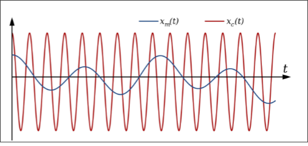

# Waves

## Modulation
- The process by which a carrier signal is changed to transfer information
- Carrier Signal 
    - A frequency by which modulation may be applied to transfer information
- We have analog modulation and digital modulation
- In both cases the signal which propagates wirelessly is analog

### Categories of Modulation
- Analog 
    - Frequency
    - Amplitude
    - Phase
- Digital
    - Freq Shift Key
    - Amp Shift Key
    - Phase Shift Key

### Analog Modulation

- $x_m$ is information signal
- $x_c$ is carrier signal

- Change carrier signal amplitude to embedded info

- Change carrier signal frequency to embedded infor

### Digital Modulation

### Amplitude‐Shift Keying
- One binary digit represented by presence of carrier, at constant amplitude
- Other binary digit represented by absence of carrier
- On and off of seeing frequency or multiple levels (base )

- Issues
    - Vulnerable to noise
    - Inefficient modulation technique (One level)
- Used to transmit digital data over optical fiber

### Binary Frequency‐Shift Keying (BFSK)
- Less susceptible to error than ASK
- Used for high‐frequency (3 to 30 MHz) radio transmission
- Can be used at higher frequencies on LANs that use coaxial cable
- Low Freq == 0 and High freq == 1
    - Can have levels

### Phase‐Shift Keying (PSK)
- Two‐level PSK (BPSK)
    - Uses two phases to represent binary digits
    - Skip forward in pi wave to flip bit
- Four level 
    - shift forward or back by 
        - $\pi$ / 4
        - 3 \* $\pi$ / 4

### Quadrature Amplitude Modulation
- QAM is a combination of ASK and PSK
    - Two different signals sent simultaneously on the same carrier frequency
    - 4 phases and 2 amp in picture (8 QAM)
    - Max is 64 QAM

### Adpative modulation
- Far from base station 
    - Uses modulation that is less prone to error
    - Sends less bits at once
- Close
    - More prone but sends to more at once

## Orthogonal Frequency Division Multiplexing (OFDM)
- Parallel data transmission on several orthogonal subcarriers with lower rate
- Maximum of one subcarrier frequency appears exactly at a frequency where all other subcarriers equal zero 
    - superposition of frequencies in the same frequency range

- Properties
    - Lower data rate on each subcarrier 
    - interference on one frequency results in interference of one subcarrier only
    - no guard space necessary
    - precise synchronization necessary (sender/receiver)
- Advantages
    - Higher data rates
    - Lower interference effects
- Application
    - 802.11a, HiperLAN2, ADSL, LTE
    - ADSL (How you connect to ISP)

- This how wireless creates channels

