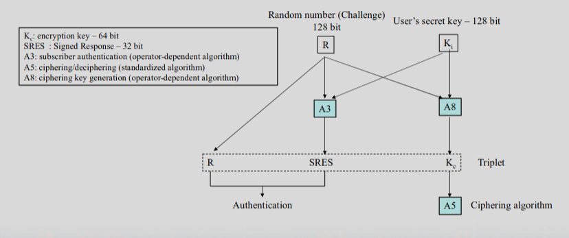
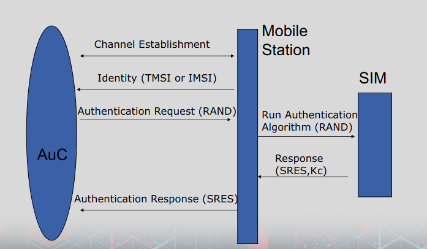
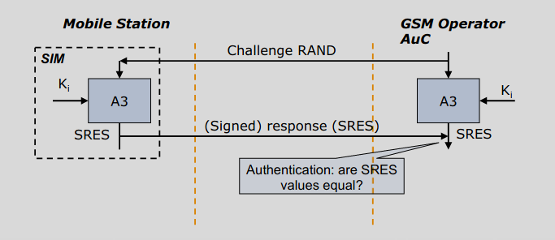
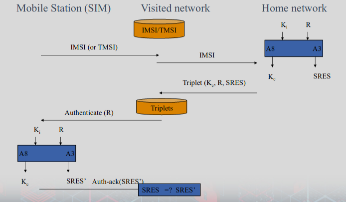
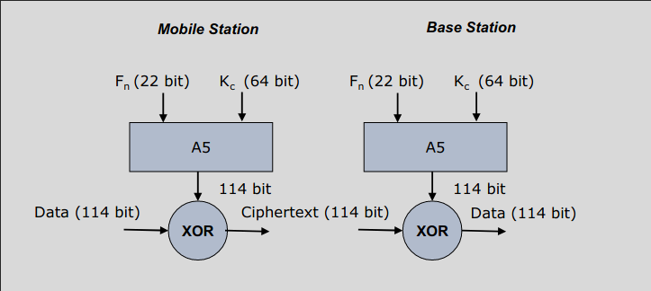

# Cryptographic algorithms of GSM

### Triplets
- Can be computed in advance by the home network (AuC)
    - Separately for each subscriber
    - Stored in a database
- $K_i$ 
    - Basically stored in HLR
    - But used by AuC

### Cipher
- GSM uses symmetric cryptography
- Stream cipher
- seeded by the ciphering key K c and frame number

### What knows and stores what?
- Mobile equipment and BSS contain
    - A5 algorithm and Kc
    - For voice encryption/decryption
- AuC/HLR and SIM contain
    - IMSI
    - TMSI (in VLR)
    - Ciphering Key Generating Algorithm (A8)
    - Authentication Algorithm (A3)
    - Individual Subscriber Authentication Key, $K_i$
- That means
    - Authentication is between SIM and AuC Center of the network
    - Encryption is between mobile handset and the BSS
- $K_i$ is known only to the operator who programs the SIM card and is tied to IMSI

### Roaming Authentication

- Basic Principle: Visited Network does not learn long term secrets
- Practical Problem
    - Talking to home network each time (for authentication)
    - Takes couple of seconds
- Solution: 
    - Home network passes several triplets to be used later 
    - when reauthentication needed

### A3 - Authentication Algorithm

- Generation of SRES response using random challenge RAND
- Input: RAND and $K_i$
- Output: SRES

### A8 - Voice Privacy Key Generation Algorithm
- Keyed Hashing Process
- Generation of encryption key $K_c$
- Input RAND and $K_i$
- Output: $K_c$

### Implement A3 and A8 together
- Both implemented on the SIM
- COMP128 used for both A3 and A8 functionality
    - Is a keyed hash function

### A5 – Encryption Algorithm
- A5 is a stream cipher
    - Design was never made public
    - Leaked to Ross Anderson and Bruce Schneier in early 90’s
    - Completely reverse engineered in 1999
- Produces keys in 114 bits of bursts
    - GSM transmission is organized as sequences of bursts 
    - one burst is sent every 4.615 ms and contains 114 bits of info

### Detection of Compromised Equipment
- International Mobile Equipment Identifier (IMEI)
    - Identifier allowing to identify the mobile device
    - IMEI is independent of SIM
- Network keeps Equipment Identity Register (EIR)
    - Black list 
        - stolen  or incompatible mobile devices
    - White list 
        ‐ valid mobile devices
    - Gray list 
        – allowed to use but tracked (actually action to be taken is operator dependent)
- Central Equipment Identity Register (CEIR)
    - Now IMEI DB
    - Centralized DB for approved mobile device types
    - Consolidated black list (posted by operators)

## Attacks

- Attacks against anonymity
- Attacks against authenticity and confidentiality
    - Attacks against the cryptographic algorithms
    - Attacks against the GSM protocol
- **Attacks on A3/A8, A5/1**
    - Through air interface
    - With possession of mobile equipment
- **False base station**
    - GSM does unilateral authentication
- Attacks on SIM card (SIM Editor, SIM Scanner)
- DoS (Denial of Service)
    - Jamming the signal
    - Preventing the MS from communicating

