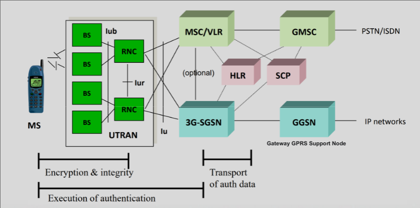
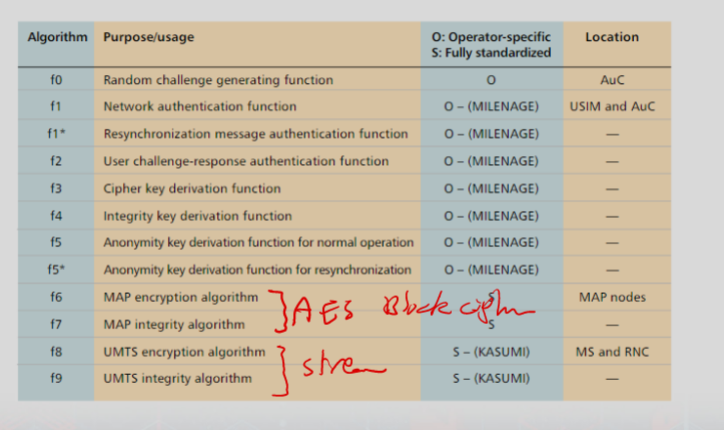
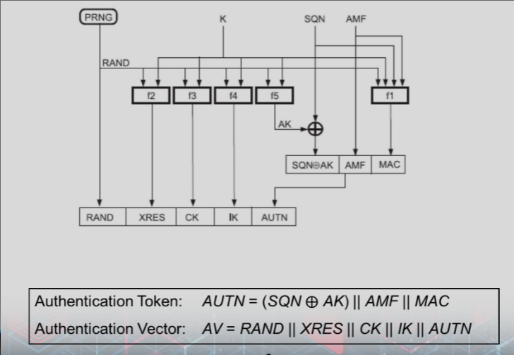
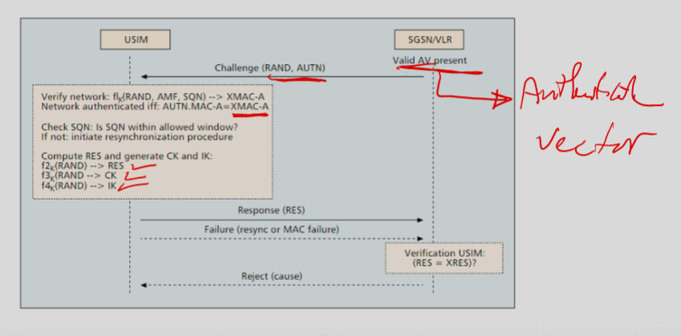
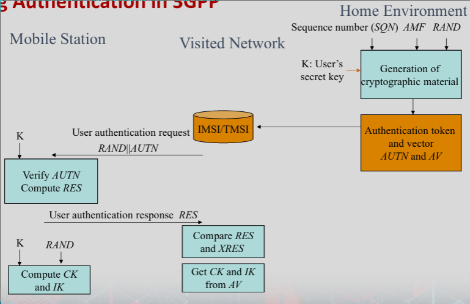
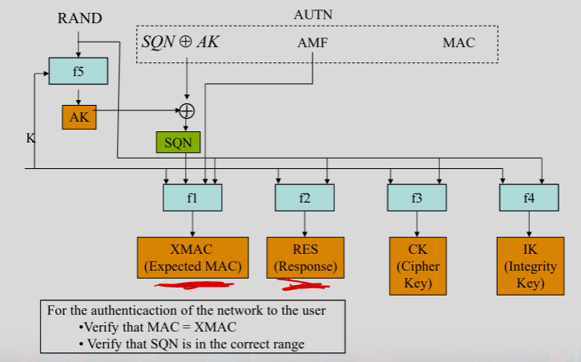
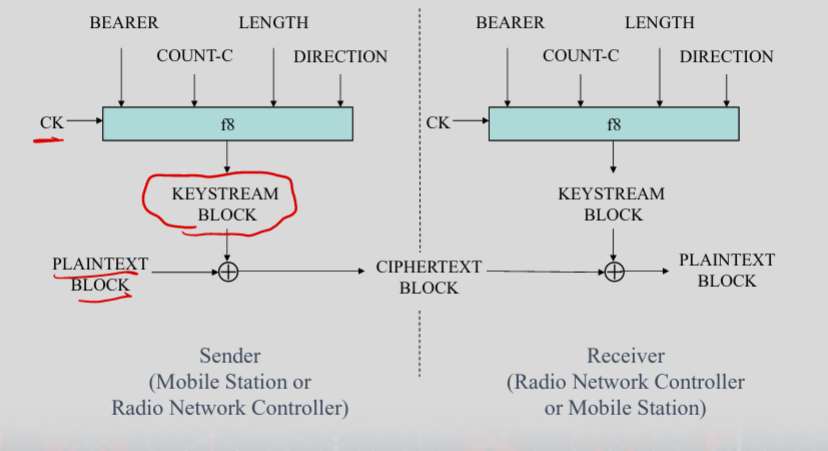

# 3G Security

### 3G
- High speed 
    - 2 to 20 Mbps
    - Packet switching
- 3GPP
    - 3G Partnership project

### Universal Mobile Telecomm Service
- 3G broadband
    - Text, voice, video, multimedia
    - 2 Mbps
- Specifices complete netowrk system
    - Radio interface and access network
    - core network and authentication via SIM

### 3G Netowrk Architechure

### Security Pronciples
- From GSM
    - SIM based Auth
        - USIM (User Siversimes Identity Module)
    - Encryption over wireless / radio
    - Protection of ID of user
- Corrections
    - Mutual Auth
    - Integrity of signalling message
    - Better encryption
    - Assure authentication and keys can't be replayed
    - Encrypted the cipher keys in transmission
    - Longer keys

### User Identity Confidentiality
- Permanent user IMSI, location, and services protected from eavesdropping
- Temporary identity (TMSI) to VLR
- IMSI sent in cleartext when establishing TMSI

### Fields for Enc
- AMF
    - authentication and key management field
    - some security related parameters (for example set the expiration of CK and IK) 
    - from the home network to the subscribe

# 3G Encryption

### Gen tokens and vectors

### Home Authentication

### Roaming Auth

### Mutual Auth
- Subscriber can auth with network by secret K 
    - f(K, SQN, AMF, RAND)

### User Auth in USIM

### Auth and Key Gen
- f1 through f5 are operator specific
- 3GPP provides example of algorithm set    
    - MILENAGE
- MILENAGE is based on Rijndael
    - AES

### Integrity Protection
- For messages exchanged during session
- User and network agree to integrity Key and alg
- Uses a MAC algorithm (f9)
    - Kasumi block cipher
    - 32 bit out

- COUNT‐I
    - Integrity sequence number, 32 bits
    - Protect the user against replay by the network
- IK 
    - Integrity key, 128 bits
- FRESH
    - Random number, 32 bits
    - One FRESH value for the entire connection
    - Protect the network against replay of message (MAC‐I) by the user (from older connections)
        - A particular IK may be used for several connections (e.g. handover)
- DIRECTION
    - Direction identifier, 1 bit (0: Uplink message, 1: Downlink message)
- MAC‐I
    - Message authentication code, 32 bits

- Fresh: 
    - One value per user throughout the duration of a single connection. 
    - It is to protect the network against replay of signaling messages by the user.

### Confidentiality
- User and network agree to encryption key and alg
- Stream cipher is used 
    - Voice calls
- Block cipher may be used
    - Data

- Count‐C
    - Ciphering sequence number, 32 bits
- CK 
    - Enc. Key, 128 bits
- Bearer
    - Radio bearer (channel) identifier, 5 bits (kind of negotiated low level port number)
- Direction
    - Direction identifier, 1 bit (0: Uplink message, 1: Downlink message)
- Length
    - Length indicator, 16 bit
    - Output key stream is “LENGTH”bits

### Problems
- IMSI is sent in **cleartext** when allocating TMSI to the user
- **Hijacking outgoing/incoming calls** in networks with disabled encryption is possible
- The intruder poses as a man‐in‐the‐middle and drops the user once the call is set‐up

### Comparing to GSM
- Mutual Auth
- Key lengths longer
    - More entropy
- Security with and between networks
- Security is based with switch rather than base station
    - Protection between base station and switch

- Both use TSMI 
    - GSM  is RAND, SRES, and cipher key
    - UMTS is RAND, XRES, cipher key, integrity key and auth token

### GSM Compare: Deregistration spoofing
- Network can't auth message over radio interface
- Intruder spoofs de-registration request
- Network de-registers the user 
- 3G intregity checks on messages prevents this

### Location update spoofing
- User spoofs location update
- Network sets user in new location
- Unreachable
- Intregrity check fixes
    - Data authetication verifies if legitimate

### Camping on a false BTS
- Modified BTS, entice user to camp on false Base station
- Once on radio channels of fake
    - Target is out of reaching of signals from serving network
- Faks BS can ask for information (sensitive)
- 3G does not prevent

### Camping on false MS
- false BTS/MS can act as reapeater and relay between network and target
    - modify or ignore requests or paging messages
- 3G does not prevent this
    - Integrity would prevent modification

### Passive Identity Caching
- View IMSI in plaintext over network
- Use of temporary identity 
    - makes ineffiecient
    - must wait for new registration or mismatch in serving network

### Active Identity Caching
- Camp on false BTS
- Request user to send identity
    - force new registration or claim mismatch
- 3G confidentiality mechanism prevents
    - enc key used for new registrations or db failure

### Suppressing Encryption (user and intruder)
- On fake BTS
- intruder does not enable encryption by spoofing cipher mode
- Intruder maintains call
- 3G Mandatory cipher mode allows mobile to verify encryption

### Suppressing Encryption (user and network)
- On fake BTS/MS
- Modifies cipher capabilities of MS
    - Appear as incompatible
- Network may establish plaintext connection
    - Intruder impersonates network to target (intruder cuts off from network)
- 3G Mobile station classmark with message auth/replay inhibition to verify encryption not suppressed

### Compromised Cipher key
- Possession of compromised auth vector
    - User has no control the cipher key
- On false BTS/MS, forces uses of compromised cipher key
- 3G sequence number, verify the freshness of the cipher key
    - prevents reuse of auth vectors
    - Not against ones that have not been used

### Eavesdropping on user data by suppressing encryption
- Attacker suppresses enc
- Sets up connection to actual network
- 3G mandatory cipher mode command verifies enc

### Eavesdroping on user data by forcing compromised key
- Same idea
- 3G freshness

### User impersonation with compromised auth vector
- Modified MS and possession of compromised auth vector
    - was intended to be used to auth legit user
- Use data to impersonate user
- 3G sequence numbers prevent reuse
    - Less opportunity

### User impersonation by eavesdropping auth response
- Auth vector may be used mutliple times
- Eavesdrops on auth response and reuses it for same challenge later
- No ciphering
- 3G seq num means auth vector can't be used

### Hijacking outgoing calls in networks with enc
- Modified BTS/MS
- Attempt to suppress by modifying cipher capabilities
- 3G integrity protection of critical signal messages protects

