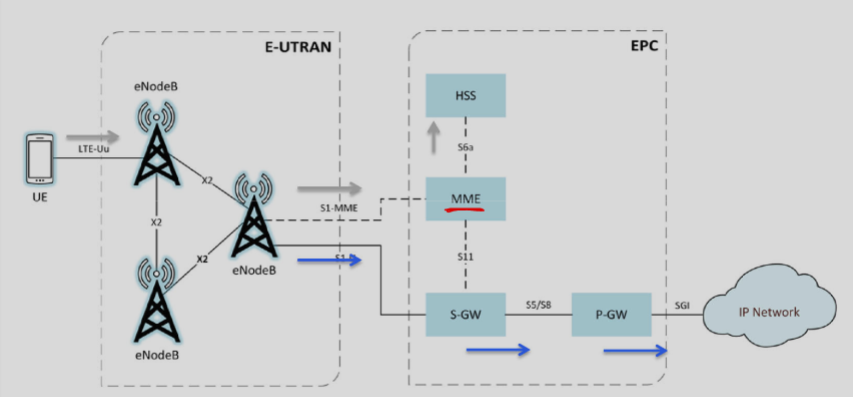
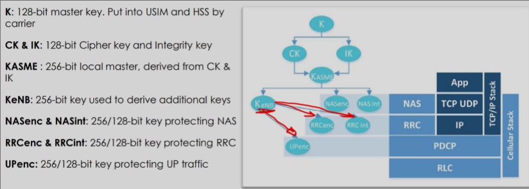
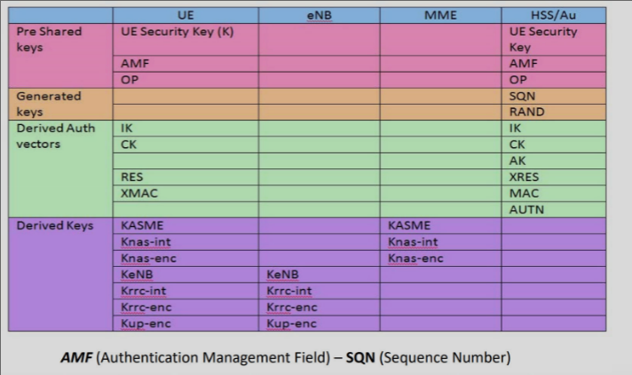
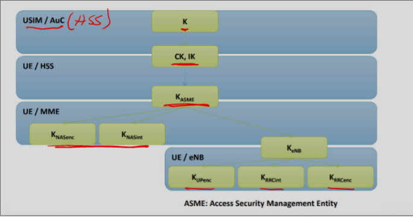
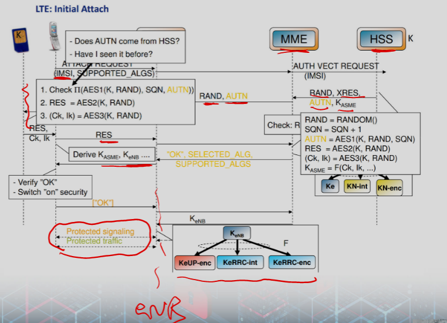
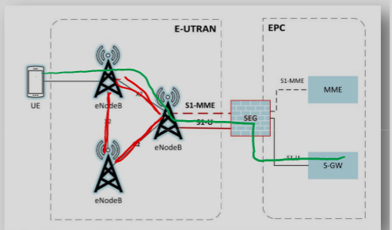

# 4G/LTE Security

### 4G
- Gbps
- Flat IP based architecture
    - Simplified
    - Packet switching

### LTE
- Long Term Evolution
- E-UTRAN
    - Evolved UTRAN (LTE radio netwotk)
- EPC
    - Evolved Packet Core (4G core netwotk)
- EPS
    - Evolved Packet System (= RAN + EPC)

### Tech
- Orthogonal Frequency Division Multiplexing (OFDM)
- Multi‐input Multi‐output(MIMO)
- Reduced power consumption

### LTE Preformance
- Mobility
    - Low to high movement speeds
- IP-optimized

### Architecture

### E-UTRAN
- eNodeB
    - Radio component
    - RF to IP internal and vice versa
- E-UTRAN
    - Mesh of eNodeB
- X2 interface
    - Mesh connection

### EPC
- Mobility Management Entity 
    - Primary signaling node
    - Functions
        - Manage UE contexts
        - Create temp ID
        - Send pages
        - Control auth
        - selecting S-GW and P-GW
- Serving Gateway
    - Routing of info between p-GW and E-UTRAN
    - Handoffs
- Packet Data Gateway
    - Allocs IP address and routing
    - Interconnects with no 3GPP network
- Home Subscriber Server
    - Houses subscriber identifiers and security info

### Comunication Planes
- Multiple planes 
- Different logical planes are multiplexed into same RF signal
- Routed to different end points
- Control plane to MME
- User plane to S-GW

# LTE Security

### Issues
- Interworking with legacy 2G and 3G
    - also non-3GPP like wifi landlines
- Allwoing BSs placement in untrusted location

### Security 
- Inherited most of 3G security
- Extended Auth and Ker agreement
- More complex key hierarchy
    - I used more key

### Evolved Packet System (EPS) Security
- Permanent security association
    - From GSM and 3G
- Interfaces in US and HSS
- Reuse 3G USIM
- No 2G SIM
- Delegated auth 
    - From GSM and 3G

### UICC Token Security
- Hardware storage location for sensitive info
    - pre-shared key K
    - IMSI
- Limited access to UICC through API
- Preforms cyrpto operations for auth

### Identity Confidentiality in EPS
- From GSM and 3G
- Send IMSI to network only if can't identity UE otherwise
- Temporary ID

### Device and Network Auth
- Auth and Key agreement is protocol for devices to auth with carrier
- Crypto keys needed to encrypt calls generated 

### Keys

- NAS: non-access stratum, encrypt MME

### Key Generation 
- Faster handovers and key changes
- Added Complexity handling security contexts

### Authentication

### Air Interface Protection
- Connection between UE and eNodeB
- 3 Algs
    - SNOW 3G = Stream cipher 
    - AES = Block cipher
    - ZUC = stream cipher
- Each can be used for confidentiality and/or integrity

### Backhaul Protection
- Confidentiality protection of traffic running over S1 interface
    - E-UTRAN to EPC is S1
- Security Gateway (SEG)
- IPSec tunnel created between eNodeB and SEG
    - Use of PKI certs for strong auth
    - Base station and core network auth each other

### Why encrypt backhaul
- User data travels over backhaul
- May or may not be trusted
    - operator A uses B's fiber to connect eNBs to its network

