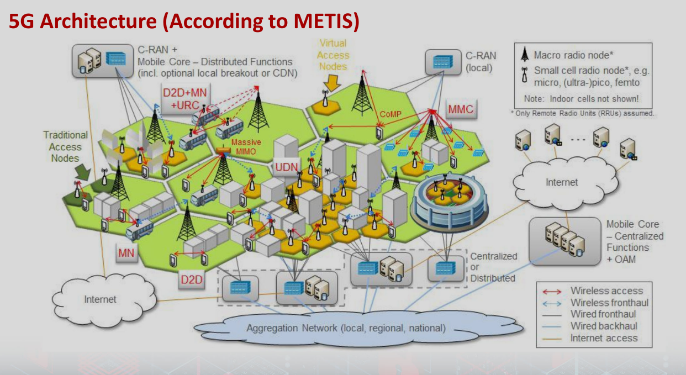
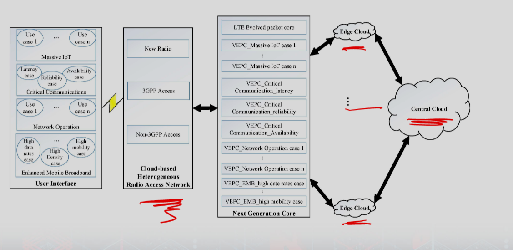
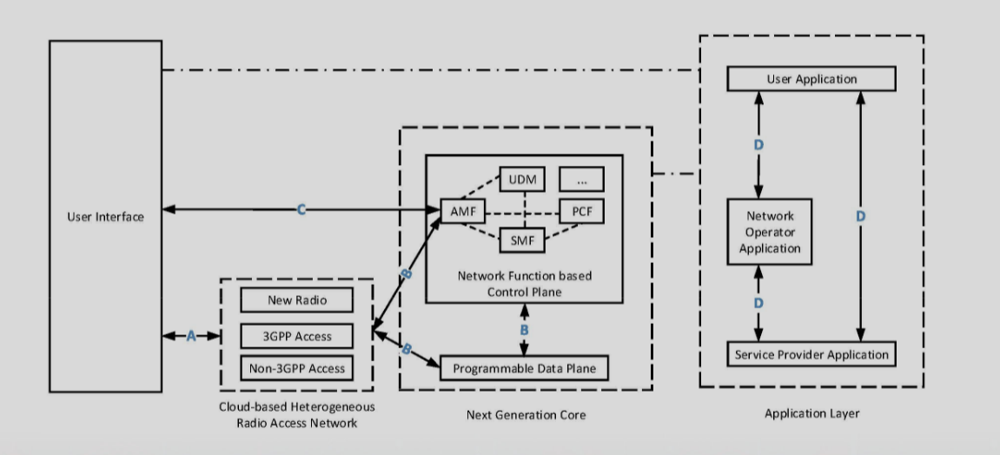
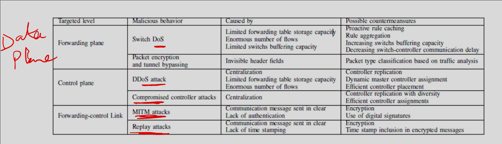
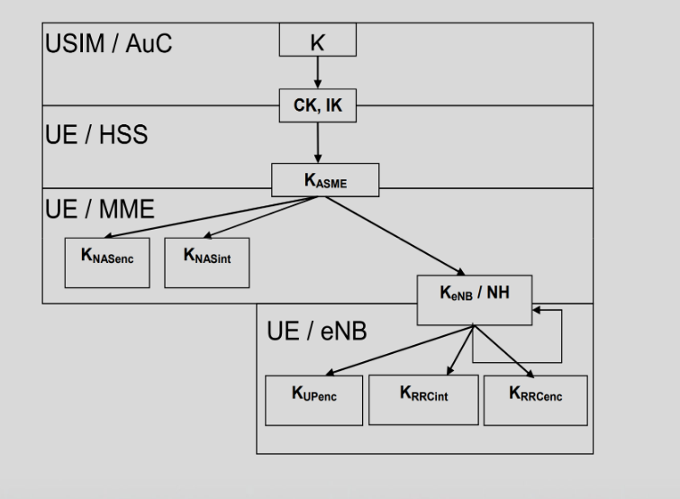
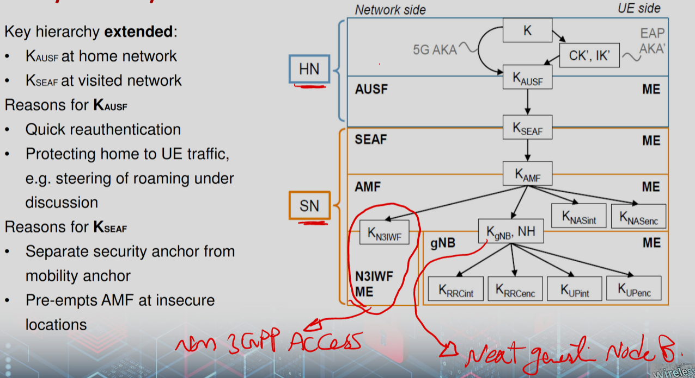

# 5G Security

### Characteristics
- 10 to 100 x higher number of connected devices 
- 10 to 100 x higher typical user data rate 
- 10 x longer battery life for low power machine communications 
- 5 x reduced End‐to‐End latency
- Wide capabilities
- Tech
    - Cloud computing
    - Heterogeneous network
    - MIMO 
    - Device to device / Machine to machine
    - Software defined networking
    - Network function virtualization

### Architechure

### Major drives for security
- Many use cases
- New networking (NFV and SDN)
- Need for preformance and thus robustness/efficiency
- Privacy concerns

### Challenges
- Islation of functions in virtual environment (NFS)
- SDN and cloud computing
- Potentioal lack of support for D2D
- Potential lack of human intervention for M2M

### SDN security
- 5G SDN base on openflow
- Generic issues
    - Lack of built in security in openflow
    - Centralized control may create signle point of failure
- SDN solves some issues
    - Flexible reaction to identified threats and vulns
    - Easy to upgrade network
    - Data mining and machine learning built-in to architechure
        - learn threats

- More issues

### NFV and Cloud 
- 5G works off of cloud
- Network functions are virtualized, run on top of general purpose hardware

### NFV Issues
- How to isolate netowrk functions from each other
    - For instance, functions may use different keys 
    - How to set up access to keys
- Hypervisor vulnerabilites affect network
- Authenicating virtual functions

- Legacy netowrks need to work with virtualized functions
    - They don't understand it is a vm
        - may act wrong
        - attack vector

- Platform security is key enabler
    - Access control
    - Secure boot

### Keys

- 4G Key Hierarchy

- 5G Key Hierarchy

