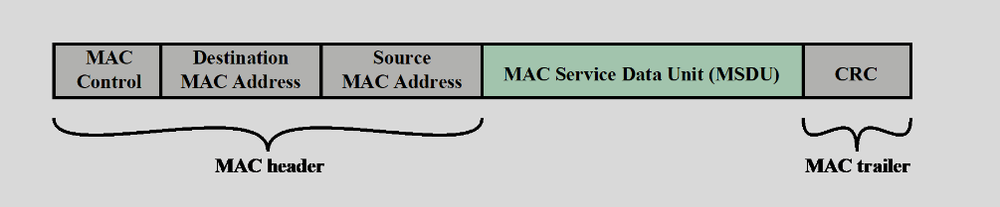
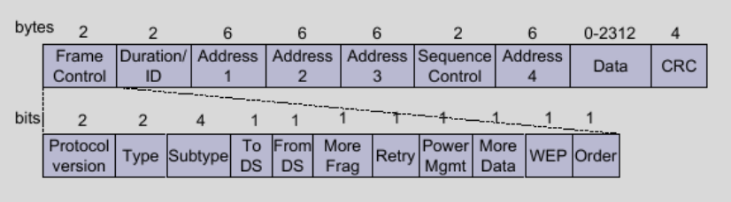
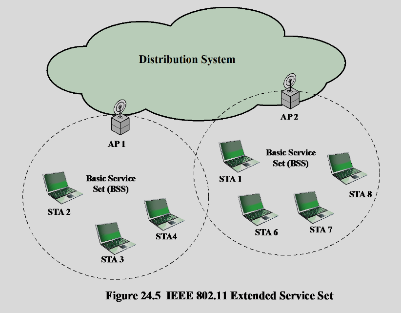

# Wi-Fi

### 802.11 Standard
- 802.11 is primarily concerned with the lower layers of the OSI model.
- Data Link Layer 
    - Logical Link Control (LLC).
    - Medium Access Control (MAC).
- Physical Layer 
    - Physical Layer Convergence Procedure
    - Physical Medium Dependent

### MAC & LLC protocols
- Functions of logical link control (LLC) Layer:
    - Perform flow and error control
    - Manage access to a shared-access medium not found in traditional layer 2 data link control
- Functions of medium access control (MAC) layer:
    - On transmission, assemble data into a frame with address and error detection fields
    - On reception, disassemble frame and perform address recognition and error detection
    - Govern access to the LAN transmission medium

### Medium Access Control
- MAC layer covers three functional areas:
    - Association control
    - Reliable data delivery
    - Wireless channel securit

- Source and Destination MAC addresses Physical attachment points
- Error Detection (Cyclic redundancy check - CRC) 
- Security is put here (where?) by 802.11i

- Frame Control – frame type, control information
- Duration/connection ID – channel allocation time
- Addresses – types include source and destination
- Sequence control – numbering and reassembly
- Frame body (Data) – MSDU or fragment of MSDU
- Frame check sequence – 32-bit CRC

- Protocol version – 802.11 version
- Type – control, management, or data
- Subtype – identifies function of frame
- To DS – 1 if destined for DS
- From DS – 1 if leaving DS
- More fragments – 1 if fragments follow
- Retry – 1 if retransmission of previous frame
- Power management – 1 if transmitting station is in sleep mode
- More data – Indicates that station has more data to send
- WEP – 1 if wired equivalent protocol is implemented
- Order – 1 if any data frame is sent using the Strictly Ordered service

### Frame Types
- Management
    - Negotiate relationship between User and AP
- Data
    - Exchange data
- Control
    - Tell when to start/stop/retransmit

### Management Frame Subtypes
- Beacon  (AP: “I am here”)
- Probe request/response (STA:”Who’s there?”)
- Authenticate request/response 
    - Open auth: STA→AP: “I am some device” STA←AP:”I am too”
    - 1.Request 2.Challenge 3.Response 4.Result
- Deauthentication
- Association request/response
    - STA →AP: “Connect?” STA←AP:”Allright”
- Dissassociation/Reassociation request/response

### Association-Related Services
- Association
    - Establishes initial association between station and AP
- Reassociation
    - Enables transfer of association from one AP to another, allowing station to move from one BSS to another (IASTATE WiFi)
- Disassociation
    - Association termination notice from station or AP

### Levels of Authentication
- Open system authentication
    - Exchange of identities, no security benefits
- MAC address access control
- Based on Shared Key 
    - Assures what?
- Authentication Server (802.1x)
    - Supplicant-Authenticator-Authentication Server
    - Extensible Authentication Protocol (EAP)
    - Multiple cryptoprotocols 

### Control Frame Sub-types
- Scanning
- Authentication
- Association
- Encryption
- **Request to Send (RTS) / Clear to Send (CTS)**
- **Acknowledgment (ACK)**
- Power Save Mode
- Fragmentation

### WLAN Two Modes of Operation
- Infrastructure mode
    - Fixed access point connected to the wired infrastructure
    - Mobile stations communicating with the access point
    - Basic Service Set (BSS)
        - One Access Point
    - Extended Service Set (ESS)
        - ≥ 2 Access Points in a subnet
- Ad hoc mode
    - Mobile stations communicate with each other
    - Independent Basic Service Set (IBSS)

### ESS

### Infrastructure
- AP Services
    - Auth
    - DeAuth
    - Privacy
- DS Services
    - Association
        -  Map client to DS via AP
    - Disassociation
        - Demap
    - Re-association
        - Association to another AP
    - Distribution
        - deliver MAC fromes across DS
    - Integration
        - deliver MAC fromes between DN and non 802.11

### Wifi Advantages
- Freedom
- Cost
- Flexibility
- Scalable
- Mobile Access

### Disadvantages
- Spepd
- Range
    - Walls and other interferences
- Security

### Basic Security Strategies
- Block your Service Set Identifier (SSID) from being broadcast.
- Change the default network name in the access point.
- Change the default access point password.
- Center the access point in the middle of the building/house (to avoid leakage).

### Media Access Control (MAC) Filtering
- Every network device has a unique MAC address
- Allocated by the manufacturer.
- MAC Filtering only allows certain addresses access. 
    - Mostly for home use.

### Basic Security Measures
- Service Set Identifier (SSID)
    - Station must specify SSID to Access Point when requesting association.
    - APs broadcast their SSID. 
    - Optionally you may not broadcast SSID
        - And bury your head into sand
- Kismet Wireless Sniffer (there are others as well)
    - Linux based passive wireless sniffer
    - Monitors all packets, not just beacons
    - Can find hidden networks

- MAC Address Locking
    - Access points have Access Control Lists (ACL).
    - ACL is list of allowed MAC addresses.
        - E.g. Allow access to:
            - 00:0E:35:0B:21:35
    - But MAC addresses are sniffable and spoofable.
    - Access Point ACLs are ineffective for security

### 802.11b Security Measures
- Two security services provided:
    - Authentication
        - Open system authentication
            - Actually no authentication; just the mechanisms described in the previous slides
        - Shared key authentication
            - Challenge response protocol
            - Uses WEP (Wired Equivalent Privacy)
- Encryption
    - WEP is used

