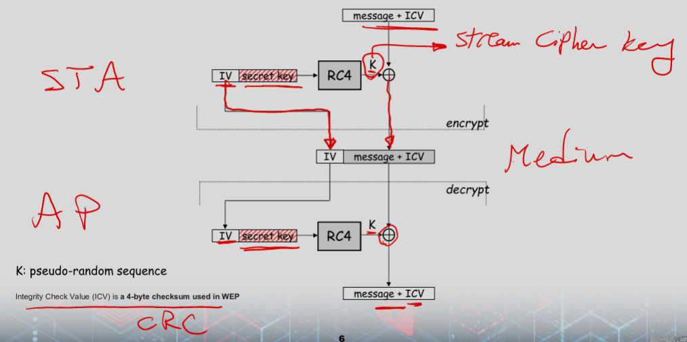
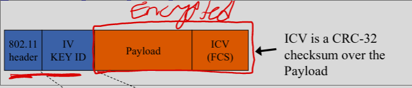
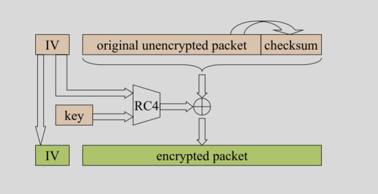
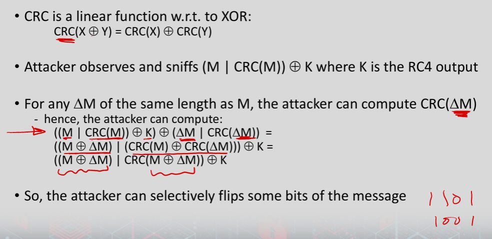

#  Wi-Fi Security

## WEP
- RC4 encryption 
    - Bad
- It is essential that each message is encrypted with a different key stream
    - the RC4 generator is initialized with the shared secret and an IV (initial value) (**64 bits together**)
        - shared secret is the same for each message (40 bits)
        - 24‐bit IV changes for every message

### ICV
- WEP integrity protection is based on an encrypted CRC value
    - ICV (integrity check value) is computed and appended to the message
    - the message and the ICV are encrypted together

### IV (Init Vector)
- Wireless cards use several methods
    - Some use a simple ascending counter for each message.
    - Some switch between alternate ascending and descending counters.
    - Some use a **pseudo random IV generator**.

### Keys 
- Two types
    - Default ie shared key
    - Key mapping keys
        - Individual or per-station key
- Generally, only default supported

- Key management is impossible w/ default key
    - When someone is fired, they still know the password to the network

- Supports multiple default keys
    - One is active and encrypts messages
    - Message header contains a key ID to determine which to decrypt

### Flaws Auth 
- Authentication is one‐way only
    - AP is not authenticated to the station
    - Station is at risk to associate to a rogue AP
- The same shared secret key is used for authentication and encryption
    - weaknesses in any of the two protocols can be used to break the key
- Stations (STA) can be impersonated 

### Flaws Auth Keys
- No session key is established during authentication
    - access control is not continuous
    - once a station has authenticated and associated to the AP 
        - attacker sends messages using the MAC address of station
    - correctly encrypted messages cannot be produced by the attacker
        - but replay of another station’s messages is still possible
        - Since generally the same key is used

### Flaw Getting the key
- recall that authentication is based on a challenge‐response protocol:
    - AP to STA: r
    - STA to AP: IV | (r xor K)
    - where K is a 128 bit RC4 output on IV and the shared secret
- an attacker can compute r xor r xor K) = K
- then it can use K to impersonate STA later:
    - AP to attacker: r’
    - attacker to AP: IV | (r’ xor K)
- Can this really happen?
- In order to carry out the attack given
    - 1. Does the attacker need to know the shared secret?
    - 2. Does the attacker make any assumption about the IV?
- Answers:
    - 1. No. Attacker uses only K which he captures
    - 2. Yes. The same IV should be used in the fake authentication. Since the station (i.e.the attacker) picks the IV, he can use the same one.
- Can the attacker impersonate several stations using one K?
    - Answer: Yes, if all stations use the same shared secret (which is a common practice).
- Final question: So what?

### Integrity and Replay
- There’s no replay protection at all
    - IV is not mandated to be incremented after each message
- The attacker can manipulate messages despite the ICV mechanism and encryption

### CRC attack 

### Brute Force WEP
- Capture ciphertext.
    - IV is included in message.
- Search all 2^40 possible secret keys.
    - 1,099,511,627,776 keys
    - Not a big number given today's technology
- Find which key decrypts ciphertext to plaintext.

- Some vendors allow limited WEP keys
    - User types in a password
    - WEP key is generated from password
    - Password creates only 21 bits of 40 bit key (the rest are fixed).
        - Reduces key strength to 21 bits = 2,097,152 which can be brute forced in minutes, if not seconds.
- Some vendors have extended WEP to 128 bit keys.
    - 104 bit secret key.
    - 24 bit IV.
    - Effectively safeguards against brute force attacks

