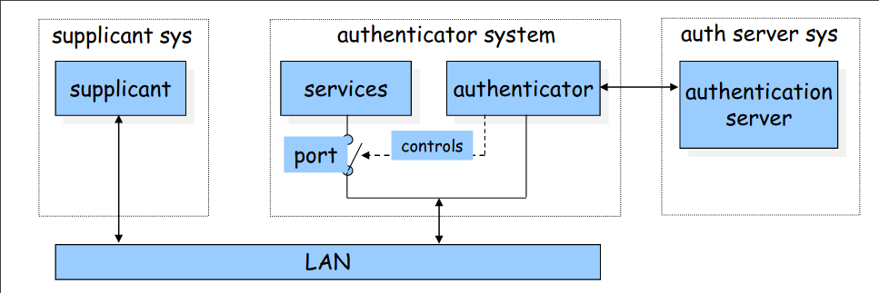

# 802.11i

### WEP collapse
- 11i fills the gap

### Characteristics
- Centralized authentication 
- Dynamic key management

### Compared to WEP
- access control model is based on 802.1X
- flexible authentication framework (based on EAP – Extensible Authentication Protocol)
- authentication process eventually results in a shared session key
- different functions (encryption, integrity) use different keys derived from the session key using a one-way function
- integrity protection and encryption functions are improved

### RSN
- 802.11i defines the concept of RSN (Robust Security Network)
    - integrity protection and encryption is based on AES (and not on RC4 anymore)
    - nice solution, but needs new hardware
        - Now, this is not a big issue since all new devices have this new hardware
        - But at the time of initial proposal, couldn’t have been adopted immediately
        - Thus we needed an interim solution that works with old hardware but securer than WEP

### TKIP
- 802.11i also defines a protocol called TKIP (Temporal Key Integrity Protocol)
    - integrity protection is based on MIC (Message Integrity Code)
    - encryption is based on RC4, but WEP’s problems have been avoided
    - Not a good solution, but it runs on old hardware (after firmware upgrade)
        - needed in transition period

### Translation
- Industrial names
    - TKIP is WAP
    - RSN us WPA2

- Because WiFi Alliance (i.e. the vendors) needed a practical solution right away, they initiated their standard based on IEEE 802.11i
    - They did not have time to wait for long standardization process
    - Is this good?
- Authentication and access control, as well as key management, are the same in WPA and in WPA2 
- The difference between the two concepts is in the cryptographic mechanisms used for integrity protection and confidentiality

### 802.1X
- Auth model

- the supplicant requests access to the services (wants to connect to the network)
- the authenticator controls access to the services (controls the state of a port)
- the authentication server authorizes access to the services
    - the supplicant authenticates itself to the authentication server
    - if the authentication is successful, the authentication server instructs the authenticator to switch the port on
    - the authentication server informs the supplicant that access is allowed

### Adding 802.1X to WiFi
- Actually 802.1X is a general framework for all Ethernet Networks (wired or wireless)
- How to use 802.1X for Wireless LANs
    - supplicant is mobile device (STA)
    - authenticator is access point (AP)
    - authentication server is server application running on the AP or on a dedicated machine
        - Mostly RADIUS server
- one more thing is added to the basic 802.1X model in 802.11i
    - successful authentication results not only in switching the port on
        - but also in a master key between the mobile device and the authentication server
    - the master key is sent to the AP in a secure way
        - this assumes a shared key between the AP and the auth server
        - this key is usually set up manually
    - Why this master key is needed?
        - Because an authenticated session can be stolen by spoofing the MAC address
        - The master key is used to generate session keys which in turn are used for authentication/encryption of further messages (avoid replay attack)

