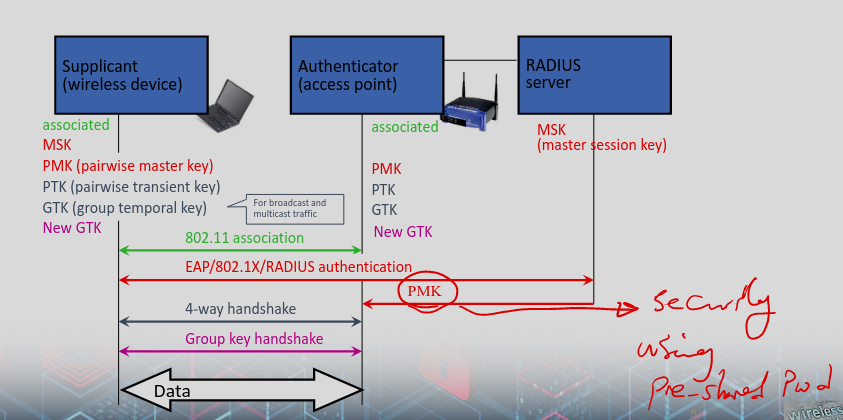
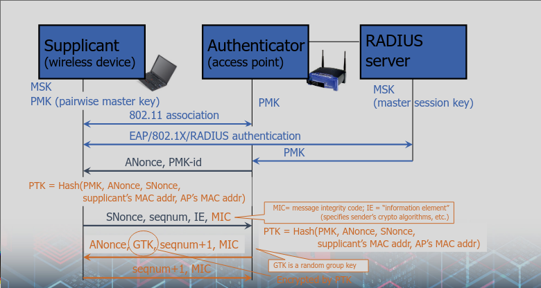
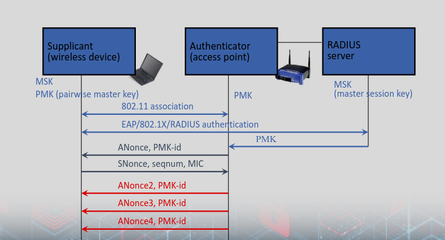
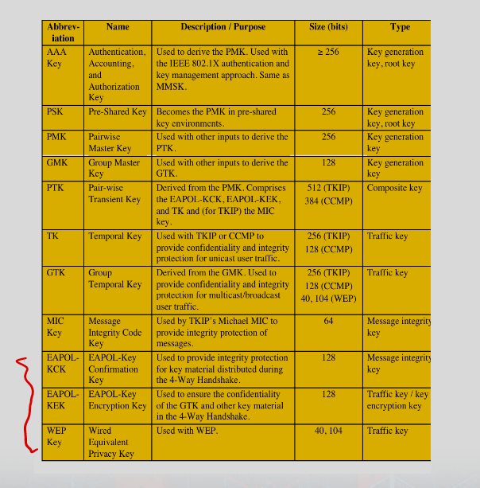
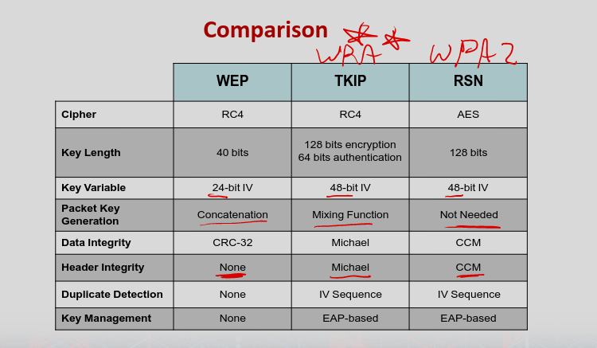

# CCMP

### AES-CCMP
- 802.11 / RSN
- New hardware, so it uses AES
- CTR (counter) mode with CBC-MAC
    - Integrity is CBC-MAC
    - Enc is CTR
    - Both AES
- More secure than TKIP
- Same key for Encryption and integrity

- CBC-MAC
    - From MAC header, RSN header and data
    - 128 bit vlocks
        - zero padded
    - 128 block is truncated to 64 bits

### Association Diagram

### 4-way handshake

### Handshake DoS

### Keys

### Comparisons

