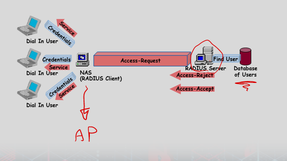
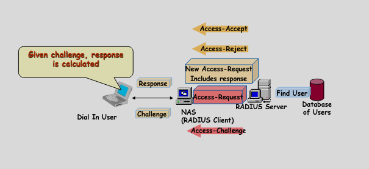
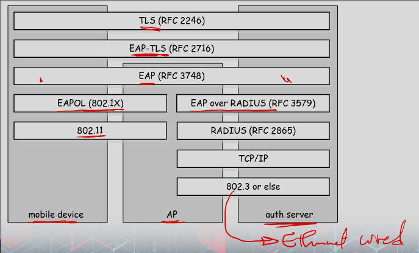
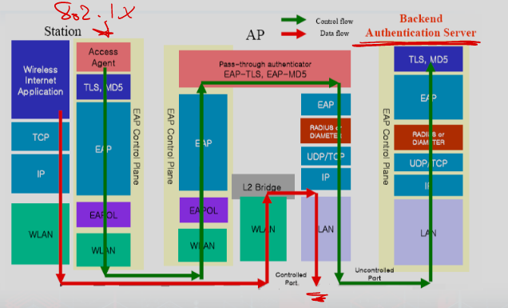

# EAP

### Benefits of 802.1X
- Integrates with other standards
    -  Radius
- Radius can manage 802.1X network

### Radius
- Remote Auth Dial in User Service
- Client server
    - Network Access Server is client 
    - Radius server
        - handles requests and auths users
        - Returns info for client to deliver services to users

### EAP
- Extensible Authentication Protocol
    - Encapsulation protocol to transport the messages of real auth
    - Like TLS
- Types
    - Request / From STA to auth server
    - Response / From auth server to STA
    - Success
    - Failure

- AP is between STA and auth server
    - AP does not know contents of EAP messages
    - But gets success and failure

### EAPOL
- EAP over LAN
    - Encapsulate wuith LAN protocols like ethernet
    - carry EAP from STA to AP
- RADIUS protocol
    - carries EAP messages from AP to auth server
    - has message type that can transport master key from auth server to AP
        - shared key with AP and auth server
        - key is used to make session keys between AP and STA
    
    - Original protocols
        - PAP / Password auth protocol
        - CHAP / Challenge Handshake Auth Protocol

### PAP

### CHAP

### EAP-MD5 
- Challenge response with MD5 hash
    - STA sends back a response that contains the hash of the shared secret and the challenge 
-  Insecure

### EAP-PSK
- Preshared key / STA and auth server know key
- Used to generate other keys for auth and session keys 
- Only AES 
- Mutual authentication

### Light EAP (LEAP)
- Cisco
- Challenge Response; Long WEP keys
- Attackable

### EAP-TLS (TLS over EAP)
- Only TLS handshake protocol is used
- Server and client auth; make a master secret
- creates session key from secret

### EAP-TTLS
- Tunnelled TLS
    - Server auths to client using certs
    - Clent to server auth is legacy method over tunnel after TLS

### Protected EAP (PEAP)
- Cisco, Microsoft, RSA
- Like EAP-TTLS
    - Phase 1: TLS handshake without client auth
    - Pahse 2: client auths over TLS tunnel

### EAP-FAST
- Flexible Authentication via Secure Tunneling
- Cisco replacement of LEAP
- Server-side TLS, server certs not mandated
    - If no server cert, master secrets are manual placed/created
    - This is stupid

### Protocol Arch

### 802.11i

### WPA, RSN, 802.11i
- 11i defines wireless network called Robust Security Network (WPA2)
- WPA is firmware update for WEP hardware
    - TKIP (Temportal Key Integrity Protocol)
- WPA replaces WEP/WPA / Actual RSN
    - Defines CCMP (Cipher block chaining Message Auth Code protocol)
    - Uses AES
- WPA3 in 2018

