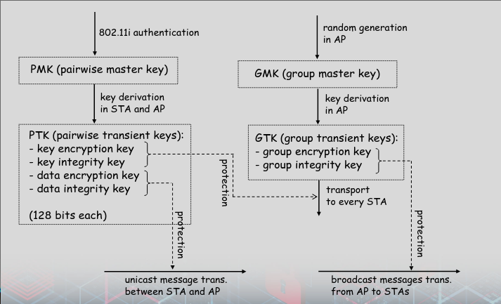
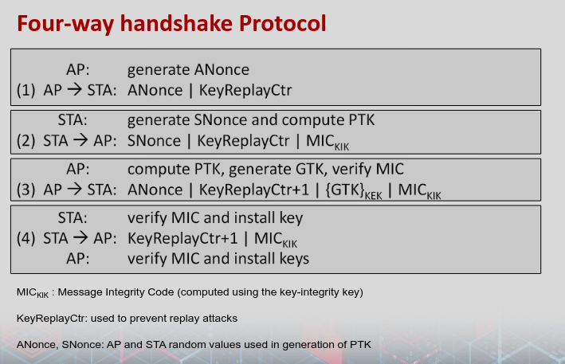
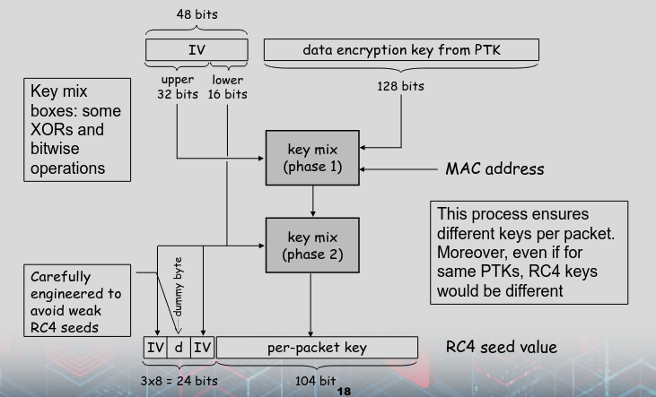

# TKIP 

### Terms
- MSDU / MAC service Data unit
    - Data from MAC layer
- MPDU / MAC Protocol Data Unit
    - MSDU / Data 
    - Plus header and CRC

### Temporal Key Integrity Protocol
- Only software changes to WEP hardware 
- Adds
    - Message integrity
    - Data confidentiality

### Message integrity
- Adds essage integrity code
- Algorithm 
    - 64-bit output
    - Takes source and dest MAC addresses, data, and key
    - Appends to data

### Data confidentiality
- Encrypting MPDU with MIC appended in RC4

### Temporal Key
- Creates 256 bit key
- 64 for MIC STA to AP 
- Another 64 for MIC AP to STA
- Remaining 128 are RC4 key to encrypt

### TKIP Sequence Counter
- Adds TSC, sequence count to each frame
- Is in each MPDU and protected by MIC to stop replay attacks
- TCK with session TK produces dynamic encyption key that changes with each MPDU

### WPA andd TKIP
- Temporal Keys recreated every 10000 packets
    - 4-way handshake dervices temporary shared key using primary shared key
- Sequencing 
    - prevents replay and each packet is encrypted with different key
- Key mixing function combines key and IV to make stronger IV
- MIC protects from flipping and forgery

### 4 way handshake
- Primary Shared Keys
    - Pairwise master key
    - Group master key

- Temporary shared keys
    - Unicast / Pairwise Transient Key
    - Multicase / Group Temporal Key

### Pairwise Master Key
- Session key betwwen STA and auth server
    - AP also learns it from Auth server
- Master as it is not directly used 
    - Used to create PTK 
- Pseudo-random function used to create PTK from PMK
    - With additional inputs of MAC addresses and shared Nonces

### Group Master key
- Protect broadcast messages
- GMK 
    - Generated by AP randomly
- GTK
    - Derived by AP from GMK
    - Sends to STAs
    - Sends by using PTKs

### 4-way handshake
- Prove AP and STA know PMK without disclosing key
- Just send messages encrypted using PMK to prove knowledge
- PMK lasts entire session
- Handshake establishes PTK 
    - Shares Nonces betwwen AP and STA
    - Both create PTK
    - AP sends GTK using 

### Key Generation

