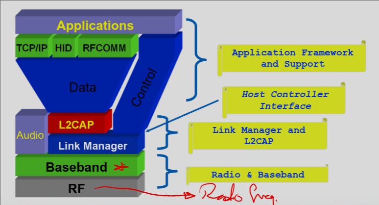
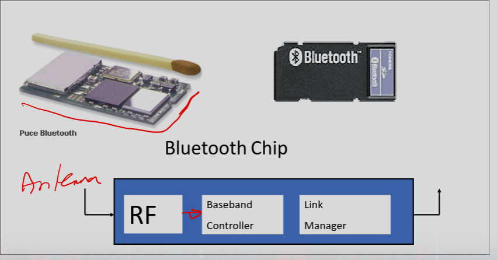
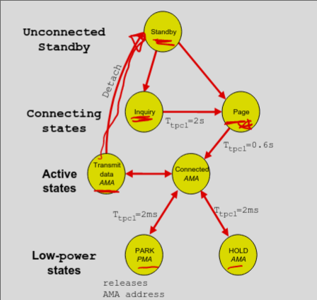
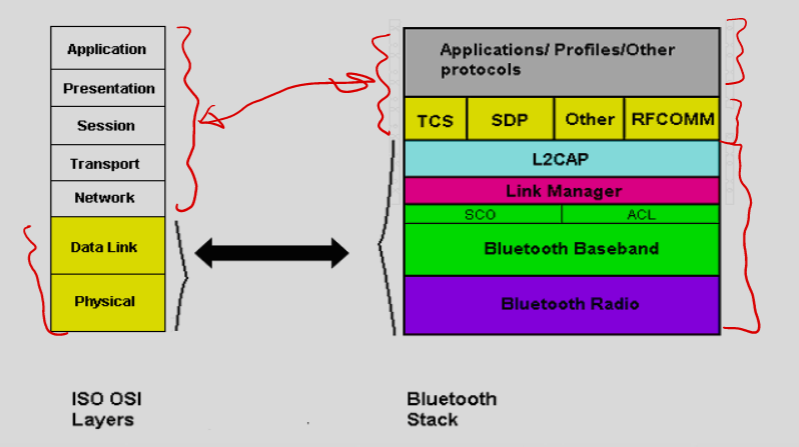
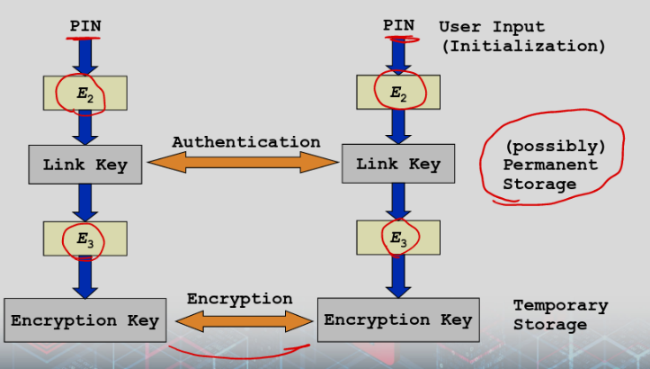

# Bluetooth Protocols

### List of Protocols

### Host Controller Interface (HCI)
- provides a common interface between the Bluetooth host and a Bluetooth module
    - Interfaces in spec 1.0: USB; UART; RS‐232

### Link Layer Control & Adaptation (L2CAP)
- A simple data link protocol on top of the baseband
    - connection‐oriented & connectionless
    - protocol multiplexing
    - segmentation & reassembly
    - QoS flow specification per connection (channel)
    - group abstraction

### Service Discovery Protocol (SDP)
- Defines a service record format
    - Information about services provided by attributes
    - Attributes composed of an ID (name) and a value
    - IDs may be universally unique identifiers (UUIDs)
- Defines an inquiry/response protocol for discovering services
    - Searching for and browsing services

### RFCOMM
- Emulated serial port for legacy apps
- Allows mulitple "ports"

### Telephony Control Protocol Spec (TCS)
- Marked important
- Call control (setup and release)
- Call management from your CAR
- How calls are sent over bluetooth (basically)

### Legacy protocol reuse
- Just a statement
- Mostly for interacting with phones

### Diagram

### Baseband Protocol
- Statemachine
- Standby
    - Waiting to join piconet
- Inquire
    - Ask about the radios to connect to
- Page
    - Connect to specific radio
- Connected
    - Actively on piconet
- Park/Hold
    - Low-power state

- Diagram

- AMA: Active Member Address
- PMA: Parked Member Address

### Link Manager Protocol
- Set up and manage baseband connections
- Piconet management
- Link config
- security

### L2CAP
- Protocol multiplexing
- Segmentation and reassembly
- QoS negotiation
- Group abstractions

### IP over Bluetooth
- Internet access
- Connect PDA to internet via LAN

### Comparison to OSI

### 802.15.4 Security
- Access control
- Encryption
- Frame integrity
- Sequential Freshness
- Suggested security suites
    - AES encryption
    - AES-CCM at MAC level
- Has unsecured mode

### Encryption in bluetooth
- Many functions
    - E0, E1, E2, E21, E22, E3
    - Key gen, auth response, and encryption
- E1 and later
    - SAFER+ encryption
        - Block cipher
    - E0 is stream cipher w/ 4 LFSR (25, 31, 33, 39)
- Key gen uses addresses, random, and time 
- 128 bit keys

### Attacks to bluetooth
- Pairing
    - Discoverable or not
    - Trusted or untrusted 

### Security Features of Bluetooth
- Fast frequency hopping (79 channels)
- Low transmit power (range <= 10m)
- Authentication of remote device
    - based on link key (128 Bit)
    - May be performed in both directions
- Encryption of payload data
    - Stream cipher algorithm ( 128 Bit)
    - Affects all traffic on a link
- Initialization
    - Pin entry by user

### Link Keys (Piconet)
- Link keys are generated via a PIN entry
- A different link key for each pair of devices is allowed
- Authentication:
    - Challenge‐Response Scheme
- Permanent storage of link keys

### Key Generation

